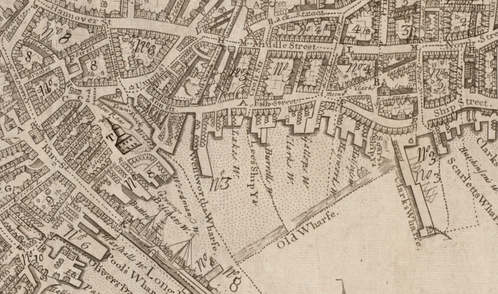
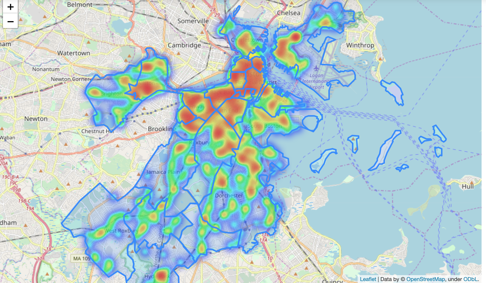
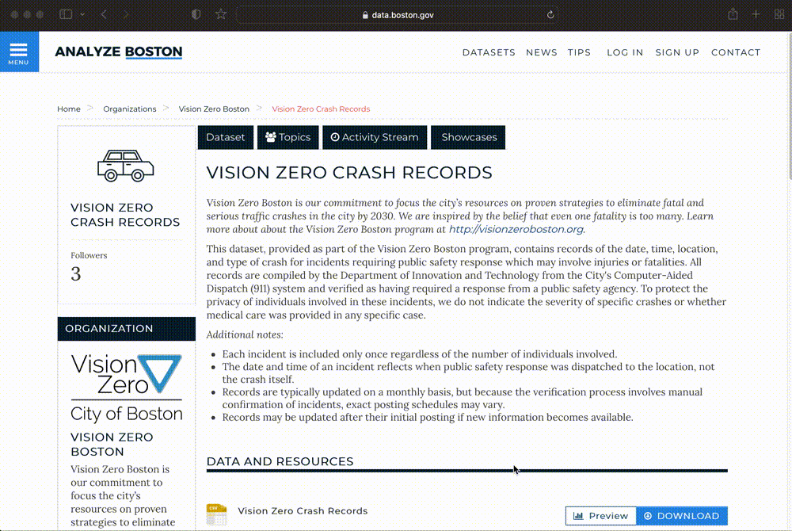
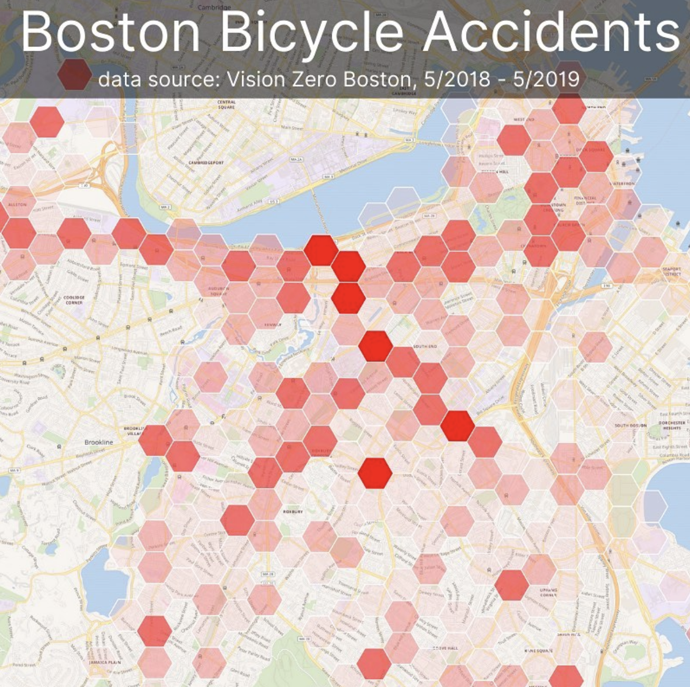
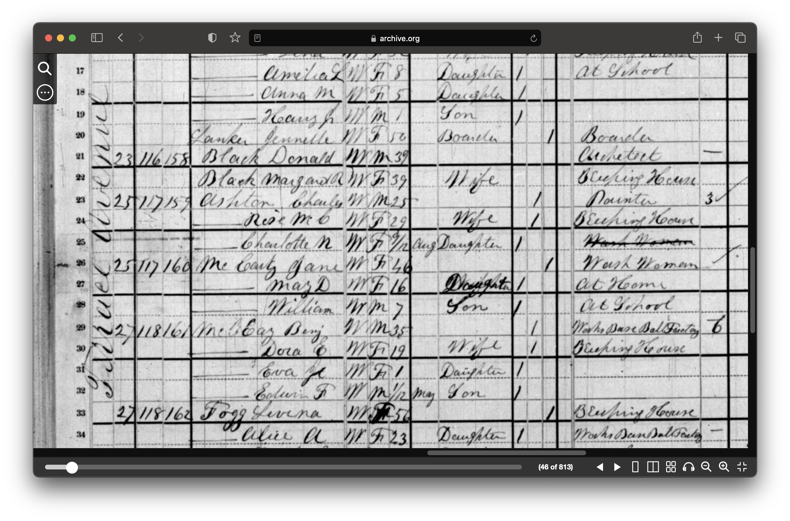
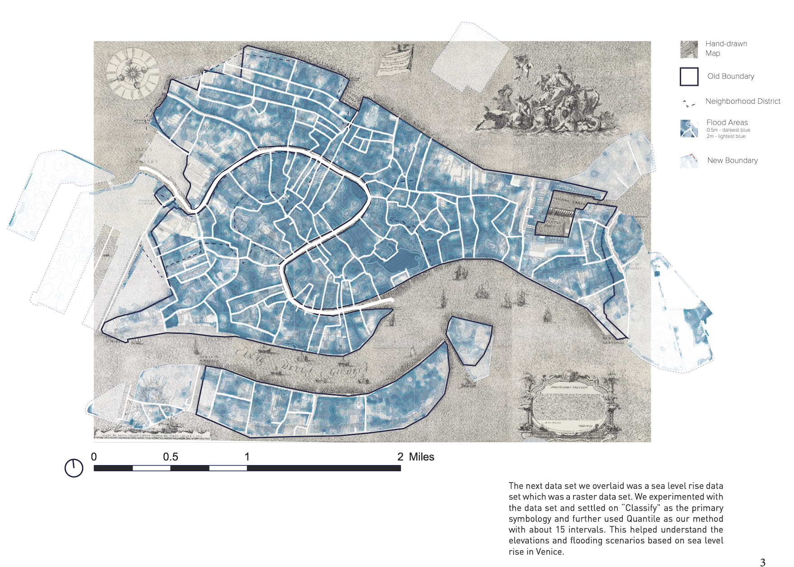
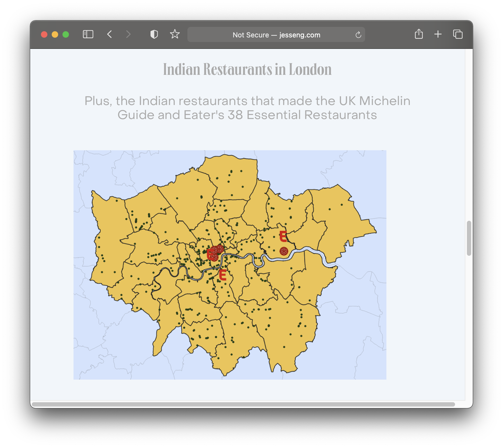

*GIS definitions.*

*John Snow cholera map, 1854.*

*John Snow cholera map, overlaid by a modern-day GIS heatmap layer.*

*[Map of Boston from 1743](https://collections.leventhalmap.org/search/commonwealth:9s161952m).*

*GIS heatmap of density of restaurants in Boston.*

*[Analyze Boston](https://data.boston.gov/group/geospatial), Boston's open data portal.*

*Vision Zero dataset, open as a table.*

*Bike crash data displayed visually as individual points in GIS software.*

*[OldNYC: Mapping Historic Photographs at the NYPL](https://www.oldnyc.org/).* 

*GIS data layers diagram.*

*Belle's house in college.*

*City of Boston Archives Reading Room.*

*19th century insurance atlas, open to a plate of downtown Boston.*

<iframe width="100%" height="550" src="https://atlascope.leventhalmap.org/#view:embed$base:000$overlay:39999059010718$zoom:18.00$center:-7914725.872110603,5210447.532772563$mode:glass$pos:204"></iframe>
<figcaption class="append">Atlas viewer, <a href="https://atlascope.leventhalmap.org/">Atlascope</a>, a GIS tool from the Boston Public Library.</figcaption>

*1880 census from [Archive.org](https://archive.org/details/10thcensus0561unit/page/n45/mode/2up?view=theater).* 

*[ArcGIS Map](https://harvard-cga.maps.arcgis.com/apps/webappviewer/index.html?id=4f084606c3f64df8a32ce2ad938a43f6) comparing 1890 atlas to today.* 

*Map [created by](https://mapping.share.library.harvard.edu/blog/2021/vis-2128/) GSD students Aeshna Prasad, Michael Lidwin, Megan Mcglinchey, and Mehvish Jamal working with the Map Collection.* 

*Record from  [Harvard Map Collection card catalog](https://iiif.lib.harvard.edu/manifests/view/drs:45555303$402i).* 

## maps@harvard.edu