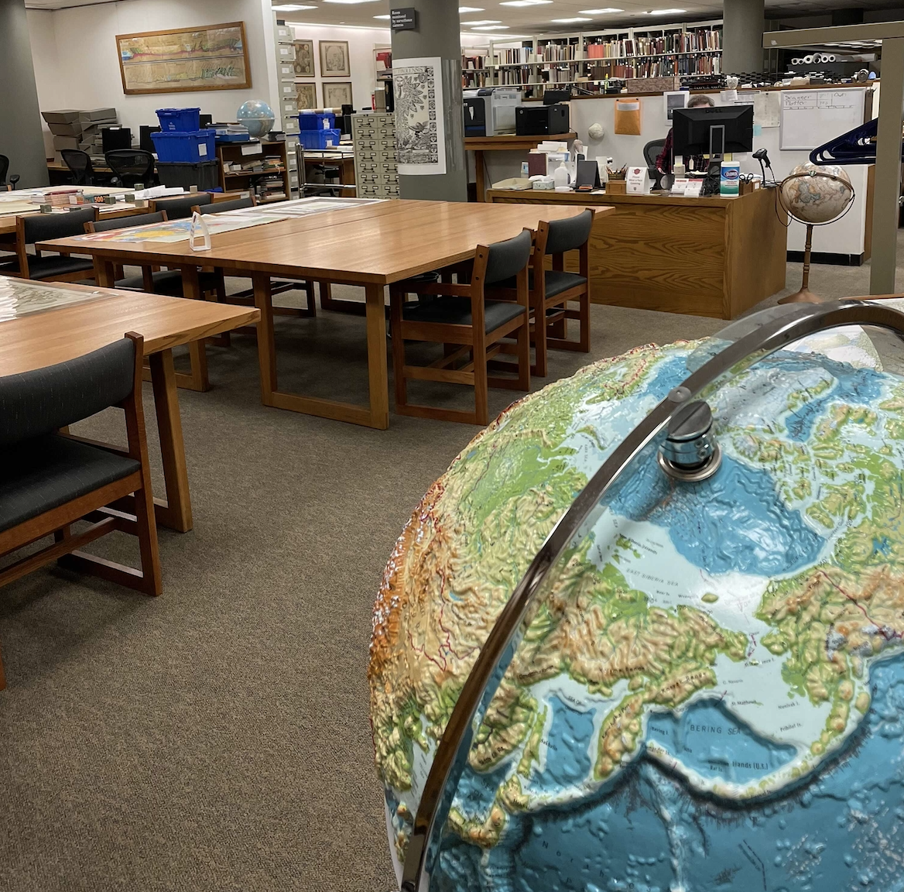
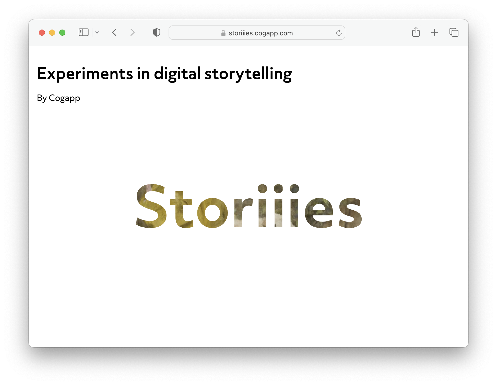
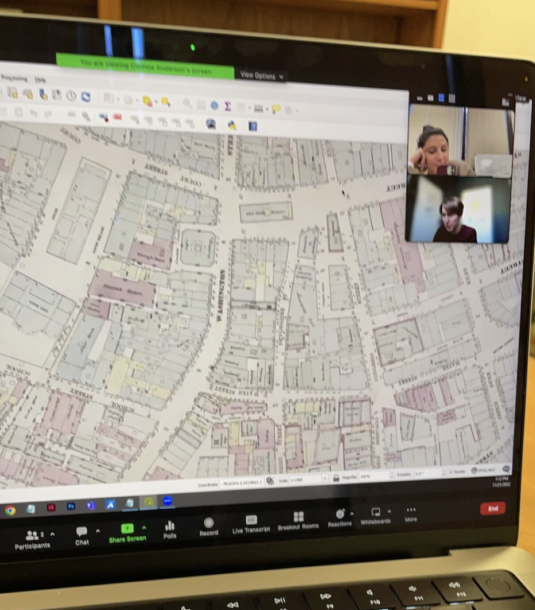
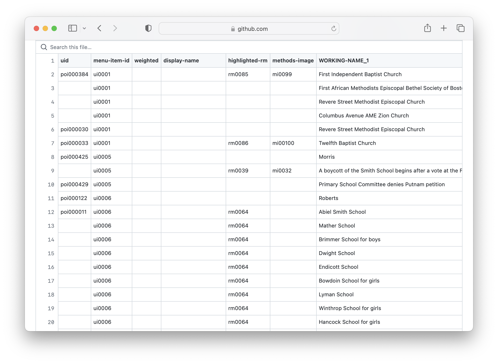
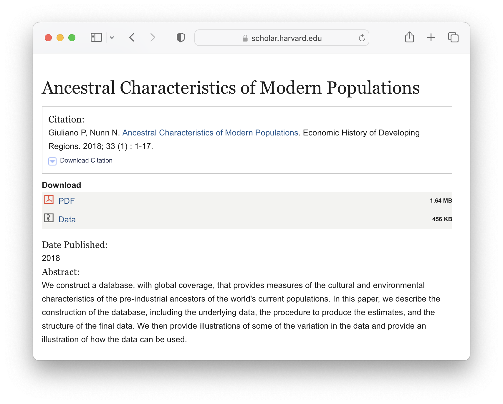
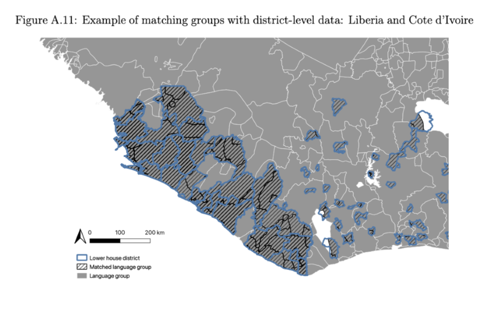
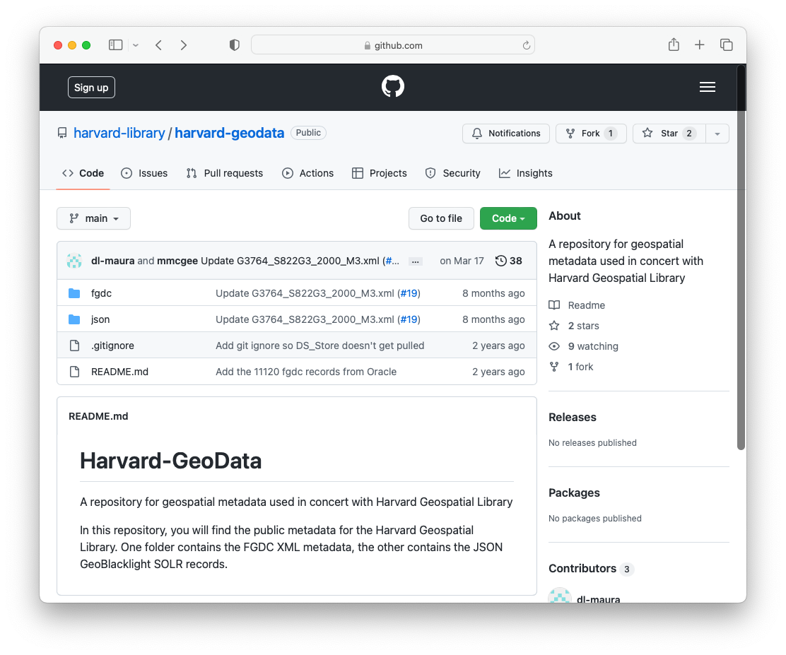

## Services

*Record from  [Harvard Map Collection card catalog](https://iiif.lib.harvard.edu/manifests/view/drs:45555303$402i).* 

## Formats

*[Tutorial](https://harvardmapcollection.github.io/tutorials/allmaps/georeference/) for how to use Harvard Libraries [digital collections items](https://library.harvard.edu/digital-collections) in [Allmaps](https://editor.allmaps.org/#/)*

*Working with [19th century map layers of Boston](https://atlascope.leventhalmap.org/#view:share$base:000$overlay:39999059010718$zoom:18.58$center:-7914696.636805333,5210508.468195375$mode:glass$pos:148).*

## Concepts

*[Ancestral characteristics of Modern Populations](https://scholar.harvard.edu/nunn/publications/ancestral-characteristics-modern-populations) dataset.*

*Map by Leo Saenger, applied mathematics.*

## Landscape

*[The Library of Missing Datasets](https://mimionuoha.com/the-library-of-missing-datasets) by Mimi Ọnụọha.* 

*[Global volcanoes dataset](https://hgl.harvard.edu/catalog/harvard-glb-volc) in the Harvard Geospatial Library (HGL).* 

