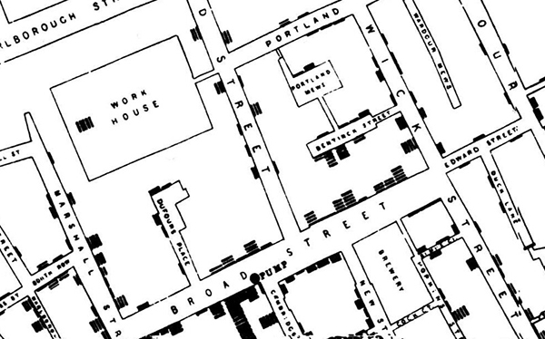
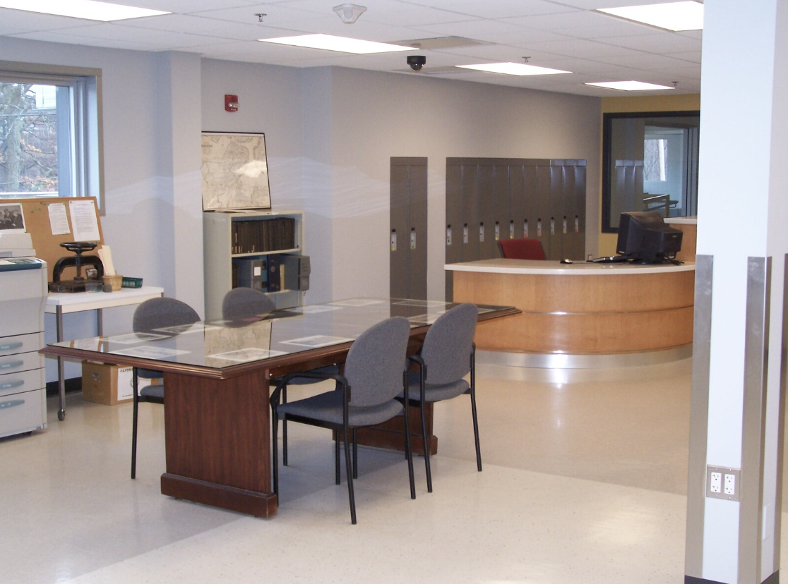
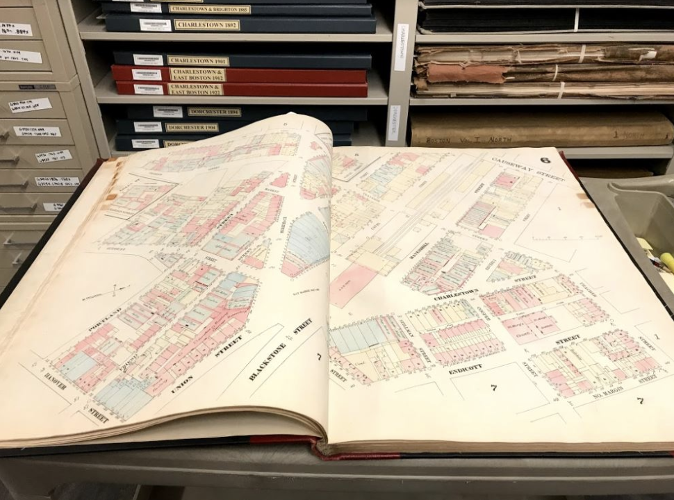
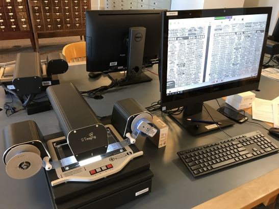
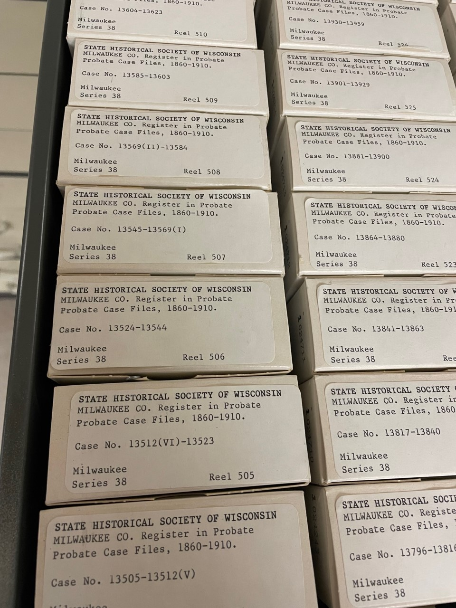
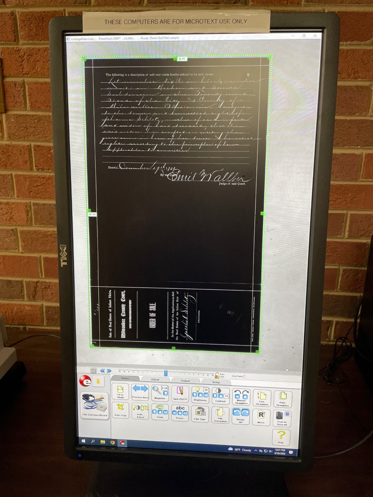
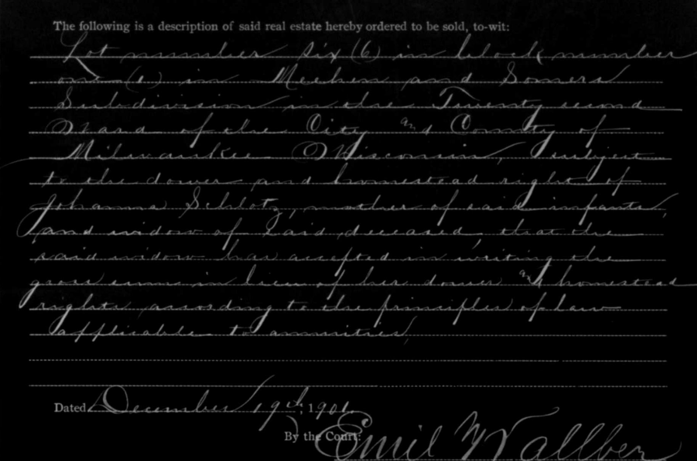
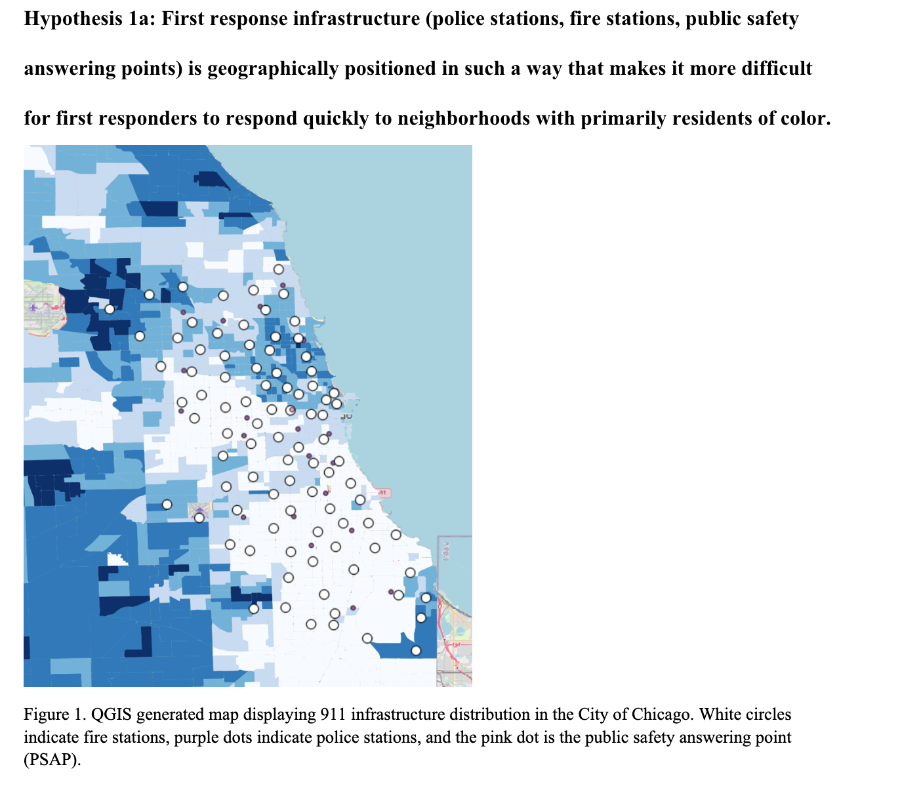

## GIS definitions

## What is GIS used for?

*John Snow cholera map, 1854.*

*John Snow cholera map, overlaid by a modern-day GIS heatmap layer.*

## GIS data layers

*GIS data layers diagram.*

*[OldNYC: Mapping Historic Photographs at the NYPL](https://www.oldnyc.org/).* 

## Property research with GIS

*Belle's house in college.*

*City of Boston Archives Reading Room.*

*19th century insurance atlas, open to a plate of downtown Boston.*

<iframe width="100%" height="550" src="https://atlascope.leventhalmap.org/#view:embed$base:000$overlay:39999059010718$zoom:18.00$center:-7914725.872110603,5210447.532772563$mode:glass$pos:204"></iframe>

*Microfilm reader.*

*Milwaukee probate records on mircofilm.*

*Probate record loaded onto the microfilm reader.*

*Text from one of the Milwaukee probate records.*

*Modern-day parcels in Milwaukee.*

## GIS support from the library

*A student in the social sciences studying race and policy who had never used GIS before learned how to create demographic maps at the library.*

*Non-GIS map for an English class a student consulted us on.*

## maps@harvard.edu

You can contact us at [maps@harvard.edu](mailto:maps@harvard.edu).