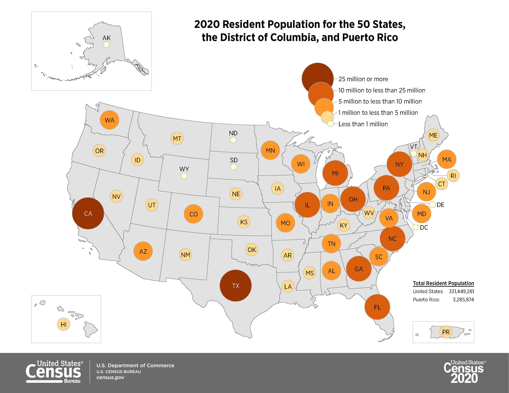
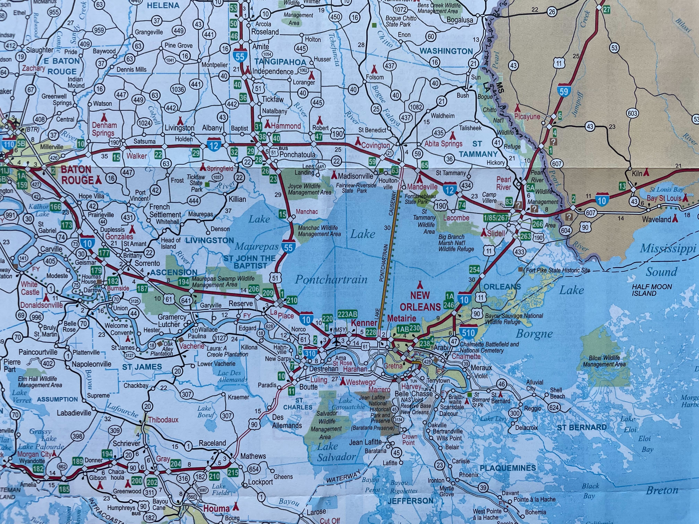
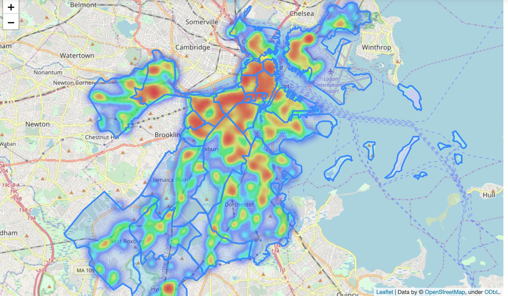
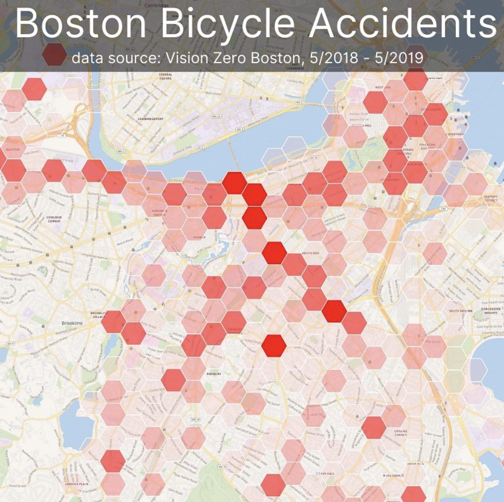
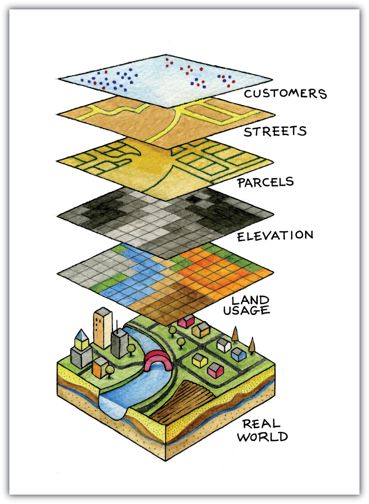

*GIS definitions.*

*John Snow cholera map, 1854.*

*John Snow cholera map, overlaid by a modern-day GIS heatmap layer.*

*Offical Olympic National Park map.*

*Graduated proportional symbol map showing 2020 population by state in the United States.*

*Louisiana and Mississippi roadmap from the Harvard Map Collection.*

*Louisiana and Mississippi roadmap from the Harvard Map Collection showing the New Orleans area.*

*Land cover map of Louisiana from 1909 in the Harvard Map Collection.*

*The legend of the 1909 land cover map of Louisiana.*

*USGS data download tool, showing land cover data from 2016.*

*[Map of Boston from 1743](https://collections.leventhalmap.org/search/commonwealth:9s161952m).*

*GIS heatmap of density of restaurants in Boston.*

*[Analyze Boston](https://data.boston.gov/group/geospatial), Boston's open data portal.*

*Vision Zero dataset, open as a table.*

*Bike crash data displayed visually as individual points in GIS software.*

*[OldNYC: Mapping Historic Photographs at the NYPL](https://www.oldnyc.org/).* 

*GIS data layers diagram.*

*Belle's house in college.*

*City of Boston Archives Reading Room.*

*19th century insurance atlas, open to a plate of downtown Boston.*

<iframe width="100%" height="550" src="https://atlascope.leventhalmap.org/#view:embed$base:000$overlay:39999059010718$zoom:18.00$center:-7914725.872110603,5210447.532772563$mode:glass$pos:204"></iframe>

*1880 census from [Archive.org](https://archive.org/details/10thcensus0561unit/page/n45/mode/2up?view=theater).* 

*[ArcGIS Map](https://harvard-cga.maps.arcgis.com/apps/webappviewer/index.html?id=4f084606c3f64df8a32ce2ad938a43f6) comparing 1890 atlas to today.* 

<iframe title="Interactive map of the Polish cities statistical data. Hovering over each city reveals information about the city." src="https://harvardmapcollection.github.io/classes/gened1140/fall-2022/assignment/demo/polish-cities/" width="100%" height="600px"></iframe>

*Follow along the GIS tutorial in a workshop setting with Belle [signup form](https://www.eventbrite.com/e/gened-1140-gis-tutorial-tickets-420298884277).*

*[Global volcanoes dataset](https://hgl.harvard.edu/catalog/harvard-glb-volc) in the Harvard Geospatial Library (HGL).* 

## maps@harvard.edu

You can contact us at [maps@harvard.edu](mailto:maps@harvard.edu).

