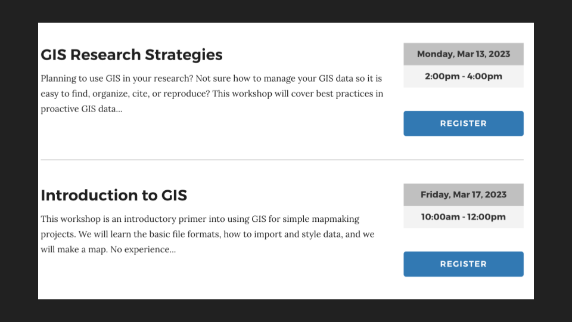
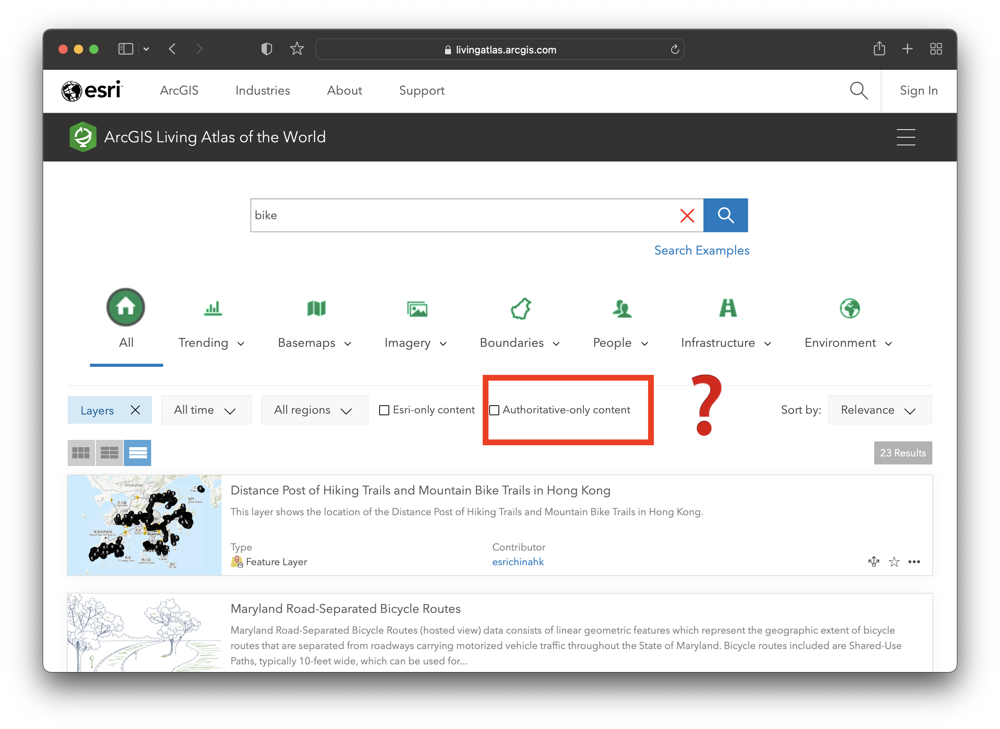

## Trying to understand things encodes them sometimes

<figcaption class="append"><a href="https://iiif.lib.harvard.edu/manifests/view/ids:7614908">Descriptive map of London poverty, 1889</a> in the Harvard Map Collection.</figcaption>

## New technologies and ethical grey space

<figcaption class="append"><a href="https://datasmart.ash.harvard.edu/community-engagement-smart-city-development">Data-Smart City Solutions</a> from Harvard Kennedy Schools' Ash Center.</figcaption>

## Being up front in your maps/data about your motivations

<figcaption class="append"><a href="https://due-parsons.github.io/methods3-fall2018/projects/spaces-of-avoidance-mapping-the-bodies-in-public-space/">Spaces of Avoidance</a> project by Alie Kilts.</figcaption>

## Letting people in to allow critique

<figcaption class="append"><a href="https://www.landgrabu.org/">Land-Grab Univerisities</a> interactive digital project.</figcaption>

<figcaption class="append"><a href="https://dsl.richmond.edu/panorama/redlining/#loc=5/39.1/-94.58">Mapping Inequality</a> project via the University of Richmond's Digital Scholarship Lab.</figcaption>

## Harvard Map Collection workshops

<figcaption class="append">Spring 2023 workshop offerings. Registration via the <a href="https://libcal.library.harvard.edu/calendar/main?t=d&q=gis&cid=15049&cal=15049&inc=0">Harvard Libraries Events calendar</a>. </figcaption>

## What gets collected 

<figcaption class="append">White Collar Crime Risk Zones <a href="https://whitecollar.thenewinquiry.com/#drt2yzp"> project</a>. </figcaption>

<figcaption class="append"><a href="https://mimionuoha.com/the-library-of-missing-datasets">Library of Missing Datasets</a> project by MIMI ỌNỤỌHA</figcaption>

<figcaption class="append">Volcanoes of the World (2003) dataset in the <a href="https://library.harvard.edu/services-tools/harvard-geospatial-library">Harvard Geospatial Library (HGL)</a>.</figcaption>

<figcaption class="append"><a href="https://mapping.share.library.harvard.edu/">Tutorials</a> on how to do GIS stuff from Harvard Libraries.</figcaption>

<figcaption class="append">Mapping project by student Luisa Shido, created in QGIS.</figcaption>

## Next steps
- Get help with maps or GIS datasets by emailing maps@harvard.edu.
- Catch up with Belle belle_lipton@harvard.edu.
- Sign up for workshops using the library calendar.
- Come to GIS office hours to hang out and make maps Tuesdays 10-noon.

