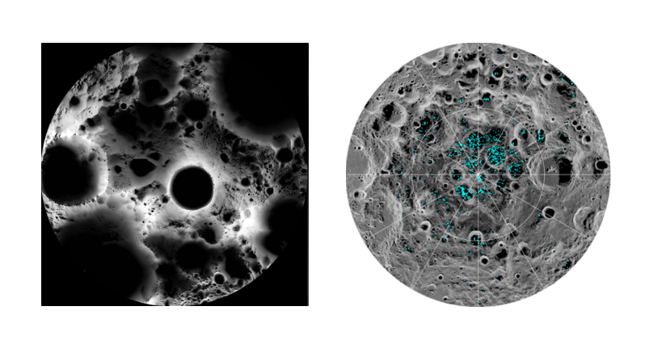

## Where are we?

## Collections and support services

*Historic maps of Havana in the Harvard Map Collection*

*[Global volcanoes dataset](https://hgl.harvard.edu/catalog/harvard-glb-volc) in the Harvard Geospatial Library (HGL).* 

## Workshops

*Spring 2023 workshop offerings. Registration via the [Harvard Library Events calendar](https://libcal.library.harvard.edu/calendar/main?t=d&q=gis&cid=15049&cal=15049&inc=0).*

## Office hours

### Programming & GIS Office Hours

- HKS Library Instruction Room
- Wednesdays, 3-4pm

### Map Collection GIS Office Hours

- In the Harvard Map Collection
- Fridays 3-5pm

## Tutorials and project examples

*[Tutorials and blog](https://mapping.share.library.harvard.edu/).*

## maps@harvard.edu

- [https://library.harvard.edu/libraries/harvard-map-collection](https://library.harvard.edu/libraries/harvard-map-collection)