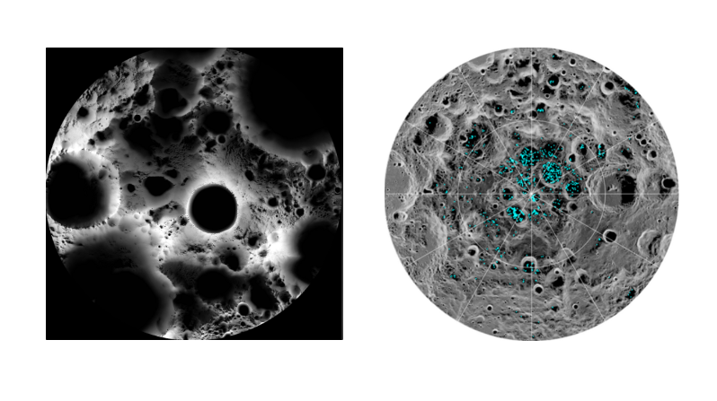
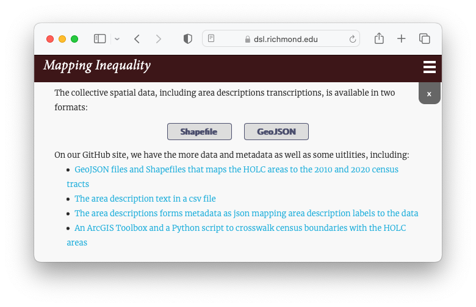
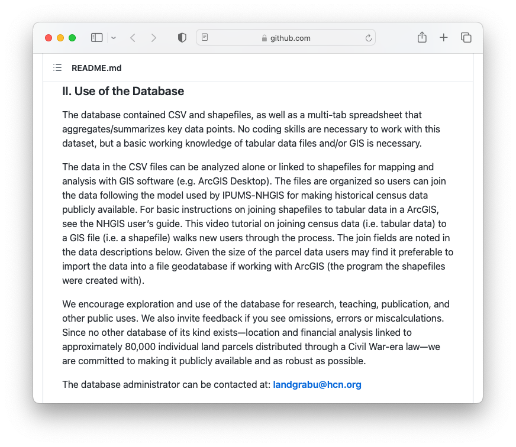
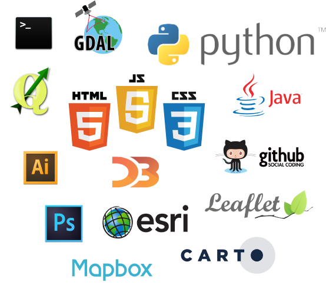
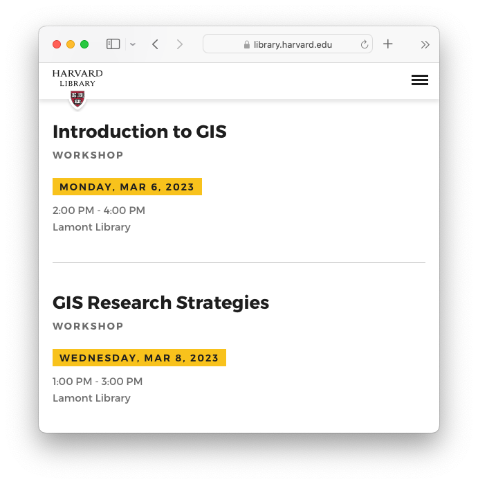

## Collections and support services

*Historic maps of Havana in the Harvard Map Collection*

*[Global volcanoes dataset](https://hgl.harvard.edu/catalog/harvard-glb-volc) in the Harvard Geospatial Library (HGL).* 

## Workshops

*[Mapping Inequality](https://dsl.richmond.edu/panorama/redlining/#loc=5/39.1/-94.58) project via the University of Richmond's Digital Scholarship Lab.*

*[Land-Grab Univerisities](https://www.landgrabu.org/) interactive digital project.*

*Spring 2023 workshop offerings. Registration via the [Harvard Library Events calendar](https://libcal.library.harvard.edu/calendar/main?t=d&q=gis&cid=15049&cal=15049&inc=0).*

## Office hours

*Map created by Luisa Shido.*

## Tutorials and project examples

*[Tutorials and blog](https://mapping.share.library.harvard.edu/).*

## maps@harvard.edu

- [https://library.harvard.edu/libraries/harvard-map-collection](https://library.harvard.edu/libraries/harvard-map-collection)