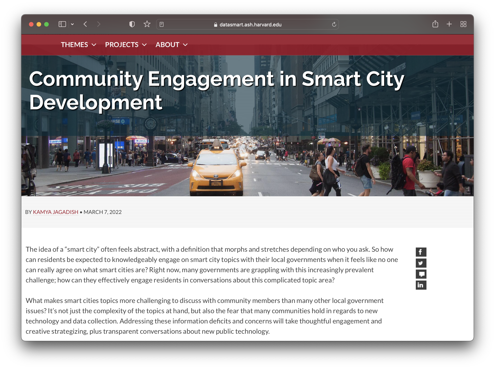

1. I have always loved maps.
- Story: OLD NYC
- Story: Census / Cranston St.
- Story: Researching house

2. GIS has a learning curve, but will give me an advantage
- Story: bike

3. I should take advantage of the trainings
- Basics: Intro to GIS
- Advanced: Research
    - Why it matters:
        - Story: AGSL - humanities, critical thinking
        - Possible story if permission: surveillance & light in Chicago
        - Story: Paige finding data
    - Then talk through research materials workshop
        - Don't need a topic
        - Just good to have a sense of what you can do

4. Students love GIS
    - Story: Luisa

5. You can only help students if you have an understand of how it works
    - Story: Historical table in borders

6. You don't have to do it all on your own. Our trainings are designed for you @ exactly the level you're at.
    - Story: Quote from intro workshop
    - Story: TAs for class came to learn how to support students, 2 hours quote, by the end all the questions were about how to make appointments for their own research
    - Story/example: Nora?

List of options:
- how to sign up for workshops
- how to make appointments

