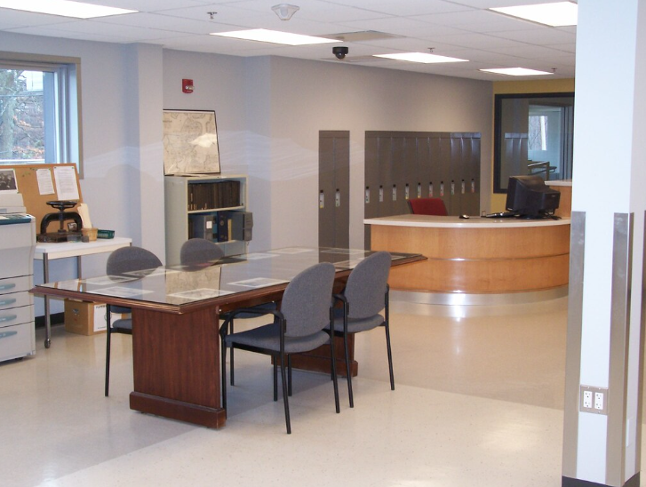
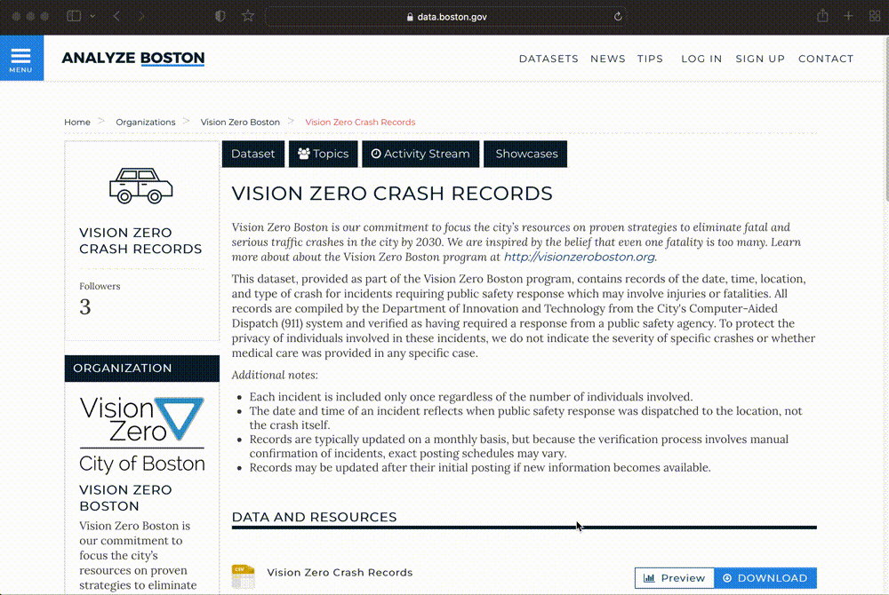

<figcaption class="append"><a href="https://www.oldnyc.org/">OldNYC: Mapping Historic Photographs</a> at the NYPL.</figcaption>

*1880 census from [Archive.org](https://archive.org/details/10thcensus0561unit/page/n45/mode/2up?view=theater).* 

*[ArcGIS Map](https://harvard-cga.maps.arcgis.com/apps/webappviewer/index.html?id=4f084606c3f64df8a32ce2ad938a43f6) comparing 1890 atlas to today.* 

*Belle's house in college.*

*City of Boston Archives Reading Room.*

*19th century insurance atlas, open to a plate of downtown Boston.*

<iframe width="100%" height="550" src="https://atlascope.leventhalmap.org/#view:embed$base:000$overlay:39999059010718$zoom:18.00$center:-7914725.872110603,5210447.532772563$mode:glass$pos:204"></iframe>

*[Analyze Boston](https://data.boston.gov/group/geospatial), Boston's open data portal.*

*Vision Zero dataset, open as a table.*

*Bike crash data displayed visually as individual points in GIS software.*

<figcaption class="append">Introduction to GIS workshop in the <a href="https://libcal.library.harvard.edu/calendar/main?t=d&q=GIS&cid=15049&cal=15049&inc=0">library calendar.</a></figcaption>

<figcaption class="append">GIS Research Strategies workshop in the <a href="https://libcal.library.harvard.edu/calendar/main?t=d&q=GIS&cid=15049&cal=15049&inc=0">library calendar.</a></figcaption>

## Humanities + critical thinking

<figcaption class="append"><a href="https://www.atlasobscura.com/places/the-american-geographical-society-library-milwaukee-wisconsin">American Geographical Society Library</a></figcaption>

<figcaption class="append">Real Estate maps of Chicago from 1929 in the <a href="https://www.davidrumsey.com/luna/servlet/detail/RUMSEY~8~1~310464~90080234:Composite--Chicago,--Illinois---She?sort=pub_list_no_initialsort%2Cpub_date%2Cpub_list_no%2Cseries_no&qvq=q:nathan%20nirenstein%20chicago;sort:pub_list_no_initialsort%2Cpub_date%2Cpub_list_no%2Cseries_no;lc:RUMSEY~8~1&mi=4&trs=5">David Rumsey map collection.</a></figcaption>

<figcaption class="append"><a href="https://mapping.share.library.harvard.edu/posts/russian-language/">Mapping project</a> by student Paige Lee, created in <a href="https://d3js.org/">D3.js</a>.</figcaption>

<figcaption class="append">Read about Paige's project on our <a href="https://mapping.share.library.harvard.edu/posts/russian-language/
">blog.</a></figcaption>

<figcaption class="append"><a href="https://www.landgrabu.org/">Land-Grab Univerisities</a> interactive digital project.</figcaption>

<figcaption class="append"><a href="https://dsl.richmond.edu/panorama/redlining/#loc=5/39.1/-94.58">Mapping Inequality</a> project via the University of Richmond's Digital Scholarship Lab.</figcaption>

<figcaption class="append">Mapping project by student Luisa Shido, created in QGIS.</figcaption>

*[Map of Boston from 1743](https://collections.leventhalmap.org/search/commonwealth:9s161952m).*

*GIS heatmap of density of restaurants in Boston.*

<iframe title="Interactive map of the Polish cities statistical data. Hovering over each city reveals information about the city." src="https://harvardmapcollection.github.io/classes/gened1140/fall-2022/assignment/demo/polish-cities/" width="100%" height="600px"></iframe>
<figcaption class="append">Historical Polish data from the 1910s in GIS format.</figcaption>

<figcaption class="append">Table from American Political Science Review.</figcaption>

<h2 style="text-align: center;">2 hours?</h2>

## Next Steps

- Email maps@harvard.edu or belle_lipton@harvard.edu
- Workshop signups on the library calendar
- We will help design + scaffold assignments
- We will schedule custom workshops

