## Pre-work to complete before class

### Homework #1: Set up your OSF.io account
1. Instantiate your [Harvard OSF (Open Science Framework)](https://library.harvard.edu/services-tools/open-science-framework) account.

  If you do not have a Harvard Key, you can make a free, non-affiliate account on <a href="https://osf.io/">osf.io</a>.

2. Select `Create New Project`.

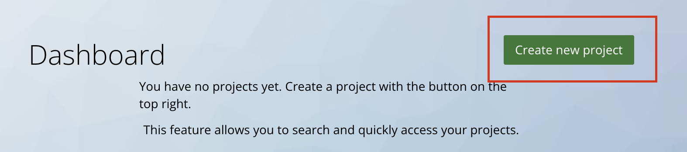

3. Name your new project `Data Management Workshop`.

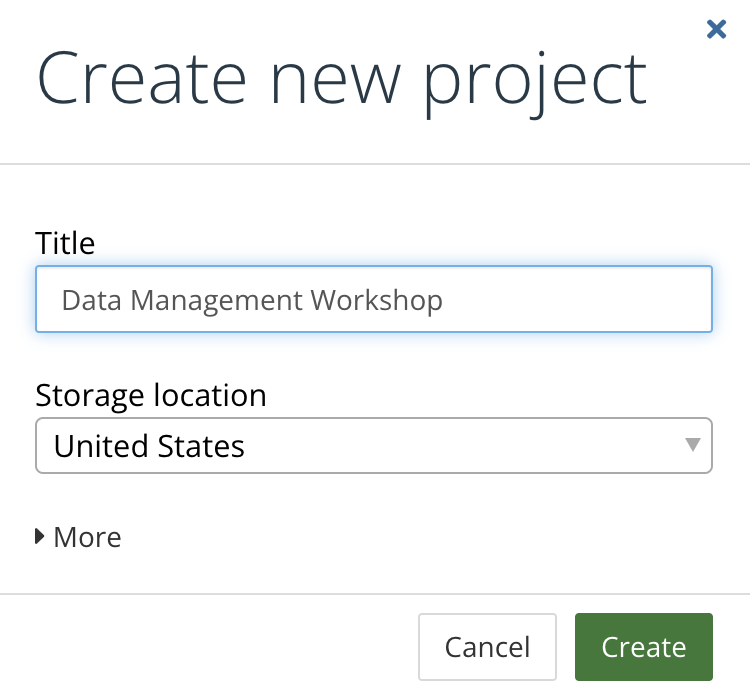

### Homework #2: Framing ideas

Read this [article about balancing data safety and open science](https://mapping.share.library.harvard.edu/posts/potterbusch/) in an academic research context.

## In-class workshop

### 1. Saving in reusable formats

#### Discussion

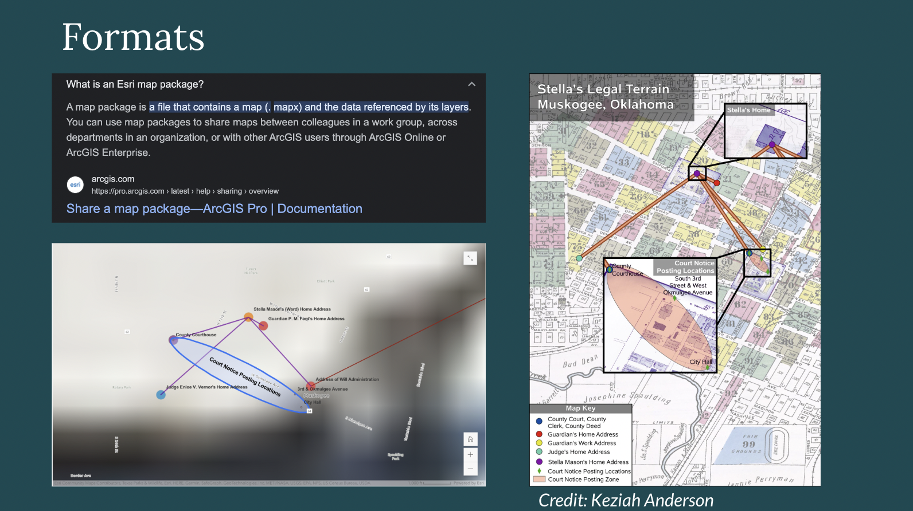

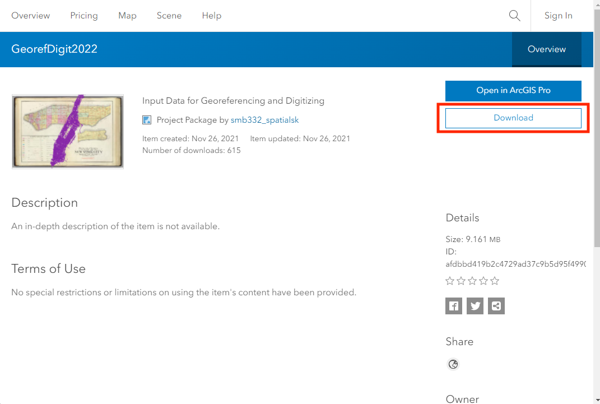

<em>While ESRI map package formats are the default, they are not backwards-compatible.</em>

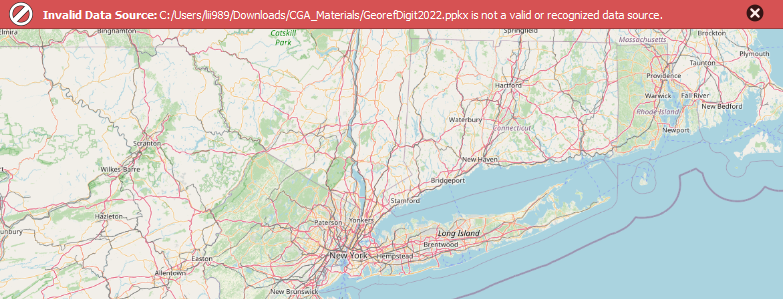

<em>ESRI map packages are not recognized by open source GIS software.</em>

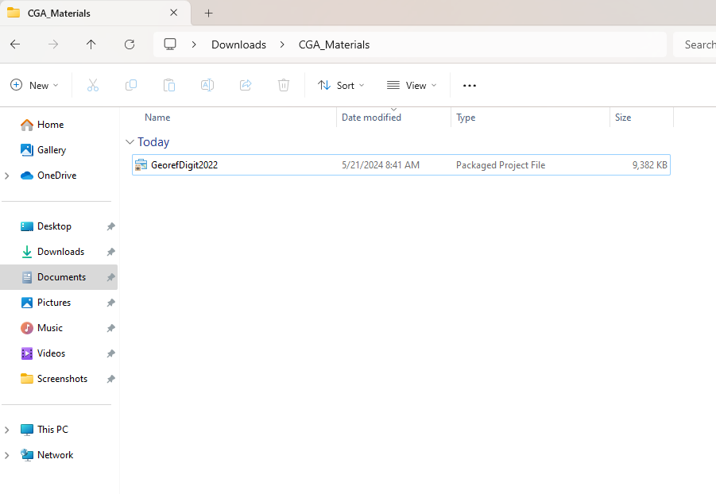

<em>ESRI map package file in a downloads folder</em>

⚠️ If we want any of our data layers to be accessible, we need to export them to more persistent file formats. 

#### Activity 

We will start using an updated version of the original map package, which includes datasets at the stage of the completed tutorial, so instead of an ungeoreferenced map, we have a georeferenced map of 1891 NYC, and a new polygon file that starts to trace out historical boundaries. 

##### Step 1: Open the source data

1. Download `ESRI_FILES.zip` from the [OSF.io example repository](https://files.osf.io/v1/resources/5ywg7/providers/osfstorage/664e09be65e1de093e893b60/?zip=), and uncompress or extract the folder, so that you can double-click `GEOREF_DIGITIZE.ppkg` and open it in ArcGIS Pro.

##### Discussion 

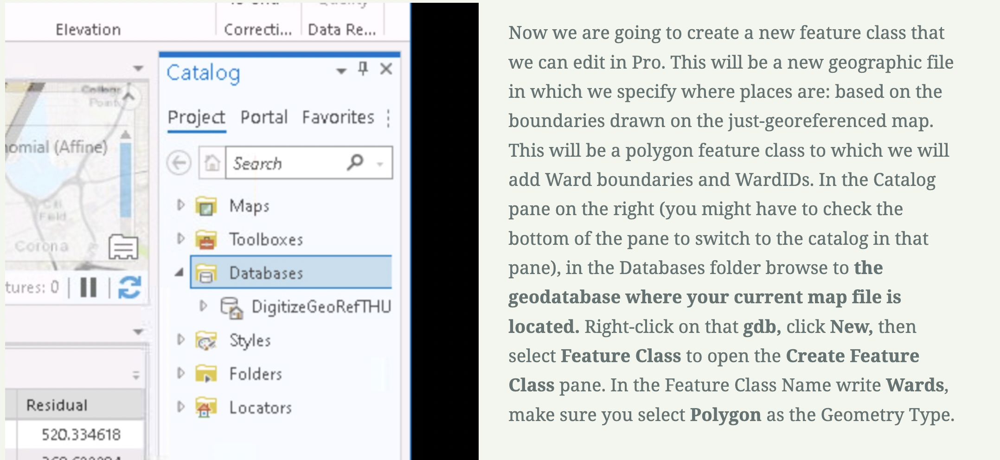

<em>Defaults in ArcGIS Pro are problematic for data management.</em>

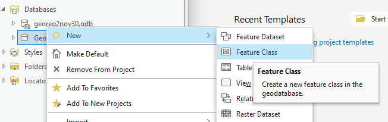

<em>Creating feature class inside a file geodatabase.</em>

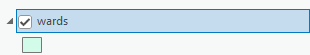

<em>Newly defined feature class in the ArcGIS Pro layer pane.</em>

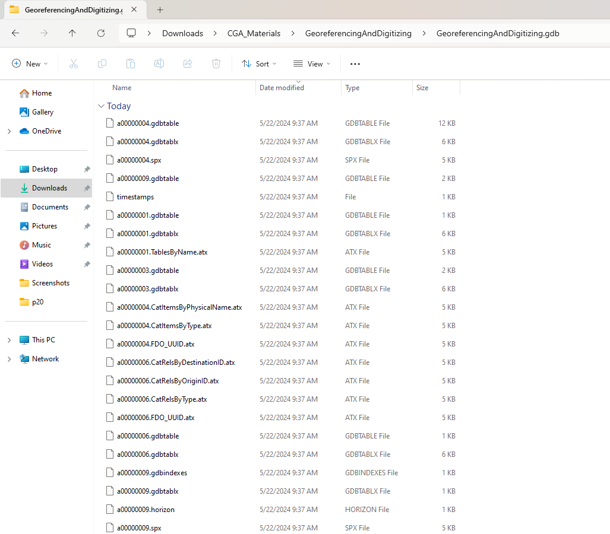

<em>What the?</em>

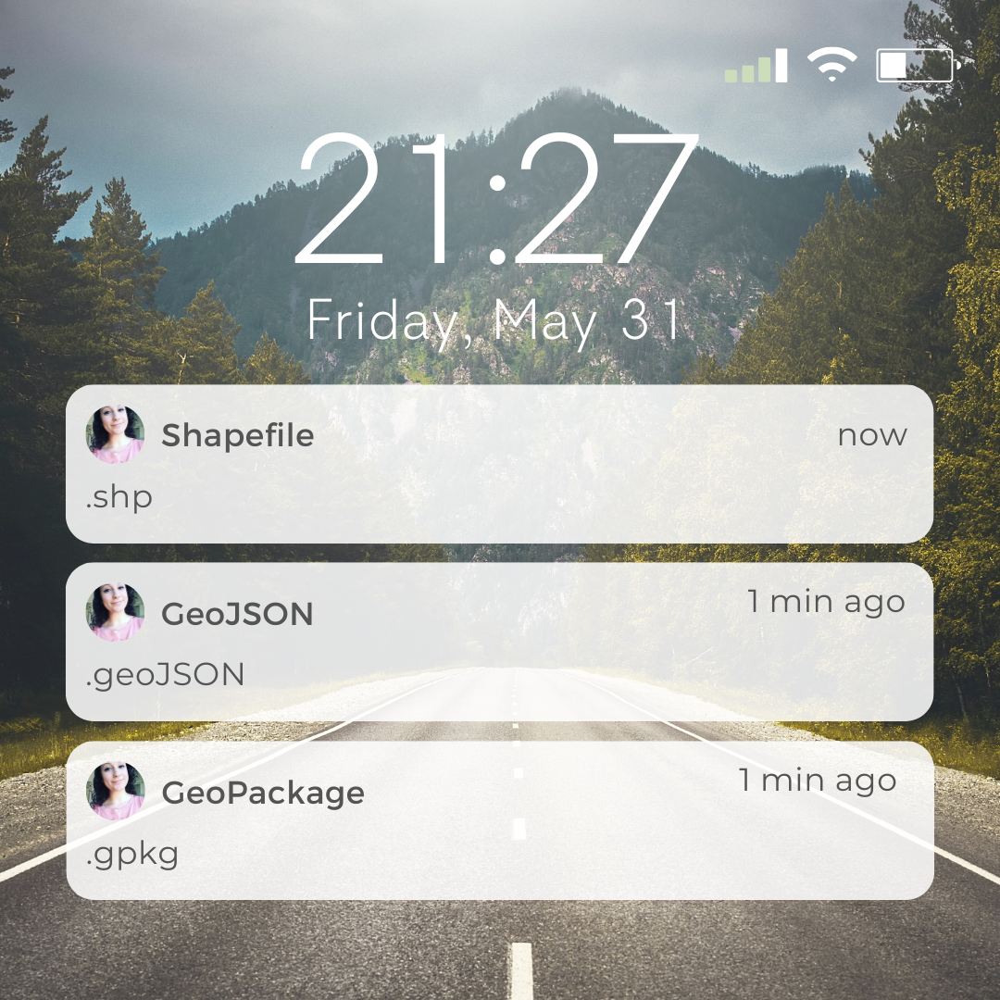
_Texts from Belle reminding you which formats to use 😸_

##### Step 2: Export to Shapefile

1. Navigate to `Analysis` → `Tools` 

2. Search for `Export Features`

3. Under `Input Features` select `Wards`

4. Click the folder icon next to `Output Feature Class` and choose a regular folder (not an ESRI file geodatabase) on your computer where you'd like to save the shapefile. 

5. Select `Run`

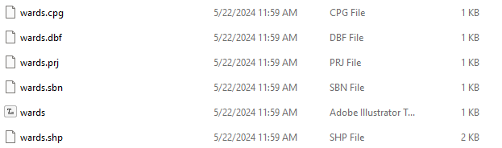

<h5>Step 3: Export to GeoJSON</h5>
<ol>
<li>Navigate to Analysis → Tools </li>
<li>Search for Features to JSON (Conversion)</li>
<li>Under Input Features select Wards: 1</li>
<li>Click the folder icon next to Output Feature Class and choose a regular folder (not an ESRI file geodatabase) on your computer where you'd like to save the .geoJSON</li>
<li>Check (select) Output to GeoJSON</li>
<li>Select Run</li>
</ol>

##### Discussion

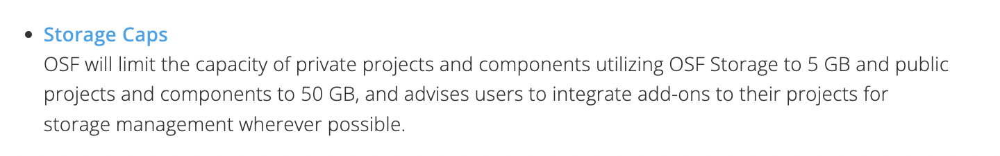

<em>OSF.io has a cap on storage.</em>

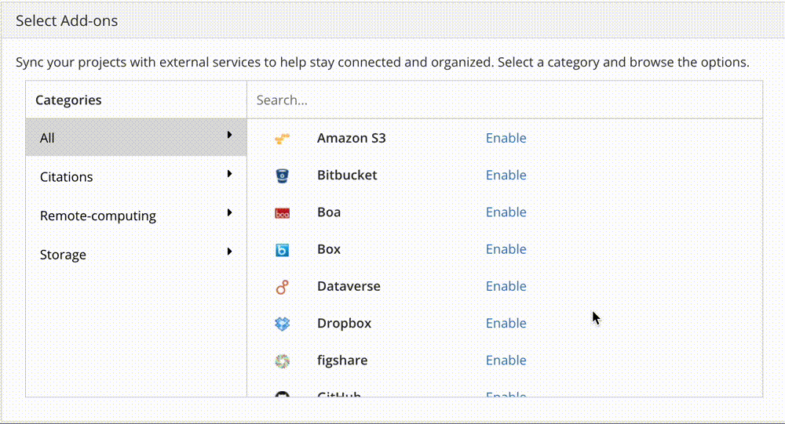

<em>Storage integration options.</em>

##### Step 4: Export to GeoTIFF

1. Navigate to `Analysis` → `Tools` 

2. Search for `Copy Raster`

3. Under `Input Raster` select `manhattan.sid`

4. Choose an output location in a folder on your computer to save the output, and name the file. 

5. Under `Format` select `TIFF format`. 

### 2. Upload data to OSF.io

1. Zip up `shapefile` and `geoTIFF` files, separately

2. Open [OSF.io](https://osf.io/dashboard) account and navigate to your `Data Management Workshop` project folder

3. Organize project folders and discuss

4. Upload the three datasets: zipped geoTIFF, zipped shapefile, and geoJSON

5. Discuss file formats and relationships and segue into mockumentation exercise 

### 3. Mockumentation

Look at example README files, and collaboratively create documentation for this project. 

## Resources
[Example OSF repository](https://osf.io/5ywg7/files/osfstorage#)

[DIY documenatation guide](https://mapping.share.library.harvard.edu/resources/researchers-handbook/prompts/)

[Make a consultation](https://library.harvard.edu/staff/belle-lipton)

