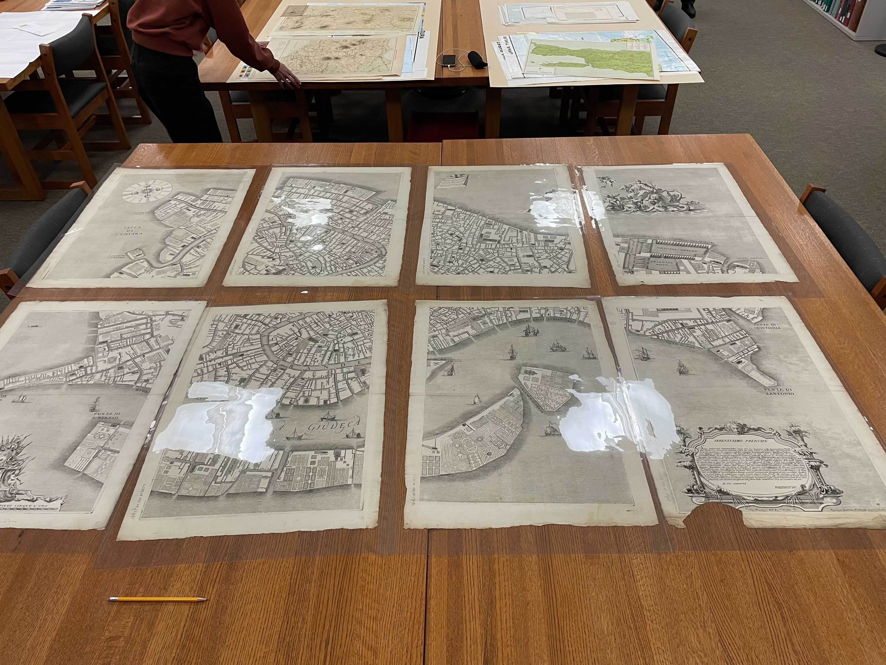
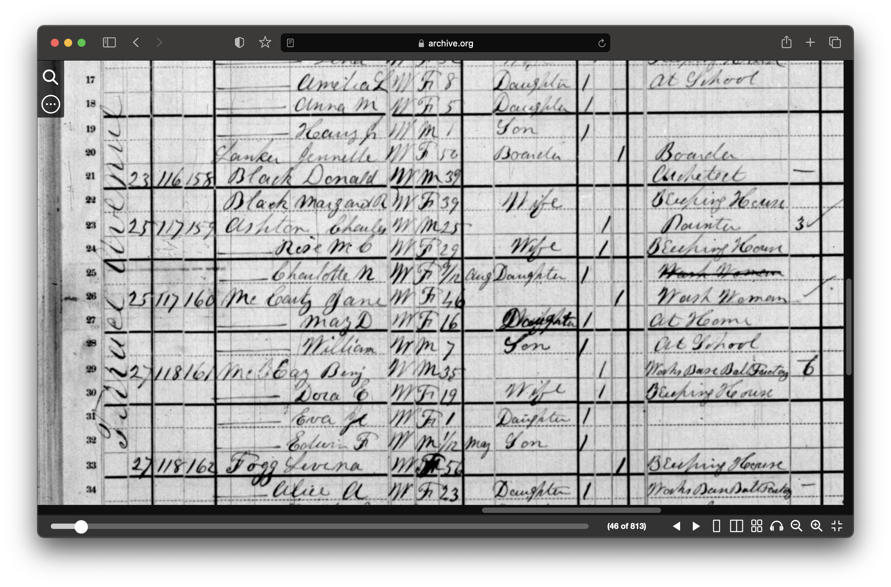
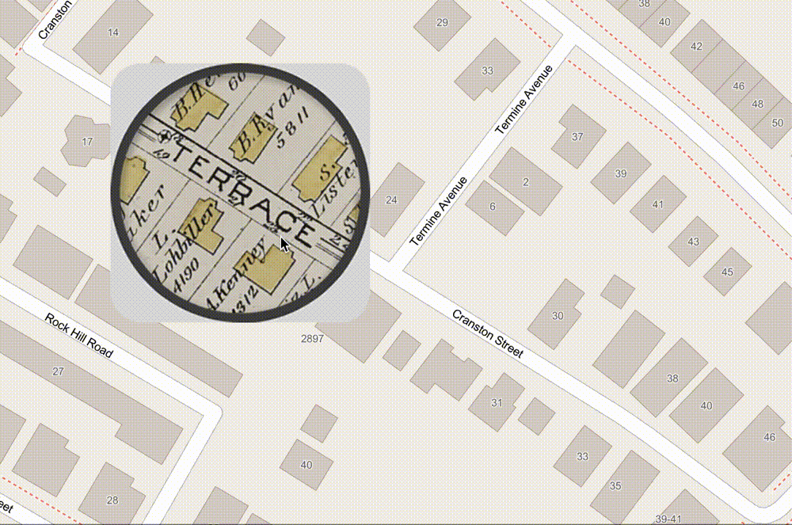
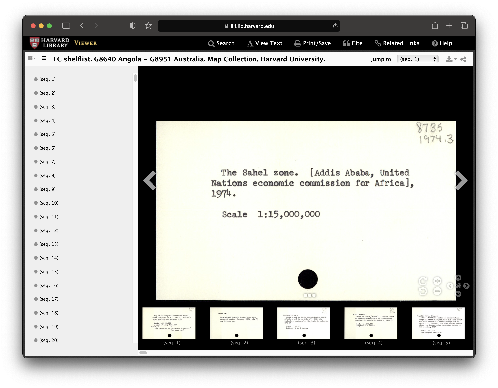
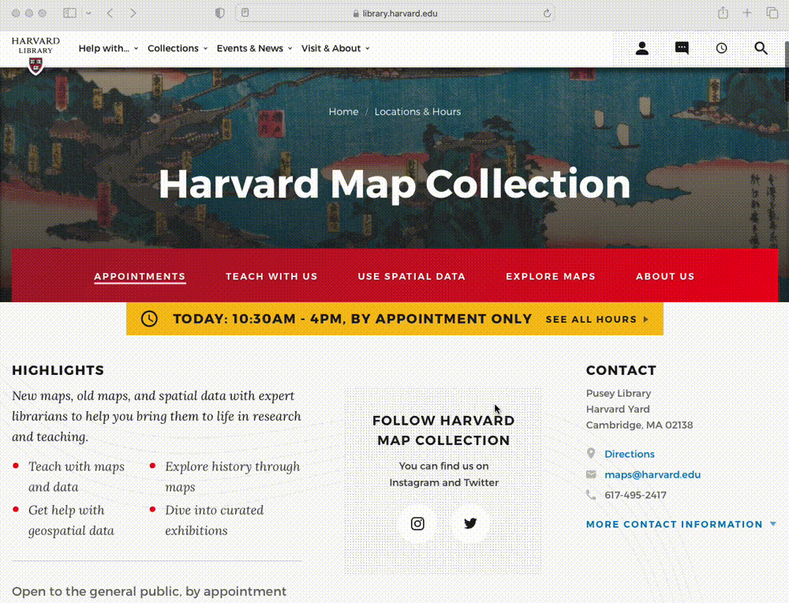

## Classes

### GSD: Spatial Analysis

*[Fall 2021 presentation](https://docs.google.com/presentation/d/141irEQNA3_SAY2sWqDPoZAheSil0gZZR7yfGWNJhVKg/edit#slide=id.gea70bf8953_0_22).* 

*Map [created by](https://mapping.share.library.harvard.edu/blog/2021/vis-2128/) GSD students Aeshna Prasad, Michael Lidwin, Megan Mcglinchey, and Mehvish Jamal working with the Map Collection.* 

## Data management

*[OldNYC: Mapping Historic Photographs at the NYPL](https://www.oldnyc.org/).* 

*1880 census from [Archive.org](https://archive.org/details/10thcensus0561unit/page/n45/mode/2up?view=theater).* 

*[ArcGIS Map](https://harvard-cga.maps.arcgis.com/apps/webappviewer/index.html?id=4f084606c3f64df8a32ce2ad938a43f6) comparing 1890 atlas to today.* 

*[Global volcanoes dataset](https://hgl.harvard.edu/catalog/harvard-glb-volc) in the Harvard Geospatial Library (HGL).* 

## Research

*Record from  [Harvard Map Collection card catalog](https://iiif.lib.harvard.edu/manifests/view/drs:45555303$402i).* 

## Services and Resources

_The Harvard Map Collection maintains a series of [tutorials, guides, and updates](https://gis-harvard.pubpub.org/) about mapmaking._

_We offer workshops available via the [library events calendar](https://libcal.library.harvard.edu/calendar/main?cid=15049&t=d&d=0000-00-00&cal=15049&inc=0)._

_Join us for [GIS Office Hours](https://libcal.library.harvard.edu/calendar/main?t=d&q=GIS%20Office%20Hours&cid=15049&cal=15049&inc=0)._

_For in-depth one-on-one consultations make an appointment frome the [Harvard Map Colletion Website](https://library.harvard.edu/libraries/harvard-map-collection)._

## maps@harvard.edu

For any questions, you can contact us at [maps@harvard.edu](mailto:maps@harvard.edu).