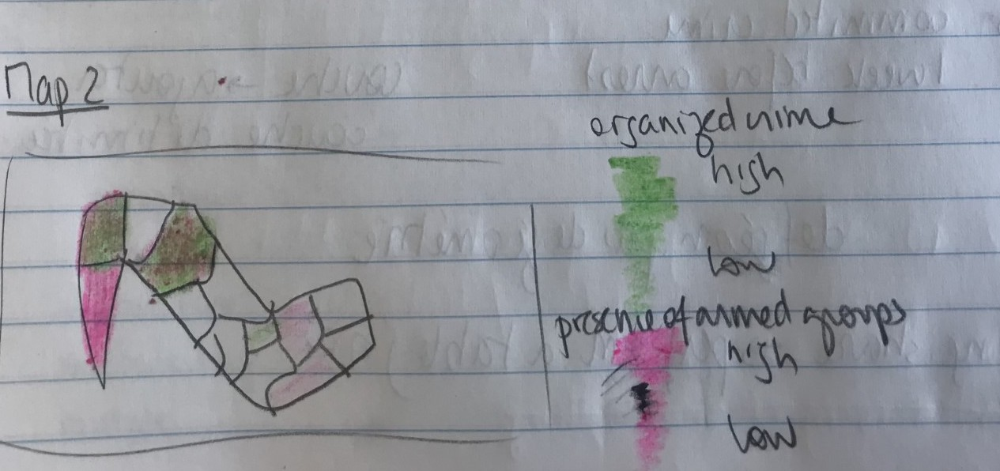

_GIS vector dataset showing [historic old growth trees in Washington State](https://geo.wa.gov/maps/61db62e6e6864b579e0e36c005e94e71/about) loaded into QGIS, a map making software._

_[Historic old growth trees in Washington State](https://geo.wa.gov/maps/61db62e6e6864b579e0e36c005e94e71/about) dataset in QGIS table view._

<iframe title="Example of polygon data showing towns in Massachussetts you can hover over to expose the column information" src="https://harvardmapcollection.github.io/classes/gened1140/fall-2022/assignment/demo/polygon-data/" width="100%" height="500px"></iframe>

<figcaption class="append"><a href="https://hgl.harvard.edu/?_gl=1%2A98bqbg%2A_ga%2AMTk0NzAyODI4Ni4xNjY4NDYxOTEz%2A_ga_3CXC97RWEK%2AMTY4MTE0OTEzMS44Ni4xLjE2ODExNDk5MTcuNjAuMC4w&f%5Bdc_format_s%5D%5B%5D=Shapefile&f%5Bdct_provenance_s%5D%5B%5D=Harvard&page=711&q=&search_field=all_fields">Harvard Geospatial Library (HGL)</a></figcaption>

_Georeferenced map of Poland from 1919._

<iframe width="100%" height="700" src="https://iiif.lib.harvard.edu/manifests/view/drs:21684875$3i" title="Russian Atlas" ></iframe>
<figcaption class="append"><a href="https://iiif.lib.harvard.edu/manifests/view/drs:21684875$3i">Russian Atlas, consisting of forty-four maps..., 1792.</a></figcaption>

_Example historical GIS data derived from library archives._

<figcaption class="append"><a href="https://github.com/HarvardMapCollection/geocards-placeholder/blob/main/documentation/glossary.csv">Playing card geodata translations codebook.</a></figcaption>

<iframe width="100%" height="700" src="https://iiif.lib.harvard.edu/manifests/view/drs:459291544$3i" title="Rewilding Harvard" ></iframe>
<figcaption class="append"><a href="https://hollisarchives.lib.harvard.edu/repositories/4/resources/4258/digital_only">Drawings and sketches by W.D. Peck, 1793-1807, Harvard University Archives.</a></figcaption>

_[Office of Scholarly Communications blog about open access](https://osc-harvard.pubpub.org/)._

<iframe width="100%" height="700" src="https://mapping.share.library.harvard.edu/" title="Russian Atlas" ></iframe>
<figcaption class="append">GIS Outreach <a href="https://mapping.share.library.harvard.edu/">blog, student project examples, and tutorials.</a></figcaption>

## Blog benefits
- Example student projects, such as Paige Lee's
- Make partnerships visible, for instance collaborations with other librarians

_Helping model [project documentation](hhttps://github.com/HarvardMapCollection/jb-pae) in the Harvard Kennedy School Masters of Public Policy students._

_Examples of Harvard [Data Security Levels](https://security.harvard.edu/data-security-levels-research-data-examples)._

_[Spatial methods](https://hughst.github.io/week-4/) for public health data, project data via [code.harvard.edu](code.harvard.edu)._

_Map sketch by HKS Public Policy student Justine Baillairt._

_Scoping map design for publication, based on students' style goals - [flight maps](https://www.gis-blog.com/flight-connection-map-with-r/)._

_Homepage of the [Black Teacher Archive](https://bta.share.library.harvard.edu/)._

_Exploration resulting from a 45 minute consultation._

## Questions

[belle_lipton@harvard.edu](mailto:belle_lipton@harvard.edu)
