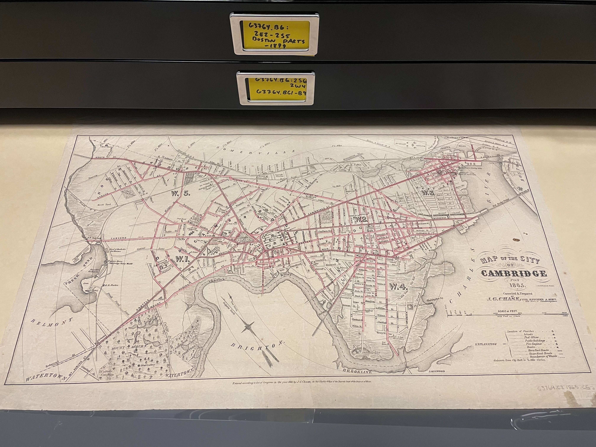
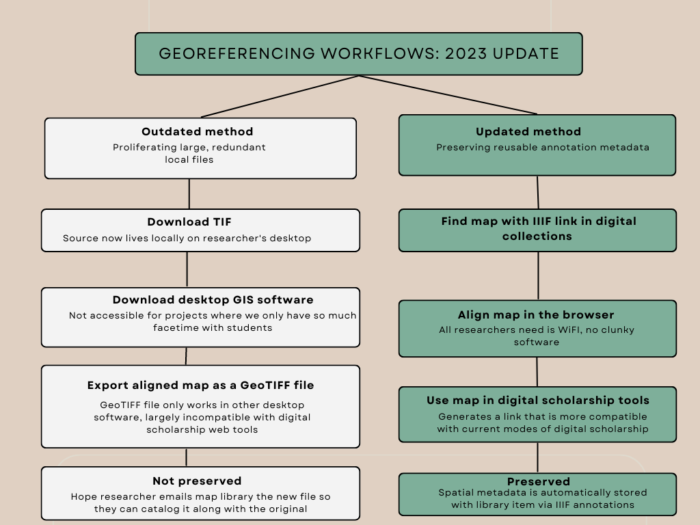
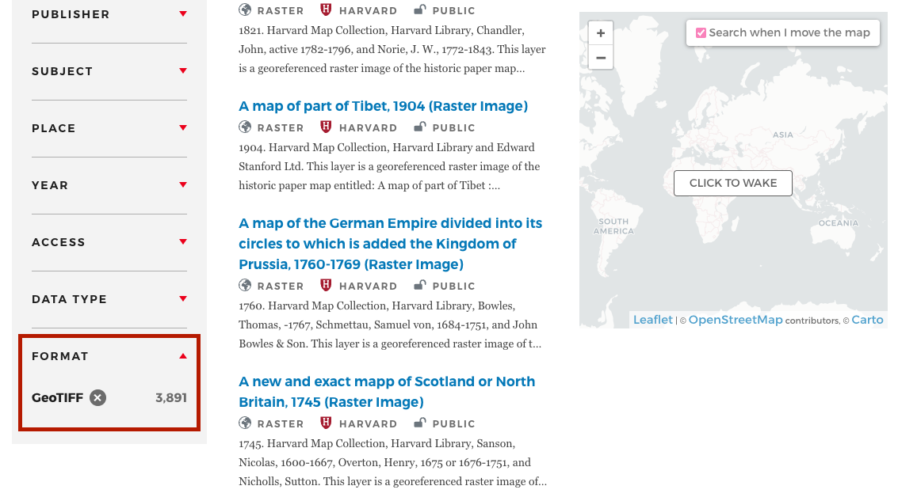
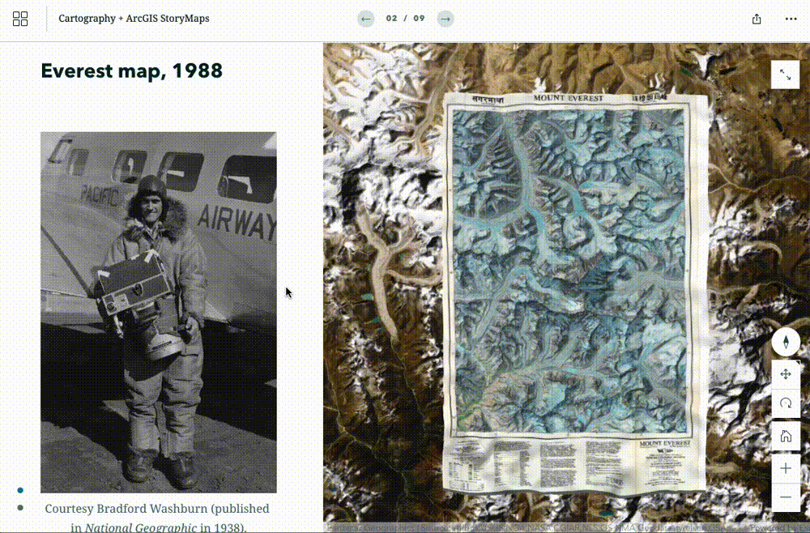
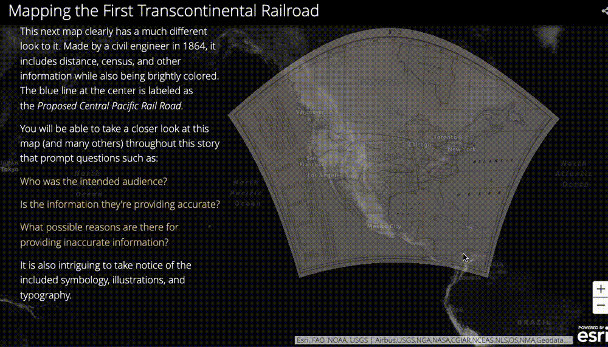
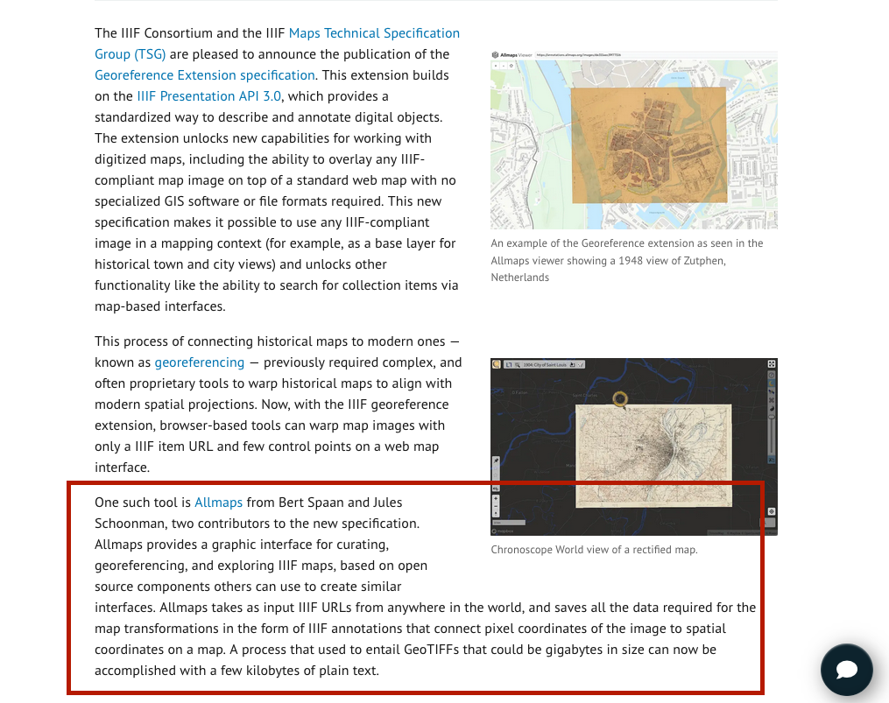
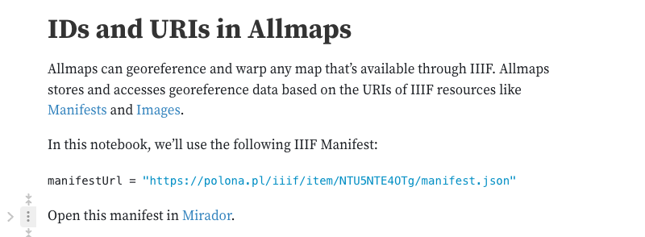

_Credit: Joan Brunetta and Eve Loftus._

<iframe width="100%" height="700" src="https://iiif.lib.harvard.edu/manifests/view/ids:2568928" title="Map of the city of Cambridge for 1865" ></iframe>
<figcaption class="append"><a href="https://curiosity.lib.harvard.edu/scanned-maps/catalog/44-990094789400203941">Map of the city of Cambridge for 1865, Harvard Map Collection.</a></figcaption>

_[Mapping Inequality, University of Richmond](https://dsl.richmond.edu/panorama/redlining/#loc=13/41.925/-87.739&city=chicago-il&area=C118)_

## How does it work?

 
 
 

## Current set up

_[Harvard Geospatial Library](https://hgl.harvard.edu/?_gl=1*1rnkd7y*_ga*OTU5OTg4NjIzLjE2NjgwMTE5ODY.*_ga_3CXC97RWEK*MTY4NjU5MTg2NC45Ny4xLjE2ODY1OTQyMTEuNjAuMC4w)_

## Why not GeoTIFF?

- Time consuming for researchers and library staff
- Hard to use, outdated format
- Completely different app - bad for discovery
- Incompatible with tools our students are using

_Credit: John Nelson's [Mapping Mount Everest](https://storymaps.arcgis.com/collections/bfaf06d067f941bebd74cf1a86d39a06?item=2/)_

_Credit: Andria Olson's [Mapping the First Transcontinental Railroad](https://stanford.maps.arcgis.com/apps/MapSeries/index.html?appid=2f3728c0622743adb5d3b2ab0e00ce6c)_

_[IIIF Georeference Extension specification](https://iiif.io/news/2023/05/15/georef-extension-published/)_

_Picture of the IIIF conference hosted at Harvard in 2022 from the [British Library Digital Scholarship blog](https://blogs.bl.uk/digital-scholarship/2022/06/iiif-conference-2022.html)._

_From our guide on [georeferencing Harvard map collections using IIIF](https://mapping.share.library.harvard.edu/tutorials/georeferencing/allmaps/)._

## Questions?

- Harvard Map Collection - maps@harvard.edu 
 
- Belle's email - belle_lipton@harvard.edu