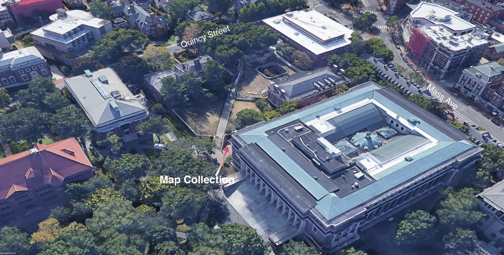
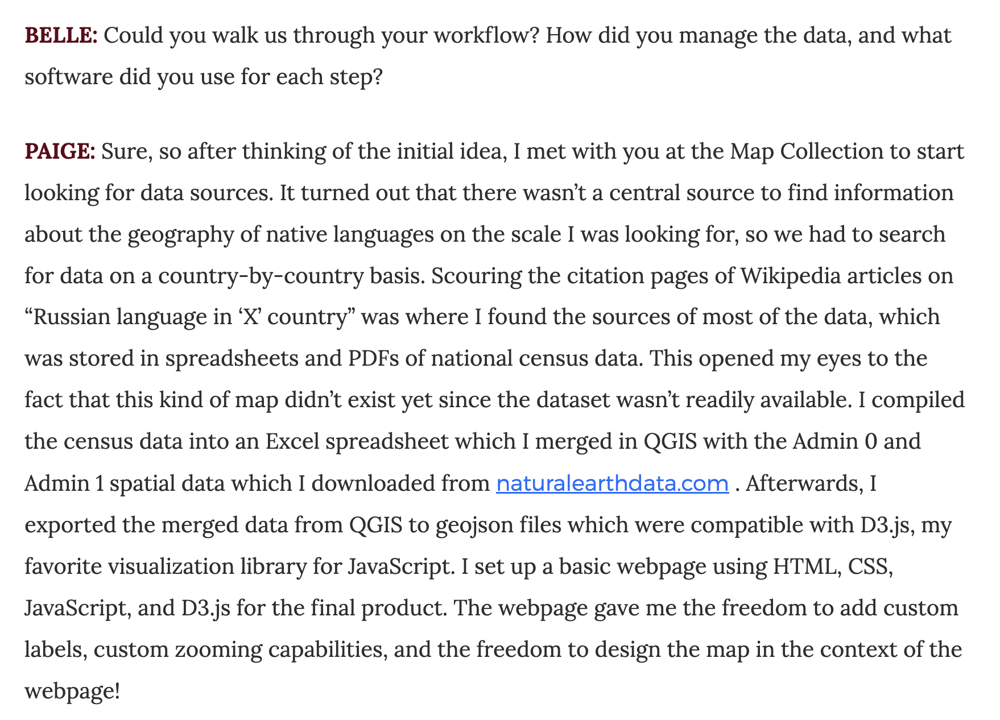
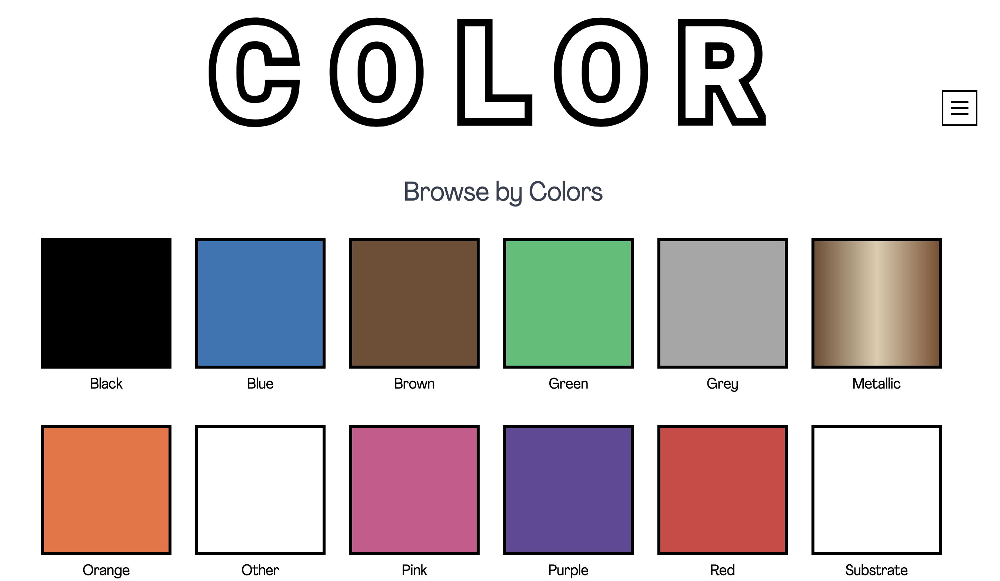
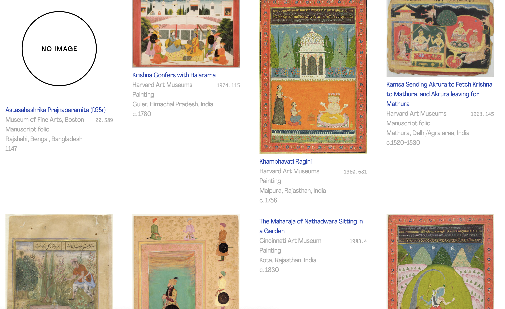
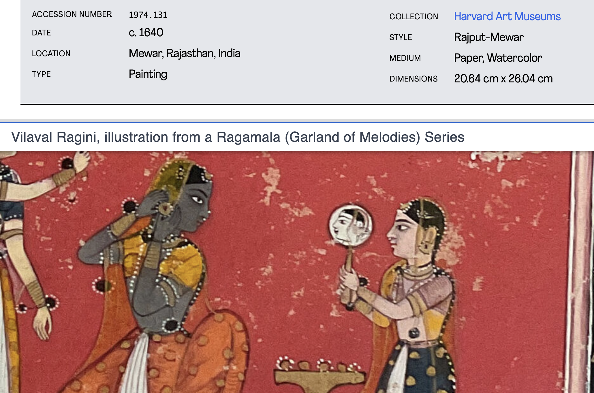
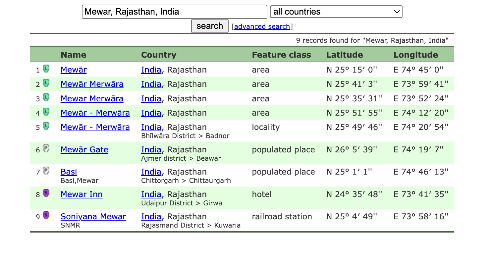
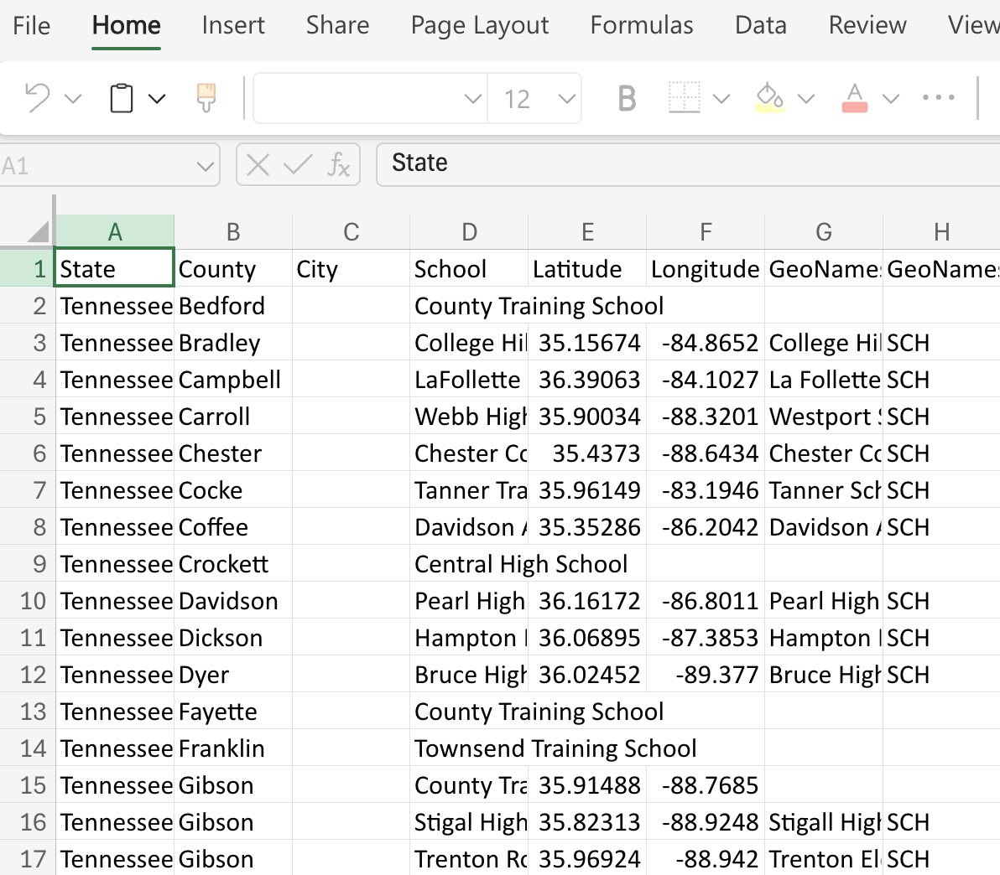
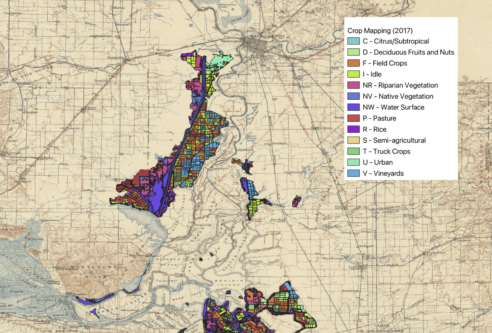

## Harvard Map Collection

- finding map sources
- finding GIS data sources
- GIS methods and software
- [1:1 appointments](https://library.harvard.edu/libraries/harvard-map-collection)
- [drop-in office hours](https://libcal.library.harvard.edu/calendar/main?t=d&q=gis&cid=15049&cal=15049&inc=0)
- [workshops](https://libcal.library.harvard.edu/calendar/main?t=d&q=gis&cid=15049&cal=15049&inc=0)
- in-class activities
- [technical tutorials](https://mapping.share.library.harvard.edu/)
- [example student projects/case studies](https://mapping.share.library.harvard.edu/tags/news/)

*** 

## Case studies
### [Mapping the Russian Language](https://mapping.share.library.harvard.edu/posts/russian-language/)

<iframe width="100%" height="700" src="https://eelegiap.github.io/russophonemap/index.html" title="Paige's project" ></iframe>
<figcaption class="append">Paige's project. Hover for interactivity.</figcaption>

### [Mapping Color](https://mappingcolor.fas.harvard.edu/)

#### Search by color

#### Search by color results

#### Artwork metadata with location

#### Geonames database

### [Black Teacher Archive](https://curiosity.lib.harvard.edu/black-teacher-archive)

<iframe width="100%" height="700" src="https://iiif.lib.harvard.edu/manifests/view/drs:495175316$13i" title="Russian Atlas" ></iframe>

***

## Paid research assistantships in the Map Collections

### In the field

### Creating spatial data

### Spatial overlay for climate studies

***

## Ways to connect

1. Know you need help with your data right away? [Make an appointment]((https://library.harvard.edu/libraries/harvard-map-collection)) with research librarian Scott Walker in the Harvard Map Collection.

2. Know you generally would like to work with the Harvard Map Collection and want to chat about options?
- [Make an appointment with Belle](https://library.harvard.edu/staff/belle-lipton)
- Drop in to [weekly office hours]((https://libcal.library.harvard.edu/calendar/main?t=d&q=gis&cid=15049&cal=15049&inc=0)) (no appointment required!)

3. Belle will be back in class on **November 5th** to help brainstorm project ideas, and on **November 12** to walk us through a [hands-on activity](https://mapping.share.library.harvard.edu/resources/finding-data/in-class-activity/) about how to find and edit your project data. 

