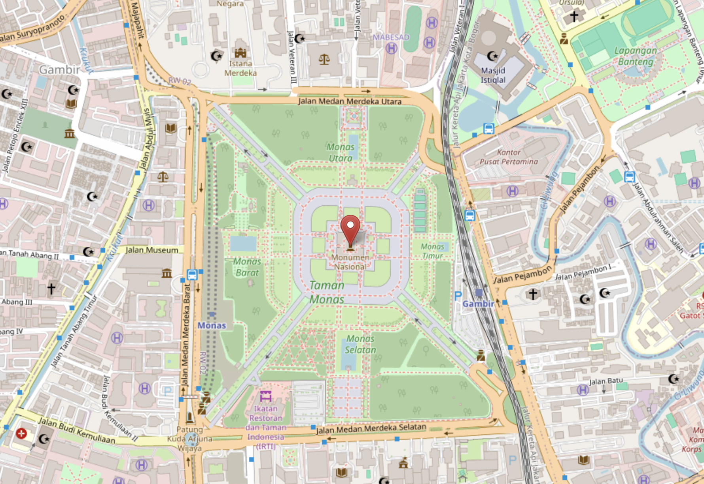
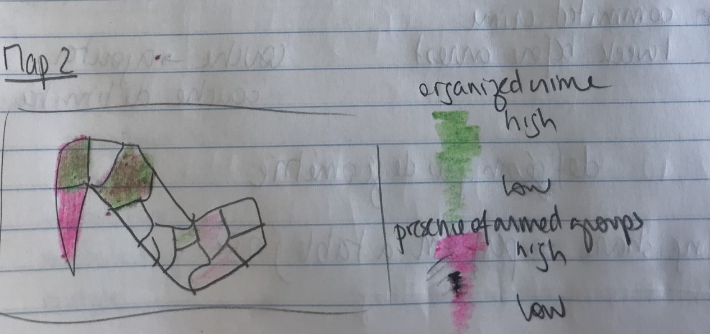
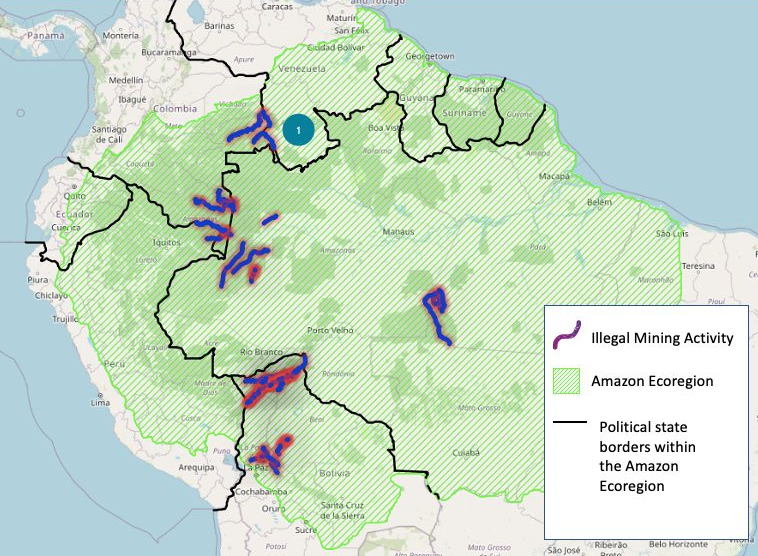
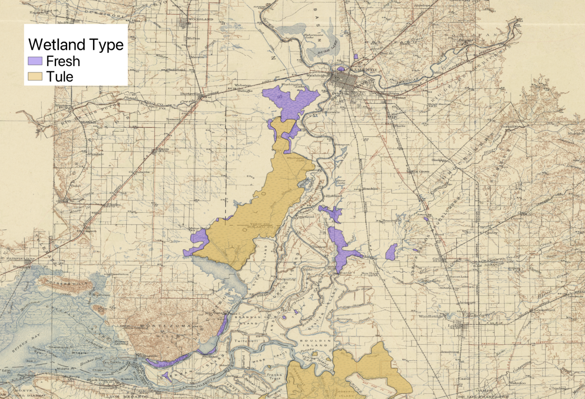
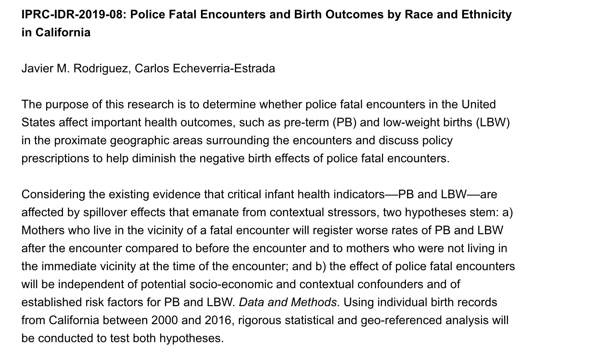
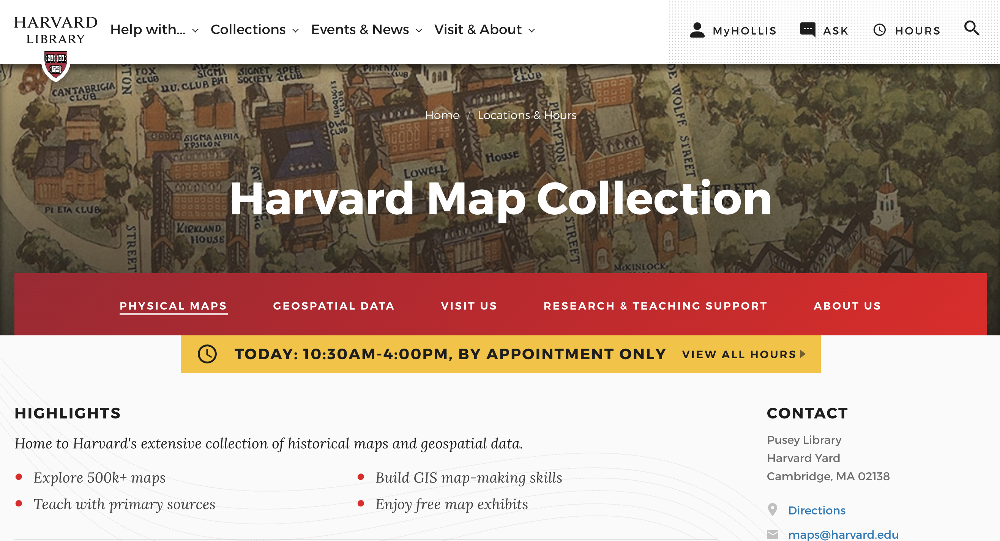

## Story #1
1. A student needed help finding geospatial data and we made them a step-by-step tutorial. 

- Here is [the tutorial](https://mapping.share.library.harvard.edu/tutorials/data-curation/openstreetmap/) to obtain crowd-sourced OpenStreetMap data developed for the student. 

## Story #2

2. A student was still developing the concept for their mapping project and used their initial Harvard Maps consult to brainstorm and sketch out ideas.

_Map sketch by HKS student Justine Baillart._

## Story #3

3. Students make use of GIS resources beyond class projects.

## Story #4

4. Students take advantage of Map Collection networks and expertise for mixed methods.

- Example of [vectorizing and spatial analysis](https://mapping.share.library.harvard.edu/projects/adler/).

### Consultations

_The best way to find maps or data is to make an appointment on the [Harvard Map Collection website](https://library.harvard.edu/libraries/harvard-map-collection)._

### Questions
Or, you can follow up with any questions by emailing:
`belle_lipton@harvard.edu`

