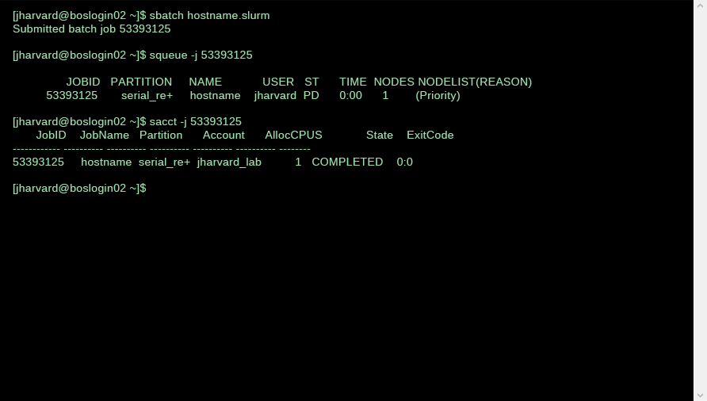

In this interview, we are lucky to speak with [Ceilyn Boyd](https://www.iq.harvard.edu/people/ceilyn-boyd), the Dataverse Development Project Manager at Harvard’s Institute for Quantitative Social Science (IQSS). Prior to her role with IQSS, Ceilyn served as the Manager of the Harvard Library Research Data Management Program. In this interview, she provides an invaluable tour around the complex research data ecosystem of Harvard University.

BELLE LIPTON: Hi Ceilyn. Thank you for speaking with us. We believe you are the ideal person to explain research data services at Harvard, given your experience working with the libraries in a data services role and your current position with Harvard Dataverse. During your time at the library, you conducted thorough assessments of the many services offered to researchers. Could you help us define “data services” for our readers, do you have an elevator pitch?

CEILYN BOYD: That is a good question. The ways data service providers sometimes think about our mental models for conceptualizing research data services can often unintentionally create barriers to access. We might think of interactive diagrams that cover data collection, analysis, publication.

*Example data information lifecycle diagram.*

Researchers usually just want to find someone who can help them with their particular problem. People hear about us through recommendations like, “I know someone who can help you. Have you spoken to so-and-so?” Then, they reach out to us and we connect in person or through virtual meetings. Ideally, we can assist them, but it may not solve their entire problem. This is a challenge we face as service providers: people can encounter us at any stage of their research journey.

LIPTON: What do you think makes Research Data Services at Harvard unique?

BOYD: So, one challenge at Harvard is its large scale. The institution is truly enormous, with a diverse range of research types and collaborations. Many research projects are interdisciplinary, adding to the complexity. There is a significant amount of research conducted here, which contributes to the overall complexity of supporting research data needs.

*Love Data Week at [Countway Library](https://hlrdm.library.harvard.edu/?_gl=1*bw8cgf*_ga*MjAzMTA2OTU0Mi4xNjY3NTAwMTIx*_ga_3CXC97RWEK*MTcwMDI1NTkwOC4yOC4wLjE3MDAyNTU5MDguNjAuMC4w).*

Another issue is the presence of silos — it is widely recognized that things can become isolated. From my observation, individuals often begin by addressing local needs before expanding their efforts outward. They may start by seeking assistance from their local group to solve a problem, asking, “Can anyone assist me with this local need?” The local environment then provides them with a solution, whether it be infrastructure, available accounts, or funding. However, challenges arise when the problem exceeds the scope of the local space and extends across multiple departments or groups. In such cases, it becomes necessary to broaden the search and consider other resources within the environment that are capable of providing assistance.

*[Dataverse training](https://projects.iq.harvard.edu/dataverse-community-meeting/media-gallery/detail/469731/2954871) led by Sonia Barbosa.*

One outstanding aspect of the Harvard environment is the abundance of individuals who are willing to offer help. While it may seem big, impersonal, and complex, there are people who are eager to lend a hand, provide guidance, and dedicate their time. This generosity is a significant advantage, as encountering the attitude of “that’s not my department” is rare. Instead, individuals will suggest connecting with others who may be able to assist, exploring potential solutions together. This willingness to step outside of one’s immediate area and forge connections is another crucial element in addressing complex challenges.

*[Harvard Kennedy School Libraries](https://mapping.share.library.harvard.edu/posts/potterbusch/) sensitive data support for graduate students' Policy Exercise Analysis (PAE).*

Then there are also regulatory factors that you may encounter in your specific type of research. If you are dealing with human subjects research, you may come across specific circumstances where you need to comply with certain regulations. Or, if you are dealing with business data or commercialization involving business and technology, there are other types of factors to consider.

So, the landscape is complex and vast, but there is also a great amount of assistance and support from people who are willing to help you solve your problem and progress your research or project. So, maybe six in one hand, half a dozen in the other. Yes, it’s big. It’s tough to navigate when all the maps go out of date almost instantly. You use your GPS and you end up in a dead end because that particular area has been blocked off now. But as it turns out, there’s a high speed rail line right next door that you can hop on and someone will conduct you along your way.

LIPTON: How do you see the interplay between research disciplines, research data computing and libraries operating specifically within the Harvard context?

BOYD: Let’s use an example. Early in my career, when I worked as a consultant, we frequently received a common question at our firm: how many ships traverse the Panama Canal? The answer is deceptively straightforward: it’s costly. It appears simple enough.

Obtaining that information was very expensive because it was strategically valuable. Nowadays, things might be different as you can simply use boat tracking software (I can’t recall the name). However, in the past, there was a company that sold that dataset for a couple million dollars. Having access to it provided many logistical advantages. They categorized it by ship type, port of origin, and cargo type. If you knew the exact number of containers of a specific type that passed through here on certain days and times, you could efficiently allocate trucks. It was a significant advantage. However, the company that collected the data charged for it.

Imagine you’re a researcher and you need to know roughly how many ships pass through each year. You find out that it’s around 800,000 ships per year by checking Wikipedia. But that’s probably not the specific information you’re looking for. You are likely interested in the number of specific types of ships or ports. You are trying to answer a question related to your hypothesis. So it’s the kind of thing where if you know, you know, right?

And so someone who works in libraries will understand that you want that data, but $5 million!? Yeah, right. So they’ll ask how granular do you need it? The publicly available data doesn’t provide information at the individual household level, right? It’s aggregated to protect people’s privacy. And that’s a big part of what we do, right? People might say, “I’m looking at this,” and we might suggest ways to look at it from a different perspective. But that’s, like, the library answer.

*FAS Research Computing [User Quick Start Guide](https://docs.rc.fas.harvard.edu/kb/quickstart-guide/).*

So let’s balance that again. Let’s say we want to do the most computationally complex thing. So if you ask the research computing folks, they’re gonna say, well, how big is the data? How many data points? What format is the data? Is it a database? Is it tabular data file? Is it one file? Is it 10 million files? Right. They’re gonna ask those questions maybe they’ll ask is this proprietary data that needs to be kept secure in a particular infrastructure with access controls? Can it be backed up? Can it only be backed up in a secure facility? How are you going to do the computation? Using Stata? SPSS? R? And the researcher’s thinking , I just wanted to know how many boat captains. And it’s three weeks before the end of the semester. So it can be overwhelming, if you don’t give it as much planning time as you would other elements of your research.

I understand that this is a challenging environment, but it is also a very rich environment. Decades ago, I worked with someone in the computer graphics field who emphasized the importance of keeping the user interface as simple as necessary to solve the problem. He pointed out that even though a piano keyboard with 88 keys may not be considered a simple user interface, it allows users to create amazing music once they have learned it. Similarly, in this case, the landscape and problems may be complicated, but there is help available in the Harvard environment. People here are incredibly helpful and willing to assist you in solving your problems. So, there is no need to feel alone. Despite the broad and complicated landscape, there will always be people here to support and guide you.

