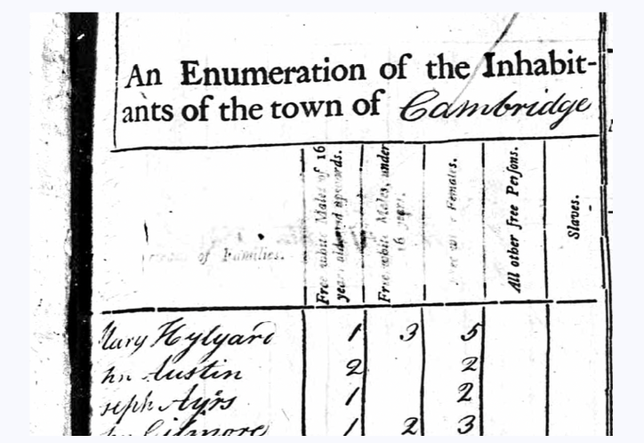
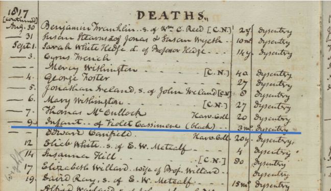

The Harvard Map Collection recently partnered with the [Leventhal Map and Education Center](https://www.leventhalmap.org/) at the
Boston Public Library to support a digital mapping project by scholars Joan Brunetta and Eve Loftus. Joan and Eve's project, titled [Mapping Black Cambridge](https://felt.com/map/Mapping-Black-Cambridge-1790-1820-Snapshots-from-the-First-Four-Federal-Censuses-ghIMa0VXTy6XhXh9A1g2bhA?loc=42.36999,-71.09789,12.89z&share=1), contributes to an evolving landscape of available data used to discern historic dimensions of Black life in Boston and Cambridge. 

Leveraging historic maps and records from local libraries and archives, along with [GIS training services](https://library.harvard.edu/libraries/harvard-map-collection#spatial), Joan and Eve have created a dataset from their meticulous research about Black life in Cambridge in the 19th century. Researchers can now browse Joan and Eve's findings in an [interactive web map](https://felt.com/map/Mapping-Black-Cambridge-1790-1820-Snapshots-from-the-First-Four-Federal-Censuses-ghIMa0VXTy6XhXh9A1g2bhA?loc=42.36999,-71.09789,12.89z&share=1). The source GIS data will soon be available for download via the Leventhal Map & Education Center's [Data Portal](https://data.leventhalmap.org/#/), as well as cross-listed in the Harvard Library's [federated portal for GIS data discovery](https://library.harvard.edu/services-tools/harvard-geospatial-library).

In addition to discovering historic GIS datasets via these portals, researchers can also make use of the library's [trainings](https://docs.google.com/presentation/d/1Kn6eqwqHdORRjKq89uW4HAn-NTAzBoV8lVE9ofhlVDs/edit?usp=sharing) and [guided brainstorming sessions](https://mapping.share.library.harvard.edu/resources/researchers-handbook/long-term-preservation/) on how to maintain and preserve their own historic datasets for long-term discovery and reuse. 

To get inspired for ways to use datasets like these in your research and educational pursuits, consider signing up for our **Asking Spatial Questions Workshop** on April 8th, 2024. In this session, you will learn how to use researcher-created historic GIS datasets to practice spatial thinking, and build these concepts into a mock lesson plan. Space is limited; to join the waitlist, please email maps@harvard.edu.
