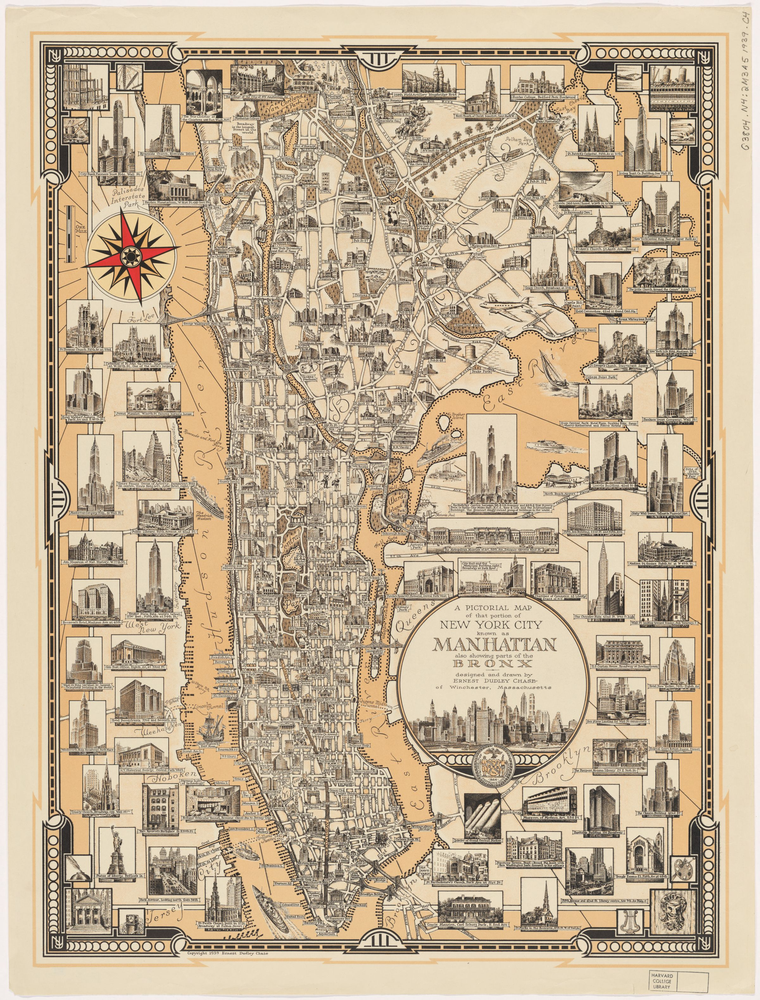
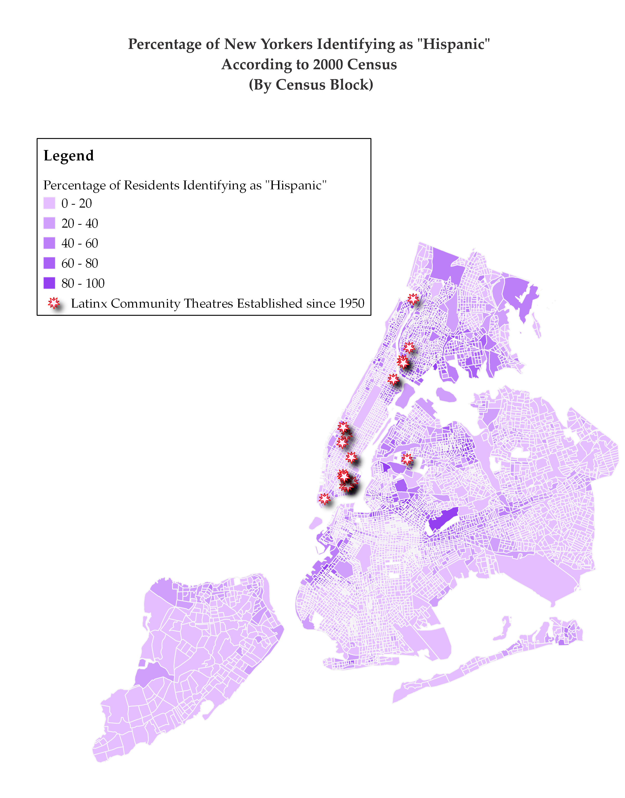
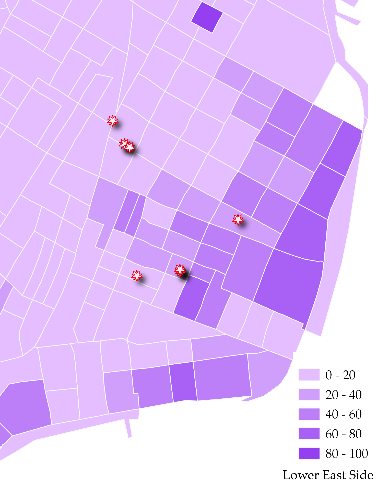
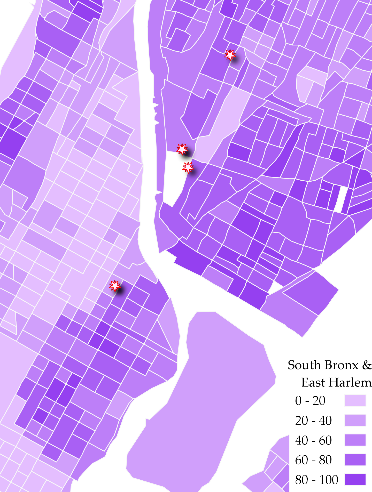
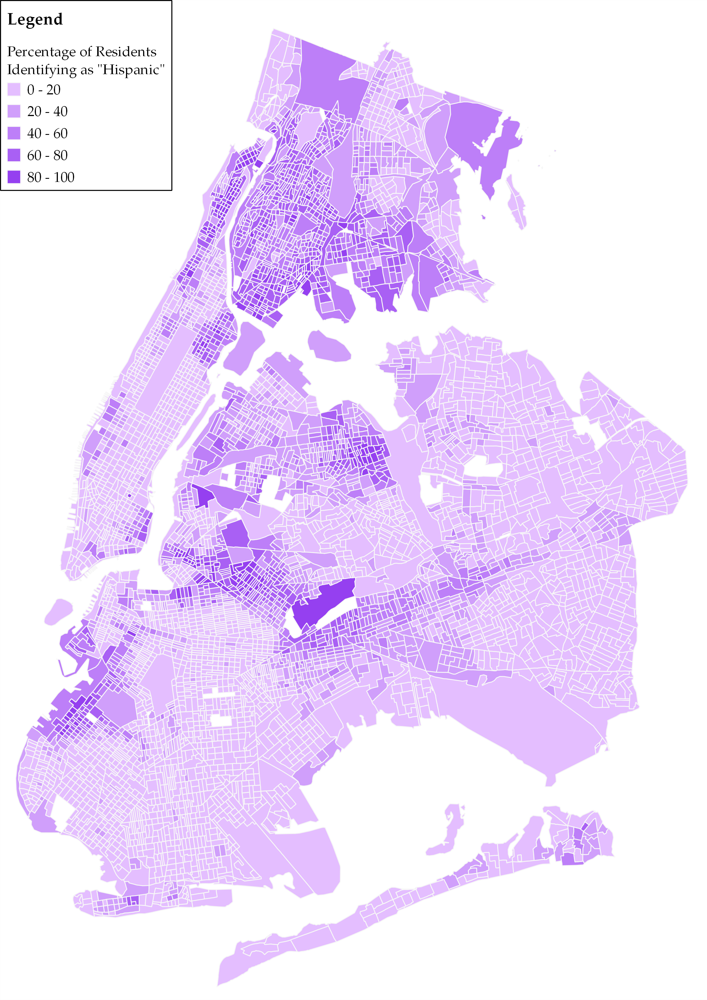
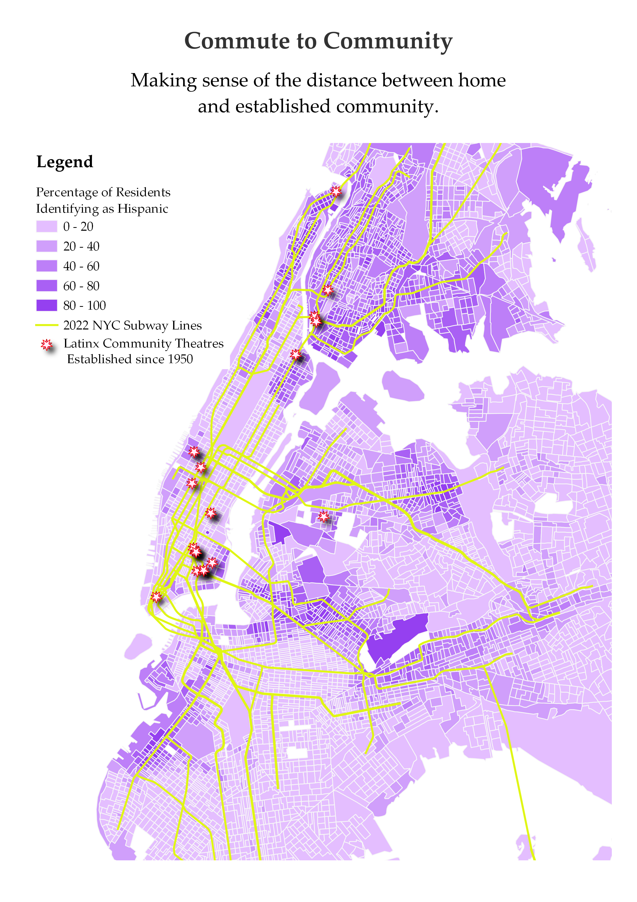

This project was made possible through a [May Crane fellowship](https://library.harvard.edu/may-crane-fellowships).

# Mapping Cultural Difference
The goal of this webpage is to allow others to follow the progress of this mapping project and understand the immediate and long-term goals and uses of the mapping project.

## About this mapping project
At its inception, this project's main goal is to demonstrate cultural distance and difference as they pertain to staged representations of Latinx (or Latine) Americans living in the United States. In order to do so, this project maps the difference between the spaces that are occupied by Latinx-Americans and Latinx immigrants and the spaces that represent or claim to represent Latinx Americans in the United States. For this initial stage of the project, this analysis is focused on the city of New York and shows data beginning in the 1940s and 1950s. The resulting map shows where Latines are living and the emergence of Latine community-centered theatres throughout the city of New York as Latine-Americans and Latine immigrants begin to create spaces for self-representation and community celebration. This map shows information gathered from census records, community organizing histories, and theatre hubs based mostly in New York.

This project has been supported by the May-Crane Fellowship which allowed collaboration with, contribution to, and invaluable support from the Harvard Map Collection.

## Contents

1. [Recurring Perspectives](#recurring-perspectives)

2. [Methods](#methods)

3. [Where Are Latines Being Portrayed?](#where-are-latines-being-portrayed)

4. [Where Are All the New York Latines](#where-are-all-the-new-york-latines)

5. [The Commute to Community](#the-commute-to-community)

6. [Next Steps and Future Questions](#next-steps-and-future-questions)

## Recurring Perspectives
### ... on the maps and in the theatre.

*Pictorial perspective map of Manhattan from the South - early 19th century*

Upon arriving at and exploring the Harvard Map Collection, it quickly became evident that certain perspectives have predominated mapmaking in New York. The focus of most maps in New York is commerce, and in more recent years, this commerce is mainly prioritized in the form of tourism. 

The map above is a perspective map of Manhattan from the early 19th century which centers the southern tip of Manhattan and shipping commerce as the most notable features of the city. The northern part of Manhattan, as well as the areas that would come to be known as Brooklyn, Queens, the Bronx, and Staten Island are featured as marginal or not at all. While this map was created long before New York City became defined by the five boroughs, the parts left off the map or left literally minimized by the perspective of the map are the places that would come to be populated by people of color, including Latine immigrants.

The map below is dated to 1939, about a century after the map above. In this case, the map is not physically skewed to represent finance and commerce. Rather, it points out locations that serve either as important financial institutions or as major attractions for those visiting from outside of the city. 

*Pictorial landmark map - 1939*

While New York has long been known for its status as a major driver of the country's financial capital, a large fraction of the city's tax revenue is driven by tourism. According to the New York State Comptroller's Office, "spending by tourists is _the critical driver_ for industry employment, wages and tax revenues." [^1]

Within tourist spending, shows and other entertainment make up more than 10% of commerce. Theatre, entertainment, and concerts all fall in the same tourism category, but Broadway remains one of the most romanticized tourist attractions due to its historical association with the lights and color that many understand as synechdoche for New York City. The image below is a zoomed crop of the 1939 map featured above to show the emphasis on Broadway's "bright lights." 

<h3>Reading List</h3>

Jay McInerey's <em>Bright Lights, Big City</em> centers on a non-native New Yorker's attraction to the "bright lights" of New York City and describes the main character's disillusionment that comes as a consequence of being drenched in the light. The pink stars on this image demonstrate Latinx community-led theatres in proximity to the theatre district.

## Methods

### Why 2000 census data?
*A note on census records:* Because measuring race and ethnicity, particularly Latinx and/or Hispanic ethnicity, has been a fraught process on the part of the U.S. census, choosing a year from which to pull census data was not simple. A hispanic/Latinx identifier appeared on the U.S. census for the first time in 1930 as "Mexican," but did not appear again until 1970. Since then, the census has posed the question of Hispanic and/or Latinx identity as a question of ethnicity distinct from race. Various version of this question has been represented each decennial year, including in the most recent 2020 census. 

By the 1990s, a massive wave of Puerto Rican immigration into the city of New York was coming to a close after nearly 50 years of steady migration. This would be the largest Latinx migration into New York City. Because Puerto Rican (or Nuyorican)culture would come to define much of the Latinx theatre scene over the end of the 20th century and because Puerto Rican enclaves would be established in all five boroughs and form foundations for larger Latinx communities, the 2000 census was chosen for mapping population data.

### Why 2022 subway maps?

The use of subway maps in this projects serves to explain a more contemporary problem of distance within the context of 21st century gentrification. As a result, it was important to reflect the ways that the Latinx community might once have commuted more easily to the theatres that were located closer to the center of the subway system which revolved heavily around the island of Manhattan. While the map shows the Latinx population as it existed in 2000, the subway map overlay is representative of the current NYC subway system. The consequences are that the Latinx population is represented as having more access to long established spaces than they actually do. 

## Where Are Latines Being Portrayed?
### ...and who is portraying them

Due in part to its multiple film revivals, one of the most famous portrayals of Latinx people in the United States is *West Side Story* written and composed by Arthur Laurents, Leonard Bernstein, and Stephen Sondheim. The play is also quite famous for featuring a mostly white cast playing Puerto Rican characters written by white Americans. The play opened on Broadway during the 1950s, a decade which also saw the largest influx of Puerto Ricans into the City of New York. This would represent the first large migration of Latinx folks into the City.

While *West Side Story* continues to hold space in the larger context of theatrical representations of Latinx people in the United States, as Latinx immigrants arrived in New York they began to create spaces where they had the ability to represent themselves and create community in doing so. This  project focuses on mapping those spaces created by Latinx folks for the sake of Latinx representation, space, and expression in New York City.

### Latinx Community Strongholds

Most often, those spaces appeared in parts of the like the Lower East Side, where large Latinx communities had already been established. 6 of 16 theatres mapped are in one of the most famous Puerto Rican neighborhoods in the United States. The Lower East Side or "Loisaida" became home to the Nuyorican Poets Café, one of the first homes of Latinx arts in New York.

### Defining Latinx Identity in New York

These spaces were also usually quite far from Broadway and existed as spaces for communities much larger than what most non-Latinx audiences would understand as Latinx. A major example is the Afro-Latinx communities of uptown and the Bronx that were created in part because of mutual lineage, but also due to their collective marginalization in the city. Where Harlem was historically Black, East Harlem, Washington Heights, and the South Bronx eventually became major Latinx neighborhoods. The cultural proximity (re)mixing that resulted in the geographic marginalization of both Black and Latinx New Yorkers resulted in Afro-Latinx spaces that are difficult to find in much of the country.

#### Next step

Mapping census racial categories on top of ethnic data could demonstrate this more neatly.

## Where Are All the New York Latines
### ... and how come they're in these spaces?

Despite the presence of some Latinx theatres closer to what many know as the theatre district, most of the Latinx theatres in New York City are not only on the margins of the theatre district, but on the margins of the islands of Manhattan or in "outer boroughs" where Latinx communities have been able to find more affordable housing.

Over the course of the city's gentrification, which has accelerated rapidly in the past twenty years, Latinx folks and people of color in general have been pushed away from their neighborhoods and those train stations that made their commutes into Manhattan more accessible.

The Lower East side is an outlier in that it lies closer to central parts of Manhattan. While its location near industry and bridge traffic long kept the Lower East Side in the hands of immigrant communities, its desirability has seen an increase, and gentrification has become a significant factor in the makeup of the neighborhood. Washington Heights, the South Bronx, Northern Queens have all benefitted from being far enough away from the center of Manhattan and the subway lines that carried residents there that they their Latinx enclaves have remained somewhat protected. 

## The Commute to Community

Even still, the outer boroughs remain relatively scant in terms of resources for theatre production. Just as people often need to do to access work, recreation, or other resources important to living in New York, many Latinx folks need to commute in order to reach the theatre communities that center them. This struggle has become magnified by gentrification as Latinx New Yorkers are pushed out of once strongholds and away from those theatres that may once have been considered the heart of their artistic communities.

<h3>Reading List</h3>

Beloved musical-turned-Disney-feature <em>In the Heights</em> by Quiara Alegría Hudes and Lin-Manuel Miranda depicts the effects of Puerto Ricans and Dominicans in Washington Heights losing their communities and leaving landmarks like murals behind. Gabriela Cázares addresses this in her article, "Resisting Gentrification in Quiara Alegría Hudes" and Lin-Manuel Miranda's <em>In the Heights</em> and Ernesto Quiñonez's <em>Bodega Dreams</em>.

## Next Steps and Future Questions

### Next steps

- Creating a map that captures change over time

- Mapping Chicago and LA

- Case studies in the NY-LA connection: Luis Valdez from the farm to Broadway

### Future questions

- What does a project look like in other cities or regions that are pertinent to my research such as Southern California, the Southwest, or Chicago?

- How does migration from city to city affect the development of Latine theatre and theatre communities throughout the United States?

- What kinds of economic interests are important to considering this landscape? (i.e. What's the difference between the profits of a shows like Sondheim's *West Side Story*, Valdez's *Zoot Suit*, and Miguel Piñero's *Short Eyes*?) Would mapping Latinx-centered and Latinx-written shows in a given city help advance this project?

This project was made possible by a [May-Crane fellowship](https://library.harvard.edu/may-crane-fellowships).

[^1]: [NYS Comptroller: Reigniting the Return](https://www.osc.state.ny.us/reports/osdc/tourism-industry-new-york-city)