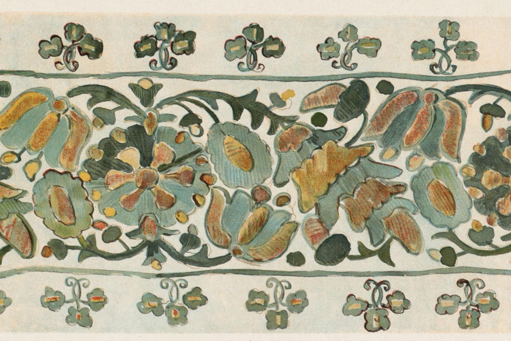

*Floral motif from Ukrainian textile produced in 1902.*

This year, the Harvard Map Collection partnered with Kelly O'Neill from the Davis Center on a project to demonstrate the value of our [GIS data curation services](https://mapping.share.library.harvard.edu/resources/researchers-handbook/long-term-preservation/). Dr. O'Neill's project aims to capture data about historic biodiversity in the Ukraine. The Harvard Map Collection worked with her team to co-develop robust and useful metadata, so that the sources can be archived for long-term discovery and reuse.

You can learn more about the project in this [Davis Center article](https://daviscenter.fas.harvard.edu/insights/undoing-empire-one-plant-time).

This project was funded by an [Advancing Open Knowledge grant](https://library.harvard.edu/visit-about/grants-fellowships) from the Harvard Libraries.

