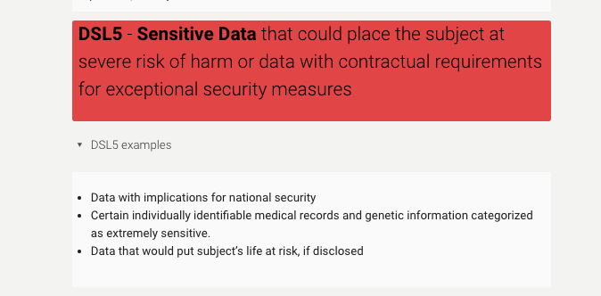

In this interview with [Megan Potterbusch](https://library.harvard.edu/staff/megan-potterbusch), the Harvard Kennedy School's Research Data Steward, you will learn:

- How to balance open science and data safety
- How to get started with support for your research

## The interview

BELLE LIPTON: Megan, can you introduce us to your role?

MEGAN POTTERBUSCH: I work within the Kennedy School’s Libraries and Research Services. I'm the primary reviewer for data safety plans. A data safety plan is required for anyone who is working with regulated or contracted data, especially data that is considered sensitive. That means if there is a data use agreement, a licensing agreement, special terms of use, or an IRB, there are paths in to the data safety system. I am the primary reviewer for data safeties. It's unusual for a librarian to serve in this capacity because it usually falls under a school security officer or something like that. Here at Harvard, I serve in that role because it’s all about Research Data Management.

LIPTON: I'm interested in the unique nature of the data that students are working with at the Kennedy School, which would necessitate this sort of librarian safety person. I know before Harvard you were working on projects with the Association for Research Libraries and the Open Science Framework, helping researchers with open access publishing processes, such as reproducibility and long-term preservation.

Do you see data safety and open access publishing principles in tension with one another, and how do you balance helping researchers with both?

_Definition for the highest level of data sensitivity in Harvard's [Data Security Levels](https://security.harvard.edu/data-security-levels-research-data-examples)_

POTTERBUSCH:  I was attending a lecture yesterday about how journals are grappling with this -- how can you expect open science, open data knowing that some people who are publishing are working with data that is restricted in some way and that it can't be fully open? There's some motion in clinical trials, genetic data. But in terms of qualitative data or data that come from businesses or internal to governments, there's still so much that doesn't have an easy answer. There are answers, but they're not easy. You could say "deidentify", OK. But what do you mean? 

To me, we're facilitating open science, the ability to push boundaries and do research we weren't able to do before by setting up these relationships that ensure that we're respecting privacy, confidentiality, intellectual property from the data provider. We're able to move forward with the research. And before, without a mechanism like a data use agreement to facilitate the sharing of that data with special guard rails, we couldn't do some of the research that we're now able to do. There would have to be a lot of informal trust established and by establishing a path for a more formalized trust between institutions we can actually use that data and do research. It's exciting to me because it's facilitating the ability to do research. 

How do we then balance that with open science? It becomes about how do you cite the data, how you describe effectively the data source that had in such a way that if somebody else was like, "oh my gosh, I want to do research on that data" and it's not a data set that could be shared by any means, how could a future person understand how they could request the same data. There is not an easy answer in a lot of cases for how to do that, especially if it's administrative data that was a report that was generated on a particular day and then like staff turnover happened. That's when I like to talk about instead of results reproducibility, could somebody else reproduce the same research project even if the results were different? Could they follow your methods and do the same methodological research that you did? So that's how I like to approach it. Even if you can't share the data, there are things you can do to have transparency in your research. 

LIPTON: 
What do you think makes the library uniquely positioned to help researchers with these types of questions? 