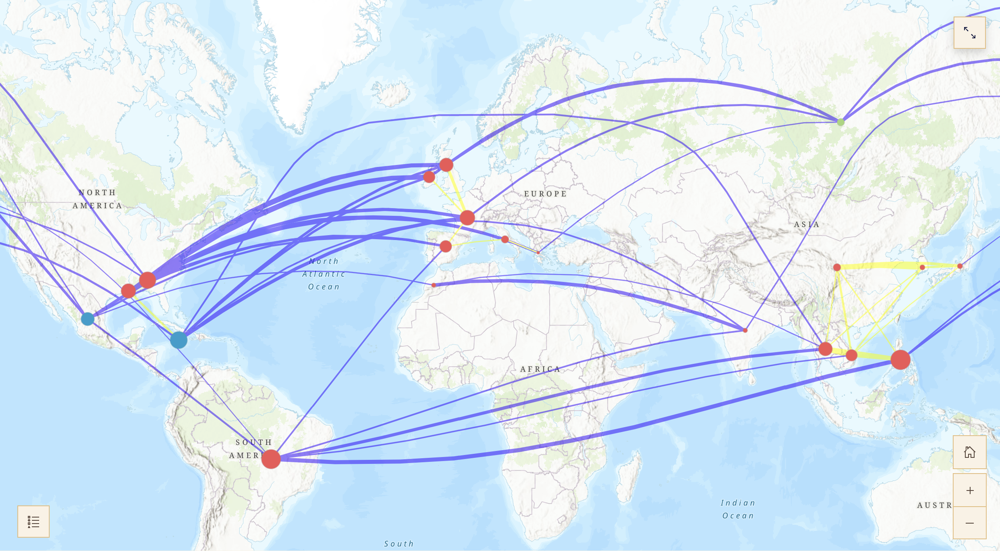

_Check out Matthew Scott Tan's prize winning project: [Salt, Fat, Acid, Distance](https://storymaps.arcgis.com/stories/26438114683f4ae88dbf47551f5b0063)._

BELLE LIPTON: Hi Matthew. You've just graduated and I'm wondering not only how you initially became interested in geospatial data science but where you're excited to go with it next?

MATTHEW TAN: Of course. I think maybe a good way to start is actually to talk about my background. I’m an international student from Singapore, so going to Harvard as a freshman was the very first time I ever came to the U.S.

As a Singaporean, you have to go for conscription, you know, work and serve in the army. So right after high school, I served in the military and they assigned me to the intelligence unit.

Intelligence in Singapore is quite a broad area, but my specific unit that I was sent to within the intelligence unit was the geospatial unit. They put me in charge of the computer vision unit.

It’s a bit of a digression, but back when I was right out of high school, computer vision was kind of this new thing. AI and machine learning hadn’t really caught up. It was something kind of new, and so they were trying to use it for military purposes, for identification of targets and vehicles and naval vessels. That’s something that I was quite involved in just because of the amount of knowledge that they drilled into me as part of my military training. Because of that, they needed a lot of tools, and so that was my exposure to geospatial analysis, so we used ArcGIS, but then they more modern software, like ERDAS, for example, and they were trying to build their own in-house software, because they didn’t want to use third-party software just because of data leaks and security risk. So that was what my role was back when I was still serving in the Army.

So that was my introduction to geospatial analysis. Then I came to Harvard and I majored in mathematics and statistics. In statistics we do have some courses like STAT 141, spatial analysis. But we don’t really have that many courses that really focus on the application of it. We learn some of the tools and some processes, but it’s very theoretical. We don’t really actually get a lot of exposure with the tools that are necessary. Even in the stats, even in the economics department, we don’t really get that much exposure, even when you kind of look at international trade analysis, it’s not much exposure. Because of that, I thought this is something that I want my experience to go to waste, so I started to pursue it with my own projects. A lot of the stuff I worked with professors in the past is what led to this project that I submitted for the Fisher Prize.

Now that I've graduated in May I will be working for an AI startup. As a bit of a side quest I’m always eager to get back into research. There's a lot of under-utilized mathematical tools that you could use and apply to geospatial analysis. For example one of the things I did in my thesis was random matrix theory. Random matrices have a lot of applications. If you know anything about it, it’s just looking at what happens if you have a matrix that has random entries and the overall behavior of the values and vectors give you a lot of information and helps you to find certain patterns that are quite general as kinds of universal laws.

That’s something that they’ve applied a lot within the CS fields and a lot of high-dimensional analysis. I’ve always wondered why doesn’t anyone apply it to just spatial analysis, because that’s kind of an example of high-dimensional analysis that is quite realistic and has a lot of applications in real-world settings. Maybe I might pursue seeing how it might fit in in the future. But, for now, I think I’ll work a bit first, and then I’ll take a look at that after.

LIPTON: So as you looked for GIS projects on your own, what were the serendipitous and the on-purpose ways you navigated that? Do you have any words to the wise for future students?

TAN: When you look at the resources that Harvard has, first of all, the fact that we even have free access to GIS software is really something that’s not exactly a given. Access to GIS is really half the battle won, because there’s a lot of tools for you to play with, and the fact that we kind of have this software available at our fingertips gives us a huge advantage in terms of getting a foot in the door. The other thing is when you take on stats courses, they did touch on a little bit about what happens if you look at spatial data. It is up to your own interest to pursue these kinds of extensions of what you have within your courses. There’s such a large library and wealth of resources we have here at Harvard, so it’s important to take advantage of.

And lastly, I do think that there is no one professor that I would say is purely focused on geospatial research. Every professor has their own field that they are interested in. For example, my professors were focused on certain sub-regions, so it’s kind of up to you to find out how can you leverage some kind of geospatial analysis within that field. That’s something that comes from within, but through this method of analysis does yield quite a fair bit of insight that you may not be able to find with any other method. That’s kind of the fun of it.

LIPTON: How do you decide which kinds of projects interest you?

TAN: In my four years at Harvard, I’ve had quite a fair bit of experience, and a nice balance in the experience between theoretical as well as application-based research. Looking back, a lot of the theoretical research comes from extensions of what you learn in courses, but a lot of the application-based research comes from areas that you’re interested in, and taking the stuff you learn in the courses and applying it outside of the courses.

There were a few things that I was considering when I was first thinking of applying for the Fisher Prize. One was looking at how food is related spatially when you take out the idea that distance affects the similarity between different kinds of cuisine.

Another area I was looking at was because I was doing some research on infectious diseases, and we were looking at how malaria spreads within African regions. When I was looking at these different areas that I could potentially apply geospatial research to, it came down to two things. One thing is how feasible is it in the sense of, A, is it really gonna give you a certain level of insight, but B, how new and novel is it? Because I can imagine if I looked at just infectious diseases modeling, there probably have been hundreds and hundreds of papers looking at how certain regions, certain countries in Africa have a higher rate of malaria than others.

And they’ve probably done hundreds and hundreds of analyses in terms of why that is so, and they probably have a lot more data than I have at my fingertips. They might look at certain kinds of weather, terrain, seasonality, so many different things. So that’s one thing that affected my train of thought, the data sets and the availability of data and what kind of insights you can get with your limited amount of data, especially as a student. So I looked at what I could get for food, and surprisingly found it somewhat limited in terms of geospatial data. You have a lot of stuff in terms of recipes but you don’t really have much in terms of geospatial data.

And then it comes down to my second point, which is if you don’t really have a lot of data, geospatial especially, what can you do to create your own data? Well, you have to be creative. I think that’s the fun part, because you don’t want to just be handed all the data on the silver platter, because that takes the fun out of the analysis. You have to be creative, and you have to be creative in a realistic way. So, what I did was I looked at all the ingredients in this whole corpus of recipes, and I said let’s take a look and see which ones have a certain cuisine that’s attached to it. When you have so many ingredients and a certain dimension space, then you can take 20 points and plot out that kind of polygon. That was my way of doing that kind of analysis and calculating the similarity between different cuisines. That's what makes it fun. You’re deriving information and some kind of value add without having to use data given to you on the silver platter, because you gotta be creative when you lack the data. 

LIPTON: What other ways of thinking or habits do you have that you attribute your successes to?

TAN:  The ideas that went into this project are something that I said I might want to give it a shot because I’ve had some experience. I thought how feasible was it to really come up with a project that I have a chance at winning? What should I pursue? Once I had a general idea of what I wanted to get towards, I started to say, okay, how might I want to do this project? And then I started looking around for areas of inspiration. What do I know? What may I need to learn? What could be useful? 

I think a lot of it comes from just being present in what you read and what you learn in class. A lot of ideas did come into mind that may have actually worked, but at the same time were not feasible within the time frame I had for this project. So you have to always be active, always  come up with ideas, and what works, you keep it. What doesn’t work, it might be a dead end, but at least you have something that may have given you some fruit. So that’s something that I thought of towards going towards this prize.

On a daily basis I don't have a particular routine in the sense of, you know, military-style schedule that I follow. But at the same time I do have my general value system. One is that discipline is quite important. I play sports. When I was a student I used to represent Harvard for the Taekwondo Club, so you do have to train quite a fair bit, whether it’s the endorphins, or whether it’s just getting you out of your chair, you know, sports do have some uses. Another thing I would say is talk to your professors. A lot of students don’t do this enough,  they go to office hours, and just get the answers, or their pieces checked, and they leave. But whether it’s one-on-one or as a group, there is a lot of insight you can get from the professors.

There’s a lot of ideas that your professsors don't really have the time to work on. These are things that you might keep in mind, and they might give you some future project ideas that you might be able to work on, or it might give you some kind of inspiration that you could use in your  projects, your p-sets, or even future research. So talk to the professors. They do have a wealth of knowledge and a lot of experience that you don’t have to go through the hard part to get to it. You can just learn from them. So much to learn from them.

LIPTON: Thank you, Matthew!

TAN: Thank you.