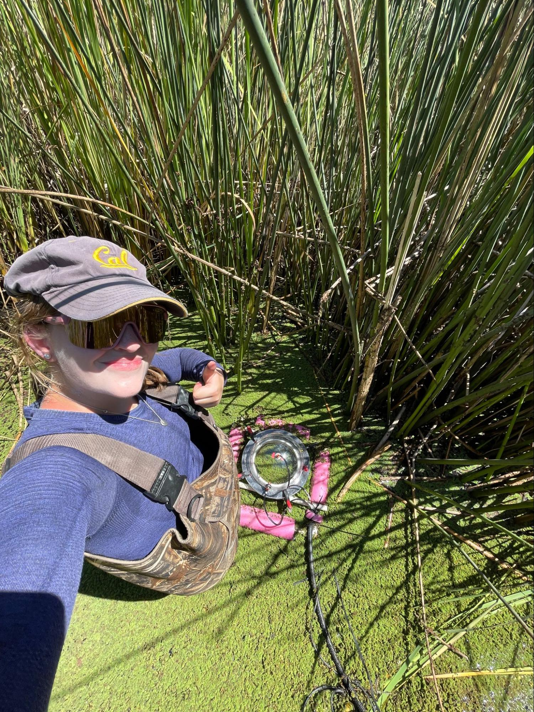
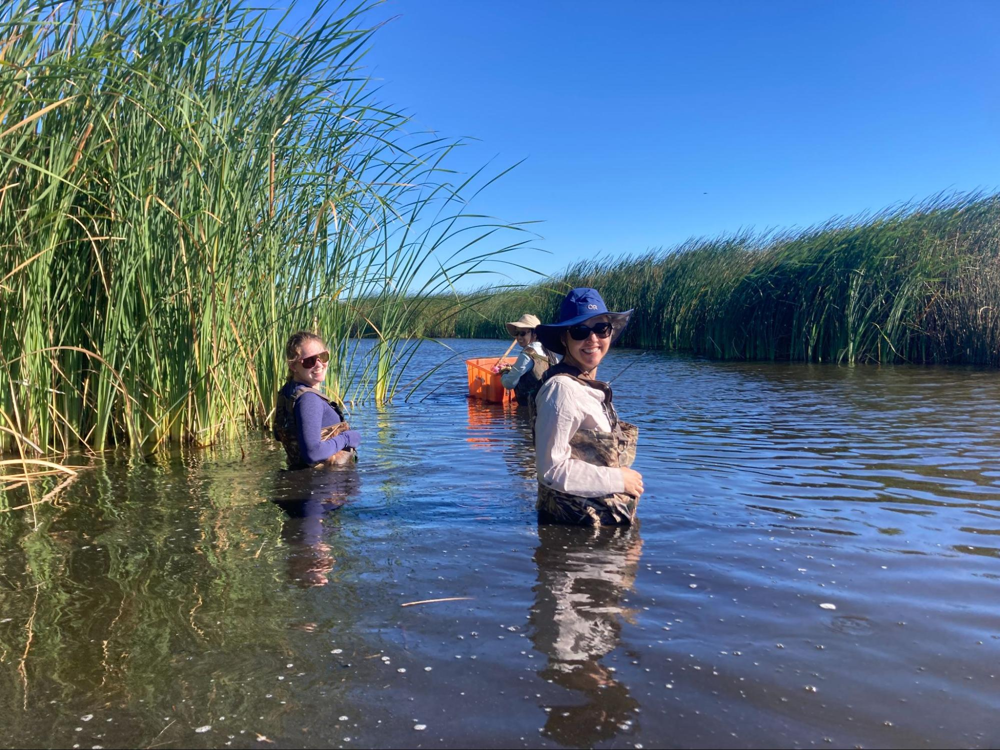
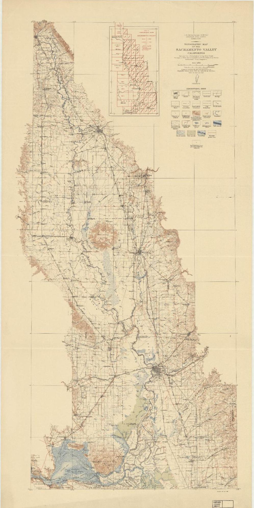

Early one August morning, I found myself donning borrowed fishing waders on the banks of a restored tidal wetland in Northern California. Thanks to a Salata Institute grant, I spent a week studying the Sacramento San-Joaquin River Delta alongside biometeorology experts. After exploring maps of the region through my assistantship with the Harvard Map Collection, I was incredibly grateful for the opportunity to traverse the landscape on foot, and prepare for my senior thesis on the science of these special ecosystems. In broad terms, I'm interested in wetlands — swamps, marshes, sloughs, estuaries — and how they exchange carbon dioxide and methane with the atmosphere. GIS and historic maps allow me to track wetlands over time and estimate historic data related to this gas exchange. The following article explores how wetlands are related to global warming, the relationship between land-use and greenhouse gasses, and what a century-old map can teach us about climate change. 

  
  

## Background

The Sacramento San-Joaquin Delta ecosystem supports 6 million acres of farmland and supplies water to 30 million California residents. Additionally, healthy wetland ecosystems play an increasingly important role in global climate change due to their ability to store carbon dioxide, an important driver of climate change. In the past century, the majority of the Delta’s wetlands have been developed for agriculture through levee infrastructure, effectively redirecting water flow to drain submerged landscapes. Although this process revealed nutrient-rich soil well-suited for crops, the process damaged the ecosystem and released large quantities of carbon dioxide to the atmosphere. Essentially, the CO2 naturally stored in the wetland soil is released when wetlands are converted for agriculture. This means the wetlands are now an additional source of greenhouse gas, and they contribute to climate change.

Using long-term ecological monitoring, scientists are now trying to discover how restoration techniques could repair wetlands that have been drained for agriculture, potentially increasing carbon storage and creating biodiverse habitats.

## The project

GIS allowed me to create usable data from historic maps of the delta. I worked with Harvard Map Collection to identify maps of the region from the twentieth century, looking carefully at land use markers, land-owner parcels, and small changes in the many winding branches of the Delta’s waterways. I sought to understand key changes in land use over time. [The map](https://id.lib.harvard.edu/alma/990091411270203941/catalog) I focused on is from 1911, and clearly marks different wetland types, waterways, and tidal flats.

After [georeferencing the Delta map from 1911](https://felt.com/map/California-wetlands-0y39AwKOPQKe5Z4f7csGjcC?loc=38.3744,-121.7539,9.49z&share=1), I created a polygon layer for all the wetland areas, and recorded information about wetland type. I used the “calculate field” QGIS tool to extract the area of each historic wetland region. Then, I downloaded current crop data (2017) from the California Natural Resources Agency. This shapefile includes information about crop type and land use for each agricultural parcel in California. I clipped the agricultural data to match the historic wetland area so I could see how the historic wetlands have been developed and exactly which crops are grown there now. 

### Historic wetland type

### Today's crops in the historic wetlands footprint

*GIS maps by Hannah Adler.* 

After exporting the attribute table (wetland types and area) to Excel, I looked at which crops were most prominent within the historic wetland footprint. This GIS data provides the opportunity to use contemporary greenhouse gas calculations to estimate historic quantities of greenhouse gas exchange using land cover. Using data collected from the wetlands in recent decades, scientists are able to estimate the carbon dioxide stored per square meter of wetland. Now that I have identified the area of specific wetlands in 1911, I can estimate the carbon that was stored there before agricultural development. I plan to expand on these calculations during my senior thesis as I work on modeling greenhouse gas flux.

## Methodology

1. Georeference historic map in QGIS.
2. Create a polygon layer for wetlands, and include wetland type for each digitized shape.
3. Use the QGIS field calculator to calculate the area for each polygon.
4. Download California crop data (shapefile), add to map.
5. Clip California crop data to overlay wetland polygons.
6. Export attribute tables to R or Excel for further analysis.

## Explore the data

Toggle between the historic georeferenced map, historic wetlands data, and modern crop data in this [exploratory web map](https://felt.com/map/California-wetlands-0y39AwKOPQKe5Z4f7csGjcC?loc=38.3744,-121.7539,9.49z&share=1).

<iframe width="100%" height="488" frameborder="0" title="Felt Map" src="https://felt.com/embed/map/California-wetlands-0y39AwKOPQKe5Z4f7csGjcC?loc=38.2875%2C-121.7981%2C9.42z&legend=1&cooperativeGestures=1&link=1&geolocation=0&zoomControls=1&scaleBar=1" referrerpolicy="strict-origin-when-cross-origin"></iframe>

Download [the project data](https://osf.io/3s4dq/) from the Harvard Map Collection's site for Research, Teaching, and Learning GIS materials. 

