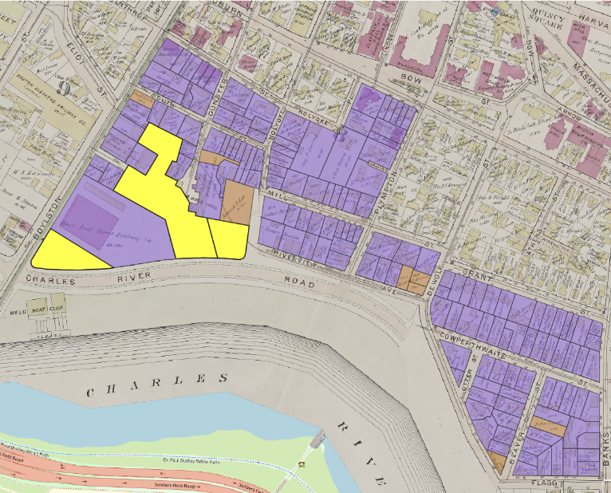
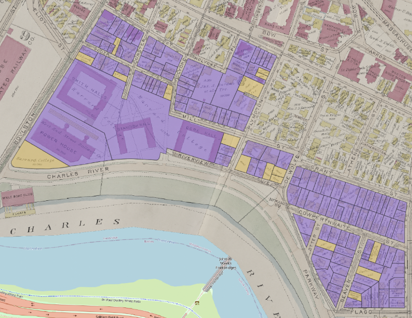
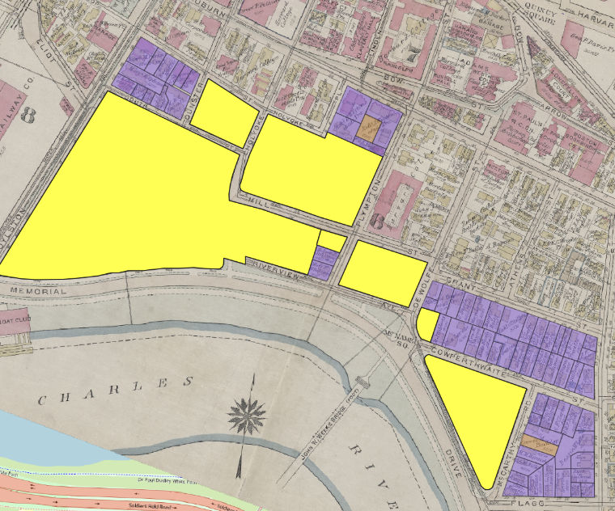
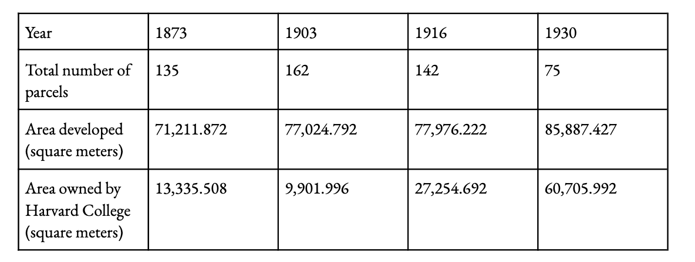

This is an example project modeling step-by-step instructions for generating geospatial data for analysis from historic maps. In June, we [shared out results](https://mapping.share.library.harvard.edu/posts/re-wilding-2024/) from partnering with Joyce Chaplin's course, Re-Wilding Harvard, where students were tasked with creating projects to investigate histories and changing natures of open space around Harvard's campus.

Hannah Adler '25 chose to study the Charles River region of Harvard's campus, on the Cambridge side near Memorial Drive.

> "I was  interested in the Harvard Square adjacent area near the river, because today we think of the river walkways and Memorial Drive, especially when it’s closed as a really valuable open space. I also had seen an image in HOLLIS that conveys a certain set of aesthetic ideals with how people were imagining the riverside could be.

<iframe width="100%" height="700" src="https://iiif.lib.harvard.edu/manifests/view/ids:3043928$1i" title="New Boston and Charles River Basin, 1880
" ></iframe>
<figcaption class="append"><a href="https://iiif.lib.harvard.edu/manifests/view/ids:3043928$1i">New Boston and Charles River Basin, 1880</a></figcaption>

Adler, who had some GIS coursework under her belt from past semesters, visited the Harvard Map Collection, knowing she wanted to incorporate spatial analysis techniques in her project. She sought to understand:

1. What did the development process look like in this area? How rapidly did this region change?
2. What was Harvard's role in developing this area?

Hannah met with GIS Librarian Belle Lipton, and discussed approaches to modeling the data to tease out these questions.

## Finding map sources

Lipton recommended a tool she worked to create at the Boston Public Library, called [Atlascope](https://www.atlascope.org/). This tool incorporates over 100 different atlases from Boston and Cambridge, and assembles them into a GIS viewer so that researchers can easily compare different years and layers. Not only do these maps show the exact changes Adler was investigating, but the map are hosted as GIS layers anyone can use in their own projects.

### 1873

<iframe width="100%" height="700" src="https://atlascope.org/#/view:share$mode:swipe-x$center:-71.11890,42.36865$zoom:16.58$base:massgis-2023-orthos$overlay:ark:/76611/al88ruzla" title="Hannah" ></iframe>
<figcaption class="append">You can swipe and zoom to see how the shape of the river has changed between 1873 and 2024.</figcaption>

### 1903
<iframe width="100%" height="700" src="https://atlascope.org/#/view:share$mode:swipe-x$center:-71.11894,42.36967$zoom:17.76$base:massgis-2023-orthos$overlay:ark:/76611/al8c0zee3" title="Hannah" ></iframe>

### 1916
<iframe width="100%" height="700" src="https://atlascope.org/#/view:share$mode:swipe-x$center:-71.11894,42.36967$zoom:17.76$base:massgis-2023-orthos$overlay:ark:/76611/al8c3wda3" title="Hannah" ></iframe>

### 1930 
<iframe width="100%" height="700" src="https://atlascope.org/#/view:share$mode:swipe-x$center:-71.11894,42.36967$zoom:17.76$base:massgis-2023-orthos$overlay:ark:/76611/al88ugbpx" title="Hannah" ></iframe>

## Vectorizing

After Adler selected the four temporal snapshots she wanted to study (1873, 1903, 1916, and 1930), and located GIS layers for each of the atlas years, the next step was to create polygon data for the parcels on the maps. Tracing the boundaries of each parcel and annotating those boundaries with important information allowed her to measure the scale of changes.

## Attribute Information

<em>Orange indicates parcels that are undeveloped in 1873, meaning they have no structures on them. Purple are developed parcels, or parcels with structures on them.</em>
 

After creating shape data for each parcel, Adler added columns to the GIS table which tracked the following attributes:
- For each parcel, was it developed or not? This was a binary value. If the parcel had a structure on it in 1873, the `developed` field for the parcel was encoded as `true`, and if it did not have a structure, the parcel had a `false` value.
- Who was the land owner in 1873? Adler created a column to encode the names of landowners, information which is found on the maps.

<em>The maps highlighted in yellow indicate parcels owned by Harvard in 1873.</em>

Adler repeated this process, vectorizing and encoding the same variables for each temporal snapshot she was interested in studying.

### 1873

<table>
  <tr>
    <th>Development</th>
    <th>Harvard-ownership</th>
  </tr>
  <tr>
    <td></td>
    <td></td>
  </tr>
</table>

### 1903

<table>
  <tr>
    <th>Development</th>
    <th>Harvard-ownership</th>
  </tr>
  <tr>
    <td></td>
    <td></td>
  </tr>
</table>

### 1916

<table>
  <tr>
    <th>Development</th>
    <th>Harvard-ownership</th>
  </tr>
  <tr>
    <td></td>
    <td></td>
  </tr>
</table>

### 1930

<table>
  <tr>
    <th>Development</th>
    <th>Harvard-ownership</th>
  </tr>
  <tr>
    <td></td>
    <td></td>
  </tr>
</table>

## Area analysis

Next, Adler was able to leverage GIS tools to generate area calculations tallying up how many square meters exist for each parcel type. Because these vectorized shapes correspond to real locations, GIS tools are able to report the amount of area each shape represents in reality. This works because the datasets are projected into specific coordinate reference systems that link the shape drawings with real places, using specific units of measurement.

Adler used the coordinate reference system `Massachusetts State Plane` or `EPSG: 26986`, which is the same coordinate reference system Massachusetts uses to store GIS data in [MassGIS](https://www.mass.gov/info-details/learn-about-massgis-data), the state's open geodata portal. This generates area calculations in the unit of `square meters`.

Adler exported the area calculations to tabular formats (`.csv`), so she could analyze them further using other software, such as `R`. Her findings are presented in the following table.

While the total area developed (parcels with structures on them) increases only a small amount between 1873 and 1930, the area owned by Harvard increases dramatically during this period. Adler reported that there were many other variables included in the historic atlases one could choose to encode and then apply this same methodology to, whereby one calculates area based on a subsetted attribute filter of the traced parcels.

## How to use this approach (a step-by-step guide)

This tutorial will guide you through the process of mapping historic land parcels using QGIS. Follow each step carefully and refer to the images provided for visual guidance.

<!-- ### Step 1: Setup Project with EPSG: 26986

1. Create a new QGIS project.
2. Set the coordinate reference system to `EPSG: 26986 (Massachusetts Mainland)`.

[https://www.notion.sopath_to_image_1](https://www.notion.sopath_to_image_1)

## Step 2: Import Georeferenced Maps

1. Import georeferenced maps from Atlascope into QGIS.
2. Go to `Layer` > `Add Layer` > `Add XYZ Tile Connection`.
3. Copy and paste the URL from the bibliographic information into the dialog box.

[https://www.notion.sopath_to_image_2](https://www.notion.sopath_to_image_2)

## Step 3: Create New Shapefile Layer

1. Click on `Layer` > `Create Layer` > `New Shapefile Layer`.
2. Select `Polygon` as the geometry type.
3. Add necessary fields for attributes (e.g., development status, owner name).

[https://www.notion.sopath_to_image_3](https://www.notion.sopath_to_image_3)

## Step 4: Draw Polygons on the Map

1. Use the snapping tool to match corners of each polygon.
2. Draw polygons to represent land parcels on the map.

[https://www.notion.sopath_to_image_4](https://www.notion.sopath_to_image_4)

## Step 5: Add Metadata to Attribute Table

1. Open the attribute table for the shapefile layer.
2. Add fields `development` (binary: yes/no) and `owner_name`.
3. Populate the fields accordingly.
    - Mark `yes` if a plot has been developed (indicated by a building).
    - Fill in `owner_name` with the name given or leave blank if illegible.

[https://www.notion.sopath_to_image_5](https://www.notion.sopath_to_image_5)

## Step 6: Calculate Area of Each Polygon

1. Open the Attribute Table.
2. Go to `Field Calculator`.
3. Create a new field named `Area`.
4. Use the `$area` expression to calculate the area of each polygon.

[https://www.notion.sopath_to_image_6](https://www.notion.sopath_to_image_6)

## Step 7: Edit Map Symbology

1. Double-click the map layer to open its properties.
2. Go to the `Symbology` tab.
3. Change symbology from `single symbol` to `categorized`.
4. Choose `developed` for Value and select distinct colors for `yes` and `no` (e.g., #cd782e and #8c5fed).

[https://www.notion.sopath_to_image_7](https://www.notion.sopath_to_image_7)

## Step 8: Identify Parcels Based on Variables of Interest

1. Filter the attribute table to highlight specific parcels.
2. For example, to identify parcels owned by Harvard College, apply the filter `owner_name = "Harvard College"`.

[https://www.notion.sopath_to_image_8](https://www.notion.sopath_to_image_8)

## Step 9: Export Data Table for Analysis

1. Right-click on the map layer.
2. Select `Export` and choose the file type (xlsx or csv) as needed for your analysis.

[https://www.notion.sopath_to_image_9](https://www.notion.sopath_to_image_9)

---

By following these steps, you will have effectively mapped and analyzed land parcels using QGIS. For any further analysis, you can export your data to software like R or Excel.

 -->

