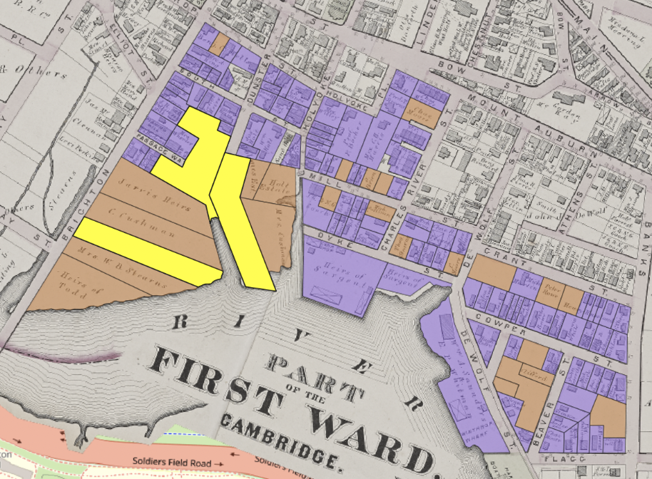

This is an example project modeling step-by-step instructions for generating geospatial data for analysis from historic maps. In June, we [shared out results](https://mapping.share.library.harvard.edu/posts/re-wilding-2024/) from partnering with Joyce Chaplin's course, Re-Wilding Harvard, where students were tasked with creating projects to investigate histories and changing natures of open space around Harvard's campus.

Hannah Adler '25 chose to study the Charles River region of Harvard's campus, on the Cambridge side near Memorial Drive.

> "I was  interested in the Harvard Square adjacent area near the river, because today we think of the river walkways and Memorial Drive, especially when it’s closed as a really valuable open space. I also had seen an image in HOLLIS that conveys a certain set of aesthetic ideals with how people were imagining the riverside could be.

<iframe width="100%" height="700" src="https://iiif.lib.harvard.edu/manifests/view/ids:3043928$1i" title="New Boston and Charles River Basin, 1880
" ></iframe>
<figcaption class="append"><a href="https://iiif.lib.harvard.edu/manifests/view/ids:3043928$1i">New Boston and Charles River Basin, 1880</a></figcaption>

Adler, who had some GIS coursework under her belt from past semesters, visited the Harvard Map Collection, knowing she wanted to incorporate spatial analysis techniques in her project. She sought to understand:

1. What did the development process look like in this area? How rapidly did this region change?
2. What was Harvard's role in developing this area?

Hannah met with GIS Librarian Belle Lipton, and discussed approaches to modeling the data to tease out these questions.

## Finding map sources

Lipton recommended a tool she worked to create at the Boston Public Library, called [Atlascope](https://www.atlascope.org/). This tool incorporates over 100 different atlases from Boston and Cambridge, and assembles them into a GIS viewer so that researchers can easily compare different years and layers. Not only do these maps show the exact changes Adler was investigating, but the map are hosted as GIS layers anyone can use in their own projects.

### 1873

<iframe width="100%" height="700" src="https://atlascope.org/#/view:share$mode:swipe-x$center:-71.11890,42.36865$zoom:16.58$base:massgis-2023-orthos$overlay:ark:/76611/al88ruzla" title="Hannah" ></iframe>
<figcaption class="append">You can swipe and zoom to see how the shape of the river has changed between 1873 and 2024.</figcaption>

### 1903
<iframe width="100%" height="700" src="https://atlascope.org/#/view:share$mode:swipe-x$center:-71.11894,42.36967$zoom:17.76$base:massgis-2023-orthos$overlay:ark:/76611/al8c0zee3" title="Hannah" ></iframe>

### 1916
<iframe width="100%" height="700" src="https://atlascope.org/#/view:share$mode:swipe-x$center:-71.11894,42.36967$zoom:17.76$base:massgis-2023-orthos$overlay:ark:/76611/al8c3wda3" title="Hannah" ></iframe>

### 1930 
<iframe width="100%" height="700" src="https://atlascope.org/#/view:share$mode:swipe-x$center:-71.11894,42.36967$zoom:17.76$base:massgis-2023-orthos$overlay:ark:/76611/al88ugbpx" title="Hannah" ></iframe>

## Vectorizing

After Adler selected the four temporal snapshots she wanted to study, and located GIS layers for each of the atlas years, the next step was to create polygon data for the parcels on the maps. Tracing the boundaries of each parcel and annotating those boundaries with important information allowed her to measure the scale of changes.

### 1873 Attribute Information

<em>Orange indicates parcels that are undeveloped in 1873, meaning they have no structures on them. Purple are developed parcels, or parcels with structures on them.</em>
 

After creating shape data for each parcel, Adler added columns to the GIS table which tracked the following attributes:
- For each parcel, was it developed or not? This was a binary value. If the parcel had a structure on it in 1873, the `developed` field for the parcel was encoded as `true`, and if it did not have a structure, the parcel had a `false` value.
- Who was the land owner in 1873? Adler created a column to encode the names of landowners, information which is found on the maps.

*Highlighted in yellow are Harvard-owned parcels in 1873.*

