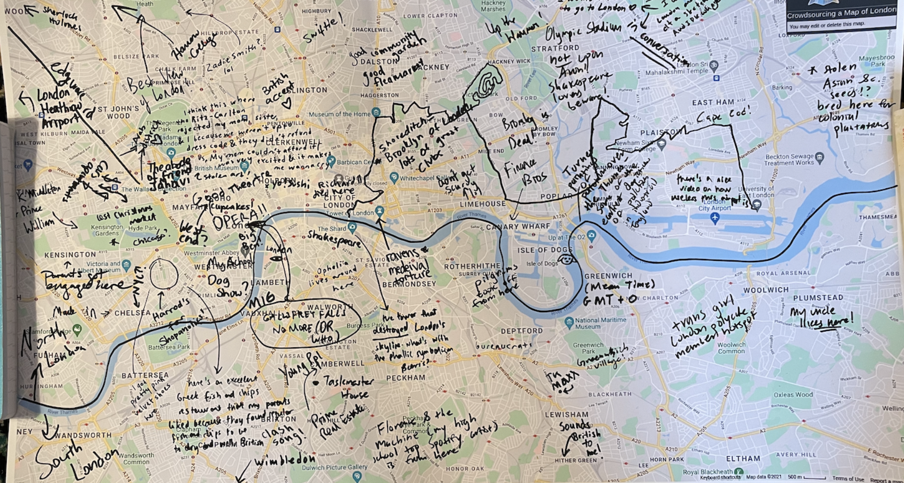

## The project

This semester, we worked with <a href="https://news.harvard.edu/gazette/story/2021/10/harvard-scholar-elucidates-the-power-of-literary-voices/">Tara K. Menon's</a> English class, titled City Fictions. In this class, undergraduates explored the various ways writers capture the constituent features of life in urban environments, reading books set in London, Bombay, New York, and Tokyo.

    

*[Wonderground map of the London town, 1914.](https://iiif.lib.harvard.edu/manifests/view/ids:49970081)*

We were happy to learn that one of the course assignments involved mapmaking; in order to get at different ways the experience of city might be represented, students were tasked with creating two distinct maps of the same place.

At the library, supporting a hand-drawn mapping assignment for an English class helped us learn ways of introducing useful GIS and data mapping competencies, even when a main learning objective wasn't mastering GIS software. 

While some students did experiment with GIS tools to create their maps, like [this StoryMap](https://storymaps.arcgis.com/stories/29f325491029422290d8e014f2929862) interrogating the complexities of leisure and safety in the experience of nightlife for women, or [this project](http://jesseng.com/london-maps/) using data [extracted from Open Street Map](https://mapping.share.library.harvard.edu/blog/2021/extract-osm-data/) and censuses to explore a city's cultural life, most of the projects were completed using paper alone. In this post, we will share some of the spatial skills leveraged, as well as highlight some great student projects.

## Class context

When we first met with the class as a whole, we shared many historic maps of London. At this point in the semester, students were reading <u>Bleak House</u>, so we had students work in groups to tease out how representations on the maps from the archives did or did not represent urban life similarly to what they were reading.

*[Post Office Plan of London, 1843](https://iiif.lib.harvard.edu/manifests/view/ids:7066367).*

Following the class visit, we met one-on-one with students to discuss projects. These discussions tended to center on three major areas: 
1. Finding existing data sources which could lend dimension to a map's argument
2. Creating novel data to populate the map
3. Common visualization techniques for spatial storytelling

## Finding data

Most of the students focused on the experiences and lived reality of themselves, people in their families, or characters from the novels. In order to contextualize these experiences, many students wanted to supplement their representations with real demographic data but didn't know where to look.

For instance, Tamar Sella was interested in exploring gentrification in the Shoreditch neighborhood, and compared Instagram reviews of upscale bakeries to areas with high Bangladeshi population density.

The learning curve for downloading and manipulating geospatial census data to create census maps is steep, and outside the scope of this assignment. In this situation, we helped students find and use a tool called [DataShine](https://datashine.org.uk/), which is England’s version of something like [SocialExplorer](http://nrs.harvard.edu/urn-3:hul.eresource:socialex)—a tool that makes it easy to explore the country's census data. Using tools like these, one can get a sense of the demographic breakdown in an area, and even export map images.

    

*Isabel Giovannetti's project showing percent of those who commute by foot.*

Isabel Giovannetti focused her project on perceived comfort in a city, defined as the absense of anxiety when moving throughout. She framed this concept through the lens of the pandemic, writing that pre-pandemic, she was enlivened by large crowds, but now finds herself moving through crowded areas with a sense of unease. 

Her maps, which she created using only tools like DataShine and [Canva](https://www.canva.com/) for presenting the information, used survey data collected in the census for those who commute to work on foot, assuming that those areas would have the highest volume of crowds at peak times. In her second map, she planned a fictional day in London, attempting to avoid crowded areas.  

    

*Map by Isabel Giovannetti exploring post-pandemic comfort and anxiety.*

## Creating data

While many students populated their maps using information from datasets they acquired, some created their own data. When we met with Saul Glist, he was transfixed by the concept of authority and authenticity in crowdsourced data. He had found a data source online showing the locations of historic plague pits in London, which had been cobbled together from various local historical societies, books, and user submitted tweets. 

*[Crowdsourced plague pit map](https://www.historic-uk.com/HistoryMagazine/DestinationsUK/LondonPlaguePits/).*

Glist found the practice of crowdsourcing an interesting way to begin studying a city, especially through the lens of "how dense communal networks of city life become communal knowledge," as he writes in his artists' statement. The way we interact with cities is often dependent on this type of data, from Yelp reviews, databases of public restrooms, to apps likes [Wheelmap](https://wheelmap.org/), which features crowd submitted data to find wheelchair accessible places.

When it comes to crowdsourced data, Glist points out, not all submissions are created equally. Pointing to the plague pit data, he asks, "Is a tweet tagging a previously unknown plague pit location for the project as trustworthy as carbon dating or legal documentation? Is it worth listing a location for which no evidence can be found, 'although local history forums seem convinced of its existence?'"

He decided to extend this line of questioning into creating his own crowdsourced map.

    

*Crowdsourced map of London by Saul Glist.*

Glist walked up and down his dining halls and collected knowledge from a few dozen students, who added annotations in sharpie to the map. His artist statement reflects on questions of authority and authenticity in the map data he collected, pointing out observations like the person who recalled being turned away from the Ritz-Carlton in London with her mother for being dressed inappropriately. 

Glist concludes, "Almost every person I spoke to had something they wanted to write onto the map, and the experience helped me appreciate how much knowledge the people around us have, if you take the time to ask. This is the power of crowdsourcing information, cities are too rich to appreciate from a single perspective."

## Visualizing data

Youmna Chamieh centered her project on experiences she had while living in London during the height of the Black Lives Matter protests. Her artist statement recalls online commenters warring over an argument that the Black Lives Matter movement was "importing America's problems" into the United Kingdom, and that the reckoning with America's legacy of slavery was reflective of the United States history, not the UK's. 

After doing some fact finding and learning about the hundreds of thousands of enslaved people Londoners transported across the Atlantic in the 1710's and '20s, as well as the modern momuments to slave traders, Chamieh writes, "That I could have lived in a city for almost a year with little to no awareness of the extent of its historical relationship with the slave trade was an unsettling experience; and yet, I believe, not a unique one."

    

*Ratio of Black people's stop and search share to their population share by Youmna Chamieh.*

She focused her maps on areas she had spent walking for leisure, to highlight this state of unawareness. She chose to contrast stop and search data with a map depicting the contested statues, writing, "Can seeing this data on a map give a better sense of the lived reality of inhabiting an urban landscape fraught with both historical and current hostility?" Presenting the maps as a pair highlights that these two hostilities are connected.

    

*Map of statues of figures connected to slavery by Youmna Chamieh.*

For visualizing the statue data, Chamieh decided to use a proportional symbol map where statues which had been in existence for longer appeared larger, to "visually capture the sheer number of generations where urban representatives saw no issue with them". She also used special symbology to depict statues which had been built only in the last century.

Projects like these demonstrate how educators can introduce and considerably augment students' spatial reasoning and data literacy skills without relying on the mastery of geospatial software alone. At the library, we're looking to build on what we learned through working with this class as a way of segueing into introducing software skills with emphasis on critical thinking. To work with our collections or learn more about our teaching and research services, you can [visit our website](https://library.harvard.edu/libraries/harvard-map-collection). 
