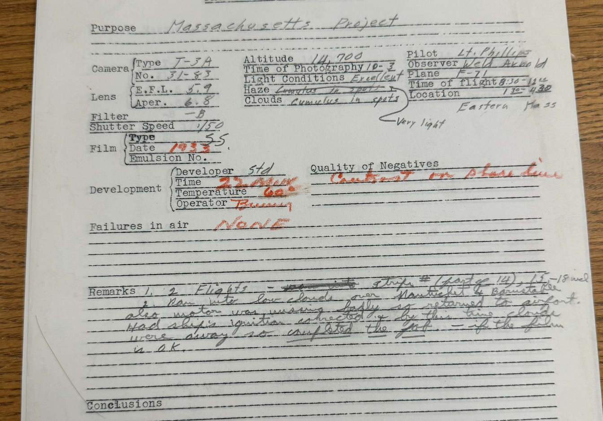
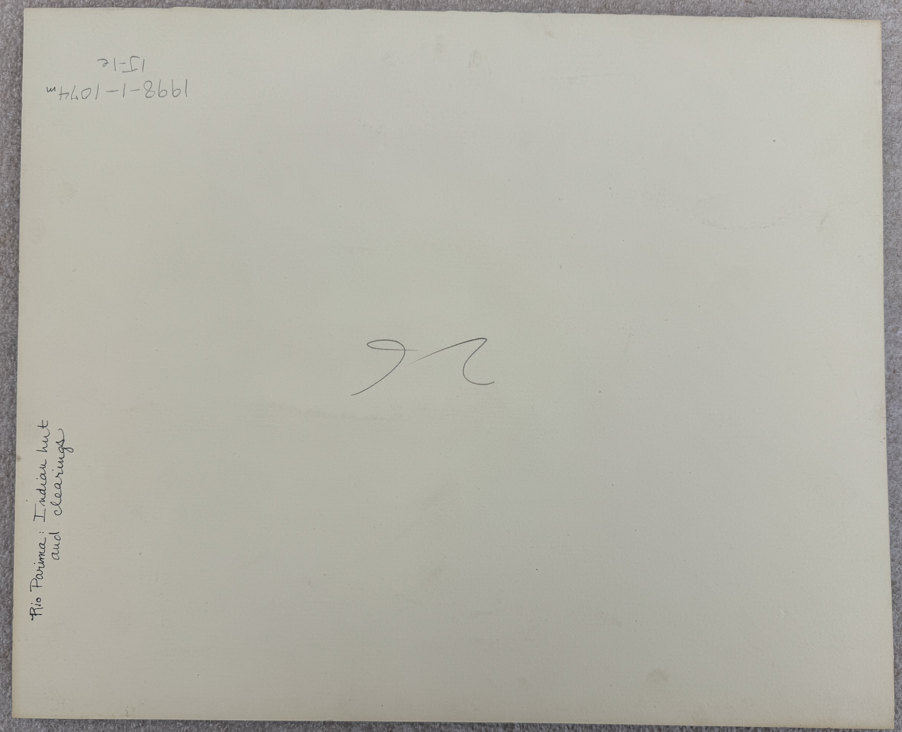
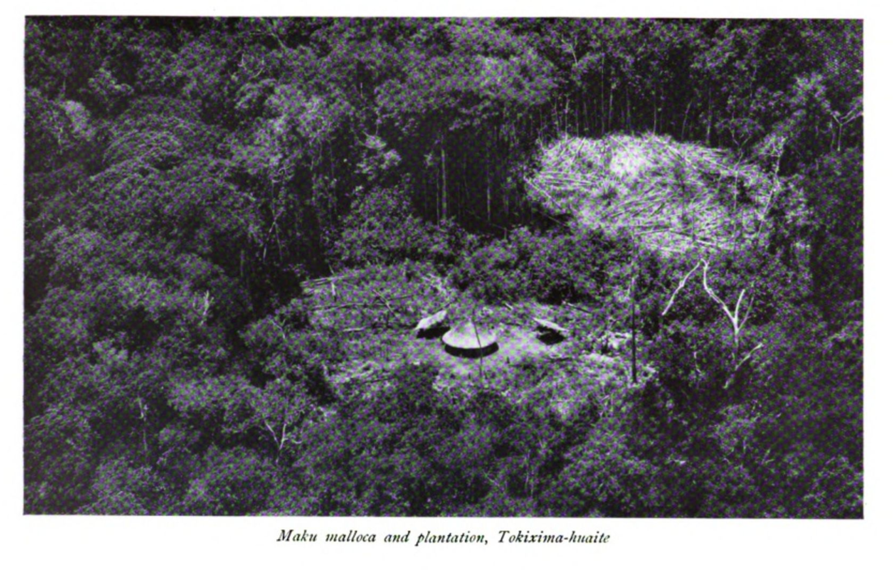

## A remembered yet unknown Institute of Geographical Exploration at Harvard (1930-1951) 

This dataset and story open the past of Harvard University’s *Institute of Geographical Exploration* (HUIGE, 1932-1951). The HUIGE was a building, a branch of Harvard’s defunct Geography department, a home to many students, and still a mystery to this day.

- The scope of this project is simple: making a guide to as many repositories of HUIGE-related artifacts across Harvard’s campus and other institutions across Massachusetts.
- This guide cannot be complete but will hopefully help launch further inquiries into the fate of Aerial Photography and Geography at Harvard and in the USA.
- The hope of this project is to call to action anyone with further knowledge about the HUIGE, its activities, and the evolving role of Aerial Photography between WWI and the evolution of Satellite Imagery in order to complete the gaps hinted at in this story.
- This project was supported by the [Pforzheimer Fellowship](https://library.harvard.edu/grants-fellowships/pforzheimer-fellowships) at Harvard, with a focus on Geospatial Data and Archival Research, and overseen by the Map Collections and especially Belle Lipton.

Every good story starts with a spark and a helping hand to fan it. This one stems from the records and institutional knowledge unveiled by the wonderful people at Havard’s Map Collection. Custodians of many important maps and the personal documents of geographers having worked at Harvard, our Map librarians have kept a finger on the pulse of Geography’s unravelling at Harvard and beyond. Due to their unrestrained support, I was brought in contact in the very beginning of my Pforzheimer Fellowship with four inestimable pillars of the HUIGE’s story:

1. Correspondence between DCR archivist Sean Fischer and the Harvard Forest Archive about the HUIGE-conducted Massachusetts aerial survey of 1933, first State-wide aerial photographic survey in America;
2. Papers recording the transfer of over 100,000 maps and photos to Harvard’s Map Collection upon HUIGE’s closure;
3. A complete photographic survey of Cape Cod taken by the HUIGE, only exemplar of a complete survey taken by the HUIGE in any archival collection to date and to my knowledge;
… all topics I will return to throughout this article, and last but not least, for the nerdy joy of research: 
4. A stamp used at the HUIGE and which now graces my booklet!

### HUIGE

The Institute was founded by Alexander Hamilton Rice through a contract with Harvard’s President Lawrence Lowell on June 18th 1930. According to the agreement between Rice and President Lowell, the former would fund the building of a “School of Geography” (regardless of there already being a Department of Geology and Geography at Harvard) with the “chief aim” of teaching “the fundamentals of geographical science and their application to pure regional geography, particularizing, especially, in geographic and physiographic problems and their relation with complementary ontographic problems”.[^1] From the lofty proposal emerged a project of two decades, hosted in what is now the Yenching Library of Harvard, at 2 Divinity Ave. Upon its final closure, October 30th 1951, the building was vacated and its belongings were distributed across Harvard’s archives, where pockets of information related to the Institute remain unconnected to this day. This article provides a gateway to the currently recorded holdings of HUIGE’s materials by Harvard Libraries and Archives. 

The story of HUIGE is inseparable from that of its founder. Rice was an exploration geographer of the Northwest Amazon and one of the wealthiest socialites of Newport R.I., after marrying the then Eleanor Elkins Widener, famous donor of Widener Library to Harvard. Rice’s mapping trips down the Orinoco and Rio Negro pioneered new techniques for surveying in the 1920s (by airplane and with the help of radio-communication), but only at the cost of indigenous lives. His harmful exploration resulted in many deaths among indigenous peoples encountered. They intrinsically haunt this story, and I hope that their resurfacing in the account below may be a small step in remembrance and further recollection. Rice’s person and personality had become eponymous of the School of Geography itself, as many people in common parlance still refer to the old HUIGE as the “Rice Institute”. Yet the work undergone at HUIGE went beyond the man, even though it was only made possible by his and the new Mrs. Rice’s donations, as well as his selection of personnel for the Institute. This project hopes to expand on the real work done by the HUIGE throughout its two decades of operation.

Discovery map goes here.

### Acknowledgements

This is a story of archival discovery that was made possible only by the help of Librarians, Archivists and many more staff members of Harvard Libraries, past and present. I wish to acknowledge their help and that of all staff members of the following institutions:

**Collection of Historical Scientific Instruments** (CHSI, or “ch-zee”) *Executive Director* Joshua Gorman and *Project Manager* Erik Lindahl, went out of their way to pull 6 boxes of heavy materials, find long buried digitizations, and make space for consultation in the midst of a move-out.

**Frances Loeb Library** *Special Collections Curator* Ines Zalduendo, *GIS, Data, and Research Librarian* Bruce Boucek and *Research, Teaching, and Writing Services Librarian* Nicole D. Santiago helped me track down a document that was by all accounts missing: “Availability of Aerial Photographs”.

At **Harvard University Archives,** truly every staff member from the Archive reference room in Pusey and especially Reference Archivist Edward Copenhagen, have helped and accommodated this research going on more than a year now.

**Map Collection** *Map Librarian* Molly Taylor-Poleskey, *Head of Geospatial Resources* Bonnie Burns and *Cartographic Reference Assistant* Jonathan Rosenwasser have given me access to uncatalogued aerial photographs, personal papers of geographers at Harvard and most of all, have shared with me a wealth of institutional knowledge about the remnants of the HUIGE at Harvard. David Weimer, now Curator of Maps at the Newberry Library, shared key information about uncatalogued remnants of the HUIGE held at the Map Collection.

**Massachusetts Department of Conservation & Recreation** (DCR) Archivist Sean Fischer, who scoured State and Harvard archives in 2020 for the first big project hosted at the HUIGE.

**Schlesinger Library** *Research Librarian* Sarah Hutcheon has gone out of her way to uncover the stories of Radcliffe women taking to the air through courses in aerial photography.

Lastly, I wish to thank for the time and resources to undertake this project every member organizing the **Pforzheimer Fellowship**, Hannah Hack, Professor Ann Blair, and especially Belle Lipton, who has taught me how to think about spatial data in an archival project, and how to tell a story that will be useful beyond my work.

### Mystery and Criticism

Several scholars have published crucial works unpacking the story of Geography’s demise at Harvard and its effects on the landscape of geographical education in the United States. [^2] Curiously, most thorough research on this topic only grazingly mentions the Institute of Geographical Exploration. Even stranger, nearly all mentions of the Institute are negative or disparaging in nature. Neil Smith’s 1987 seminal article, “Academic War Over the Field of Geography: The Elimination of Geography at Harvard, 1947-1951”, names Alexander Hamilton Rice, the Institute’s founder, “a scoundrel by various accounts”[^3], although “more a nuisance than the villain of the piece”[^4]. As for the Institute, it allegedly “was not respected, either within Harvard or outside, and relations were difficult between the Institute and the Division of Geological Sciences.”[^5] This impression was built from archives of correspondence between influent Harvard faculty members such as President James B. Conant or members of the broader Academic community, such as head of the American Geographical Society Isaiah Bowman.

The influence of this piece has been long-lasting. In the more productive ways, it has opened a field of inquiry over the silencing of political dissidence and homosexuality at Harvard around the WWII period, most prominently taken up by the geographers Allison Mountz and Kira Williams.[^6] Yet this piece has fenced the Institute of Geographical Exploration in stagnation, as a stain over the reputation of Geography at Harvard. Smith’s image of a disreputable Rice remains common parlance, as a Harvard Crimson retrospective on the Institute from March 2023 still describes Rice as a “scoundrel” and a “nuisance”[^7]. The reasons for attaching these words to Rice are different today than they were in his own time, however. A short critical overview of Rice’s geographical exploits is presented in what follows, before returning to the reputation he had gathered in his own time. 

### Rice in the Amazon

In an account given to the American Geographical Society upon the receipt of the “David Livingstone Centenary Medal” in 1920, Rice presented the adventures of his latest expedition. The goal of the expedition was to map the river course of the Rio Negro, a tributary of the Amazon splaying off to the North around Manaus, as well as “the adjacent country, its topography, and its native population”. Charts and maps were not the only materials resulting from the expedition, but also Rice’s “many slides depicting the life of the natives”[^8]. Perhaps one such slide was a picture inscribed on the back with a number (24) and the quote: “Scene on the Amazon”: 

This photo [^9] is included in a small collection of [17 photographs held at the Collection for Historical Scientific Instruments (CHSI)](https://mapping.share.library.harvard.edu/projects/huige/collection-for-historical-scientific-instruments/), perhaps a representative set of photographs about different subjects used as teaching materials at the HUIGE. There is slight evidence that many of these pictures may have come from A. H. Rice’s private collection.

For instance, another of the 17 photos, appears in Rice’s account of his 7th expedition (1924-25):

<u>Above:</u> Photo inscribed on the back with the number “26” and described as “Rio Parima: Indian hut and clearings”, Harvard’s CHSI.[^10]

<u>Below:</u> Plate found in Rice’s account: “The Rio Branco, Uraricuera and Parima : surveyed by the expedition to the Brazilian Guayana from August 1924 to June 1925 : a paper read at the meeting of the Society, 22 March 1926”. This expedition did not accomplish its goals, but brought much attention to Rice for his insistence on the use of aerial photography (by retrofitted aeroplane) and shortwave radio telecommunication. The picture is the same as CHSI’s but is titled alternatively: “Maku malloca and plantation, Tokixima-huaite”.[^11]

The “climax” of Rice’s account, however, was an encounter with “savages” which resulted in an attack that Rice was “lucky enough to escape with his life”. [^12] The polite summary published by the AGS does not include the term used by Rice to describe the indigenous people he encountered… His own retelling involves “cannibals” of the “most ferocious” kind, armed with “bows and arrows” and “spears and blow guns” appearing on the other side of a river. When this indigenous group had started wading across the river, with bows above the water, Rice’s party had taken out their “revolver”, “shotgun, and a rifle” and “fired volley after volley, killing several of [the indigenous’ group’s] number”. There is little else to the account besides the disparaging final comment that, having no boats of their own, the indigenous people would most likely “not know how to use them if they did have canoes” [^13]. Allegedly followed along the shore by this group of men for four days, Rice extolls the survival of his party after much angst at the whole affair:

<embed src="media/NYT_96890007.pdf" style="width:100%; height:600px;"
 type="application/pdf" alt="NYT article">

From the point of view of the explorer, the terrifying justification for taking indigenous lives easily coexists with gratitude for indigenous knowledge. Elsewhere, Rice praises the indigenous communities having helped him along the way as “very intelligent and hospitable people”[^14]. This single-minded geographical gaze, focused on the extraction of data needed to fill in the blanks left by Western predecessors on maps meant for European and American audiences, makes “mapping [itself] a form of colonisation”[^15]. This point of view stamps over the reality of interactions between different tribes and communities in the Amazon, rendering them into hostiles and friendlies with respect to the explorer’s mission. 

Such fraught relationships to the land and its people, and still not the reason why Rice was dubbed a “scoundrel” and a “nuisance” in his time! The criticism of his professional abilities came rather from the different approaches to academic geography adopted by professionals and academics at the time, something Luciana Martins summarizes as : “the fraught relationship between academic geography and exploration.”[^16] Without extending further on the critiques of “exploration” incipient in the early 20th century Geography, which have been better treated elsewhere [^17], I hope to make a case for HUIGE’s many successes, often independent of Rice’s direct action. 

### Forgotten praise for the HUIGE

In the early days of raising awareness about the new Institute and its most well-known course, Aerial Photography, Weld Arnold, previously field astronomer for Rice’s expeditions, organized a successful series of lectures given by some of the best experts in the field of aerial reconnaissance [^18]: 

| Instructor | Role | Date of talks | Topic of talks |
| --- | --- | --- | --- |
| Capt. Albert W. Stevens | "U.S. Army Air Corps, Wright Field, Dayton, Ohio" | March 2nd and 3rd 1932 | "Operation of Aerial Cameras, Methods of Developing, Processes of Printing and Enlarging, Chemistry of Aerial Photographing” |
| Capt. Dache M. Reeves | "U.S. Army Corps of Engineers, Wright Field, Dayton, Ohio” | March 8th and 9th 1932 | "Military Use of Aerial Photographs” |
| Capt. Bruce C. Hill | "U.S. Army Corps of Engineers, Chief Technical Data Branch, Wright Field, Dayton, Ohio” | March 16th and 17th 1932 | "Stereoscopic Methods of Preparing Topographic Maps from Aerial Photographs” |
| Lieut. J. F. Phillips | "U.S. Army Air Corps, Wright Field, Dayton, Ohio” | March 23rd and 24th 1932 | "Use of Aerial Photos in Map Making” |
| Major James W. Bagley | "Lake Survey, Detroit, Michigan” | March 30th and 31st 1932 | "Use of Multiple Lens Cameras in Map Making” |
| Lieut. Samuel P. Mills | "Dept. Military Science and Tactics, N.Y. University New York, N. Y.” | April 13th and 14th 1932 | "Airplane Navigation and Flight Problems” |
| F.W. Lutz | "Vice-President, Fairchild Camera Corp.” | April 20th and 21st 1932 | "Commercial Uses of Aerial Photographs” |

With time, most of these instructors were to teach courses at the HUIGE. 

To take one example, James Warren Bagley had worked for the United States Geological Survey before distinguishing himself during the First World War by his hand in the creation of a “three-lens camera by which a much larger field could be photographed at a single flight than was possible with the single-lens camera.”[^19] The laudatory words come from Bagley’s obituary by the influential cartographer Erwin Raisz, himself a Lecturer at the HUIGE. More famously, Bagley contributed to aerial photography the “five-lens camera”, which can take simultaneous pictures vertically over the ground as well as obliquely at 45° in all four cardinal directions. During his tenure as Lecturer in Geography at the HUIGE, Bagley wrote a fundamental tome for the discipline of photogrammetry: “Aerophotography and Aerosurveying”[^20]. The cameras in use at the HUIGE and in the USA between the two Wars were all from the Fairchild Aerial Camera Corporation, which improved upon Bagley’s initial tri-lens camera. Helpful graphs as to their functioning have surfaced during my search among a box of miscellaneous files at the Frances Loeb library. [^21]

[^1]: [contract_UAV_5.168_Box 399].

[^2]: Martin J. Haigh and T. W. Freeman, “The Crisis in American Geography,” Area 14, no. 3 (1982): 185–90; Andrew F. Burghardt, “On ‘Academic War over the Field of Geography,’ The Elimination of Geography at Harvard, 1947-1951,” Annals of the Association of American Geographers 78, no. 1 (1988): 144–144; Neil Smith, “‘Academic War over the Field of Geography’: The Elimination of Geography at Harvard, 1947-1951,” Annals of the Association of American Geographers 77, no. 2 (1987): 155–72; Alison Mountz and Kira Williams, “Let Geography Die: The Rise, Fall, and ‘Unfinished Business’ of Geography at Harvard,” Annals of the American Association of Geographers ahead-of-print, no. ahead-of-print (2023): 1–26, https://doi.org/10.1080/24694452.2023.2208645; Alison Mountz and Kira Williams, “Derwent’s Ghost: The Haunting Silences of Geography at Harvard,” in A Place More Void (Nebraska, 2021), https://doi.org/10.2307/j.ctv1bd4n3v.12.

[^3]: Smith, “Academic War over the Field of Geography,” 156.

[^4]: Smith, 167.

[^5]: Smith, 161.

[^6]: See references in note 3, above.

[^7]: Barry, Mila G., and Matthew A. Thompson. “From the Institute of Geographical Exploration to East Asian Studies: A Retrospective on 2 Divinity Ave.,” March 9, 2023. https://www.thecrimson.com/article/2023/3/9/divinity-ave-retrospection/.

[^8]: “Presentation of the David Livingstone Centenary Medal to Dr. Alexander Hamilton Rice and Lecture by Dr. Rice,” Geographical Review 11, no. 1 (1921): 139–41.

[^9]: Photo taken by author during consultation at the CHSI, can be found online as “1998-1-1074i” http://waywiser.fas.harvard.edu/objects/20918/photograph-of-scene-on-the-amazon-river?ctx=ed06e63b-01d5-4c5f-b64b-daf1fd20251a&idx=54

[^10]: 1998-1-1074m http://waywiser.fas.harvard.edu/objects/20922/aerial-photograph-of-hut-and-clearings-in-rainforest-in-rio?ctx=5b3f2627-f80c-4d01-bba6-1c3e88812b97&idx=67

[^11]: Alexander Hamilton Rice, *The Rio Branco, Uraricuera and Parima: Surveyed by the Expedition to the Brazilian Guayana from August 1924 to June 1925 : A Paper Read at the Meeting of the Society, 22 March 1926* (London: Royal Geographical Society, 1928).

[^12]: “Presentation of the David Livingstone Centenary Medal to Dr. Alexander Hamilton Rice and Lecture by Dr. Rice.”

[^13]: “EXPLORERS FIGHT AMAZON SAVAGES: Prof. A.H. Rice Arrives Home-- Tells of Thrilling Escape from Huge Cannibals. TRIBESMEN NEARLY WHITE Mrs. Rice Said to Have Gone Farther Into Jungles Than Any Other Woman. Attacked by 200 Savages. No Sleep for Four Days,” *The New York Times*, May 12, 1920.

[^14]: Article from the Evening Sun quoted in: Luciana Martins, “Illusions of Power: Vision, Technology, and Geographical Exploration of the Amazon, 1924-1925,” *Journal of Latin American cultural studies : travesía* 16, no. 3 (2007): 298.

[^15]: Luciana Martins, “Geographical Exploration and the Elusive Mapping of Amazonia,” *Geographical Review* 102, no. 2 (2012): 229, https://doi.org/10.1111/j.1931-0846.2012.00144.x.

[^16]: Martins, 235.

[^17]: See note 2, above.

[^18]: TN996714 UAV 461.214 Box 2, *1_Geog.36_1932-33_Early Correspondence.*

[^19]: Raisz, Erwin. “James Warren Bagley, 1881–1947.” *Annals of the Association of American Geographers* 37, no. 2 (June 1947): 122–122. https://doi.org/10.1080/00045604709351949.  See also: Bagley, James Warren. “The Use of the Panoramic Camera in Topographic Surveying with Notes on the Application of Photogrammetry to Aerial Surveys.” Bulletin. Govt. Print. Off., 1917. https://doi.org/10.3133/b657.

[^20]: Bagley, James Warren. Aerophotography and Aerosurveying. 1st ed. New York, London: McGraw-Hill Book Company, inc., 1941.

[^21]: Frances Loeb Library Archives, VF (vertical files) NAC 1244, folder “Ahrens - Utilization of aerial photographs”.