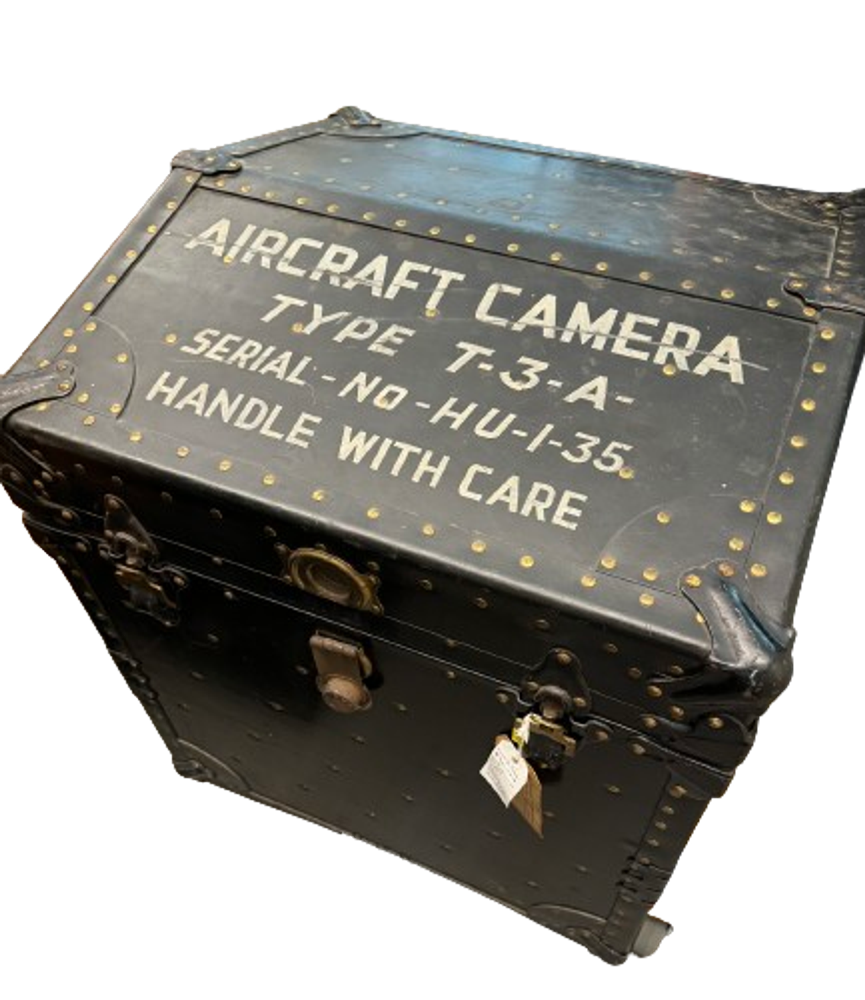
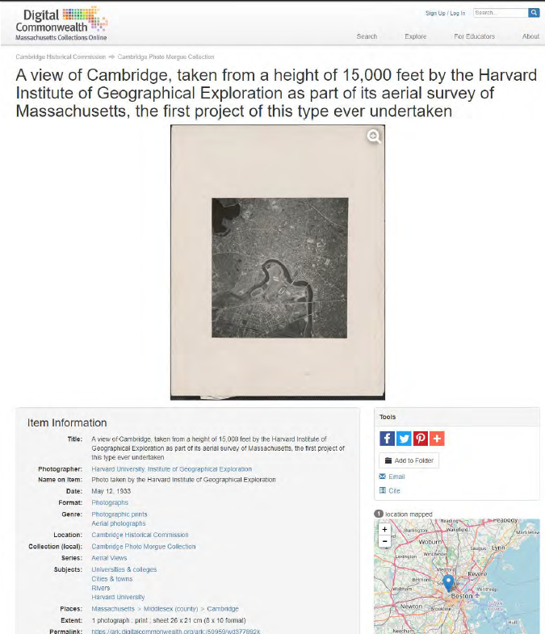
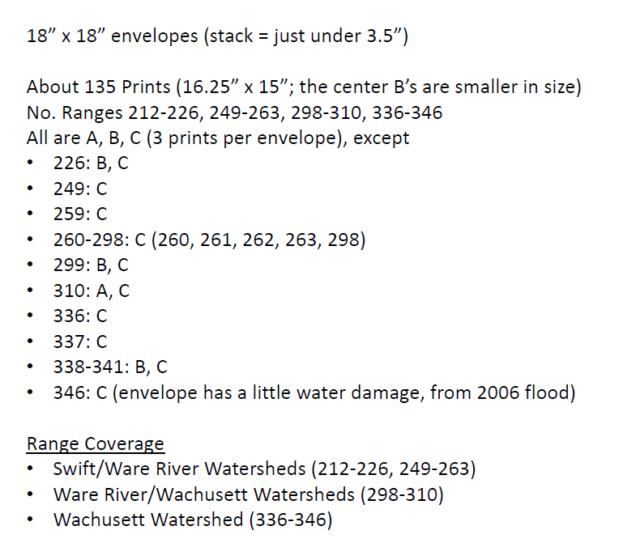
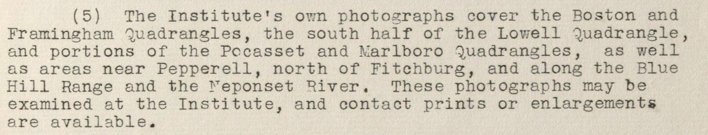
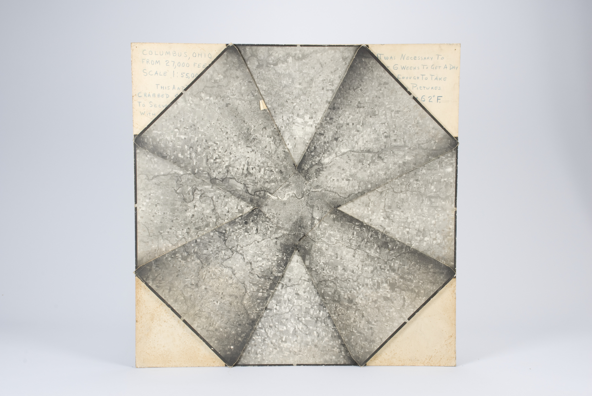
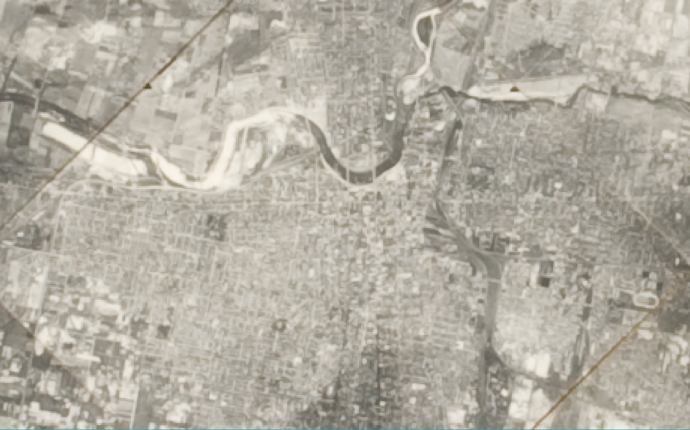

## A remembered yet unknown Institute of Geographical Exploration at Harvard (1930-1951) 

This dataset and story open the past of Harvard University’s *Institute of Geographical Exploration* (HUIGE, 1930-1951). The HUIGE was a building, a branch of Harvard’s defunct Geography department, a home to many students, and still a mystery to this day.

- The scope of this project is simple: making [a guide](https://mapping.share.library.harvard.edu/projects/huige/) to as many repositories of HUIGE-related artifacts across Harvard’s campus and other institutions across Massachusetts.
- This guide cannot be complete but will hopefully help launch further inquiries into the fate of Aerial Photography and Geography at Harvard and in the USA.
- The hope of this project is to call to action anyone with further knowledge about the HUIGE, its activities, and the evolving role of Aerial Photography between WWI and the evolution of Satellite Imagery in order to complete the gaps hinted at in this story.
- This project was supported by the [Pforzheimer Fellowship](https://library.harvard.edu/grants-fellowships/pforzheimer-fellowships) at Harvard, with a focus on Geospatial Data and Archival Research, and overseen by the Map Collections and especially Belle Lipton.

Every good story starts with a spark and a helping hand to fan it. This one stems from the records and institutional knowledge unveiled by the wonderful people at Havard’s Map Collection. Custodians of many important maps and the personal documents of geographers having worked at Harvard, our Map librarians have kept a finger on the pulse of Geography’s unravelling at Harvard and beyond. Due to their unrestrained support, I was brought in contact in the very beginning of my Pforzheimer Fellowship with four inestimable pillars of the HUIGE’s story:

1. Correspondence between DCR archivist Sean Fischer and the Harvard Forest Archive about the HUIGE-conducted Massachusetts aerial survey of 1933, first State-wide aerial photographic survey in America;
2. Papers recording the transfer of over 100,000 maps and photos to Harvard’s Map Collection upon HUIGE’s closure;
3. A complete photographic survey of Cape Cod taken by the HUIGE, only exemplar of a complete survey taken by the HUIGE in any archival collection to date and to my knowledge;
… all topics I will return to throughout this article, and last but not least, for the nerdy joy of research: 
4. A stamp used at the HUIGE and which now graces my booklet!

### HUIGE

The Institute was founded by Alexander Hamilton Rice through a contract with Harvard’s President Lawrence Lowell on June 18th 1930. According to the agreement between Rice and President Lowell, the former would fund the building of a “School of Geography” (regardless of there already being a Department of Geology and Geography at Harvard) with the “chief aim” of teaching “the fundamentals of geographical science and their application to pure regional geography, particularizing, especially, in geographic and physiographic problems and their relation with complementary ontographic problems”.[^1] From the lofty proposal emerged a project of two decades, hosted in what is now the Yenching Library of Harvard, at 2 Divinity Ave. Upon its final closure, October 30th 1951, the building was vacated and its belongings were distributed across Harvard’s archives, where pockets of information related to the Institute remain unconnected to this day. This article provides a gateway to the currently recorded holdings of HUIGE’s materials by Harvard Libraries and Archives. 

The story of HUIGE is inseparable from that of its founder. Rice was an exploration geographer of the Northwest Amazon and one of the wealthiest socialites of Newport R.I., after marrying the then Eleanor Elkins Widener, famous donor of Widener Library to Harvard. Rice’s mapping trips down the Orinoco and Rio Negro pioneered new techniques for surveying in the 1920s (by airplane and with the help of radio-communication), but only at the cost of indigenous lives. His harmful exploration resulted in many deaths among indigenous peoples encountered. They intrinsically haunt this story, and I hope that their resurfacing in the account below may be a small step in remembrance and further recollection. Rice’s person and personality had become eponymous of the School of Geography itself, as many people in common parlance still refer to the old HUIGE as the “Rice Institute”. Yet the work undergone at HUIGE went beyond the man, even though it was only made possible by his and the new Mrs. Rice’s donations, as well as his selection of personnel for the Institute. This project hopes to expand on the real work done by the HUIGE throughout its two decades of operation.

The map below summarizes the respective holdings of different Harvard archives. Discover each of their holdings by clicking on the colorful buildings highlighted on Harvard’s campus:

<iframe style="left:-3em;position:relative;" width="120%" height="700" src="https://mapping.share.library.harvard.edu/huige/" title="spatial finding aid" ></iframe>

### Acknowledgements

This is a story of archival discovery that was made possible only by the help of Librarians, Archivists and many more staff members of Harvard Libraries, past and present. I wish to acknowledge their help and that of all staff members of the following institutions:

**Collection of Historical Scientific Instruments** (CHSI, or “ch-zee”) *Executive Director* Joshua Gorman and *Project Manager* Erik Lindahl, went out of their way to pull 6 boxes of heavy materials, find long buried digitizations, and make space for consultation in the midst of a move-out.

**Frances Loeb Library** *Special Collections Curator* Ines Zalduendo, *GIS, Data, and Research Librarian* Bruce Boucek and *Research, Teaching, and Writing Services Librarian* Nicole D. Santiago helped me track down a document that was by all accounts missing: “Availability of Aerial Photographs”.

At **Harvard University Archives,** truly every staff member from the Archive reference room in Pusey and especially Reference Archivist Edward Copenhagen, have helped and accommodated this research going on more than a year now.

**Map Collection** *Map Librarian* Molly Taylor-Poleskey, *Head of Geospatial Resources* Bonnie Burns and *Cartographic Reference Assistant* Jonathan Rosenwasser have given me access to uncatalogued aerial photographs, personal papers of geographers at Harvard and most of all, have shared with me a wealth of institutional knowledge about the remnants of the HUIGE at Harvard. David Weimer, now Curator of Maps at the Newberry Library, shared key information about uncatalogued remnants of the HUIGE held at the Map Collection.

**Massachusetts Department of Conservation & Recreation** (DCR) Archivist Sean Fischer, who scoured State and Harvard archives in 2020 for the first big project hosted at the HUIGE.

**Schlesinger Library** *Research Librarian* Sarah Hutcheon has gone out of her way to uncover the stories of Radcliffe women taking to the air through courses in aerial photography.

Lastly, I wish to thank for the time and resources to undertake this project every member organizing the **Pforzheimer Fellowship**, Hannah Hack, Professor Ann Blair, and especially Belle Lipton, who has taught me how to think about spatial data in an archival project, and how to tell a story that will be useful beyond my work.

### Mystery and Criticism

Several scholars have published crucial works unpacking the story of Geography’s demise at Harvard and its effects on the landscape of geographical education in the United States. [^2] Curiously, most thorough research on this topic only grazingly mentions the Institute of Geographical Exploration. Even stranger, nearly all mentions of the Institute are negative or disparaging in nature. Neil Smith’s 1987 seminal article, “Academic War Over the Field of Geography: The Elimination of Geography at Harvard, 1947-1951”, names Alexander Hamilton Rice, the Institute’s founder, “a scoundrel by various accounts”[^3], although “more a nuisance than the villain of the piece”[^4]. As for the Institute, it allegedly “was not respected, either within Harvard or outside, and relations were difficult between the Institute and the Division of Geological Sciences.”[^5] This impression was built from archives of correspondence between influent Harvard faculty members such as President James B. Conant or members of the broader Academic community, such as head of the American Geographical Society Isaiah Bowman.

The influence of this piece has been long-lasting. In the more productive ways, it has opened a field of inquiry over the silencing of political dissidence and homosexuality at Harvard around the WWII period, most prominently taken up by the geographers Allison Mountz and Kira Williams.[^6] Yet this piece has fenced the Institute of Geographical Exploration in stagnation, as a stain over the reputation of Geography at Harvard. Smith’s image of a disreputable Rice remains common parlance, as a Harvard Crimson retrospective on the Institute from March 2023 still describes Rice as a “scoundrel” and a “nuisance”[^7]. The reasons for attaching these words to Rice are different today than they were in his own time, however. A short critical overview of Rice’s geographical exploits is presented in what follows, before returning to the reputation he had gathered in his own time. 

### Rice in the Amazon

In an account given to the American Geographical Society upon the receipt of the “David Livingstone Centenary Medal” in 1920, Rice presented the adventures of his latest expedition. The goal of the expedition was to map the river course of the Rio Negro, a tributary of the Amazon splaying off to the North around Manaus, as well as “the adjacent country, its topography, and its native population”. Charts and maps were not the only materials resulting from the expedition, but also Rice’s “many slides depicting the life of the natives”[^8]. Perhaps one such slide was a picture inscribed on the back with a number (24) and the quote: “Scene on the Amazon”: 

This photo [^9] is included in a small collection of [17 photographs held at the Collection for Historical Scientific Instruments (CHSI)](https://mapping.share.library.harvard.edu/projects/huige/collection-for-historical-scientific-instruments/), perhaps a representative set of photographs about different subjects used as teaching materials at the HUIGE. There is slight evidence that many of these pictures may have come from A. H. Rice’s private collection.

For instance, another of the 17 photos, appears in Rice’s account of his 7th expedition (1924-25):

<u>Above:</u> Photo inscribed on the back with the number “26” and described as “Rio Parima: Indian hut and clearings”, Harvard’s CHSI.[^10]

<u>Below:</u> Plate found in Rice’s account: “The Rio Branco, Uraricuera and Parima : surveyed by the expedition to the Brazilian Guayana from August 1924 to June 1925 : a paper read at the meeting of the Society, 22 March 1926”. This expedition did not accomplish its goals, but brought much attention to Rice for his insistence on the use of aerial photography (by retrofitted aeroplane) and shortwave radio telecommunication. The picture is the same as CHSI’s but is titled alternatively: “Maku malloca and plantation, Tokixima-huaite”.[^11]

The “climax” of Rice’s account, however, was an encounter with “savages” which resulted in an attack that Rice was “lucky enough to escape with his life”. [^12] The polite summary published by the AGS does not include the term used by Rice to describe the indigenous people he encountered… His own retelling involves “cannibals” of the “most ferocious” kind, armed with “bows and arrows” and “spears and blow guns” appearing on the other side of a river. When this indigenous group had started wading across the river, with bows above the water, Rice’s party had taken out their “revolver”, “shotgun, and a rifle” and “fired volley after volley, killing several of [the indigenous’ group’s] number”. There is little else to the account besides the disparaging final comment that, having no boats of their own, the indigenous people would most likely “not know how to use them if they did have canoes” [^13]. Allegedly followed along the shore by this group of men for four days, Rice extolls the survival of his party after much angst at the whole affair:

<embed src="media/NYT_96890007.pdf" style="width:100%; height:600px;"
 type="application/pdf" alt="NYT article">

From the point of view of the explorer, the terrifying justification for taking indigenous lives easily coexists with gratitude for indigenous knowledge. Elsewhere, Rice praises the indigenous communities having helped him along the way as “very intelligent and hospitable people”[^14]. This single-minded geographical gaze, focused on the extraction of data needed to fill in the blanks left by Western predecessors on maps meant for European and American audiences, makes “mapping [itself] a form of colonisation”[^15]. This point of view stamps over the reality of interactions between different tribes and communities in the Amazon, rendering them into hostiles and friendlies with respect to the explorer’s mission. 

Such fraught relationships to the land and its people, and still not the reason why Rice was dubbed a “scoundrel” and a “nuisance” in his time! The criticism of his professional abilities came rather from the different approaches to academic geography adopted by professionals and academics at the time, something Luciana Martins summarizes as : “the fraught relationship between academic geography and exploration.”[^16] Without extending further on the critiques of “exploration” incipient in the early 20th century Geography, which have been better treated elsewhere [^17], I hope to make a case for HUIGE’s many successes, often independent of Rice’s direct action. 

### Forgotten praise for the HUIGE

In the early days of raising awareness about the new Institute and its most well-known course, Aerial Photography, Weld Arnold, previously field astronomer for Rice’s expeditions, organized a successful series of lectures given by some of the best experts in the field of aerial reconnaissance [^18]: 

| Instructor | Role | Date of talks | Topic of talks |
| --- | --- | --- | --- |
| Capt. Albert W. Stevens | "U.S. Army Air Corps, Wright Field, Dayton, Ohio" | March 2nd and 3rd 1932 | "Operation of Aerial Cameras, Methods of Developing, Processes of Printing and Enlarging, Chemistry of Aerial Photographing” |
| Capt. Dache M. Reeves | "U.S. Army Corps of Engineers, Wright Field, Dayton, Ohio” | March 8th and 9th 1932 | "Military Use of Aerial Photographs” |
| Capt. Bruce C. Hill | "U.S. Army Corps of Engineers, Chief Technical Data Branch, Wright Field, Dayton, Ohio” | March 16th and 17th 1932 | "Stereoscopic Methods of Preparing Topographic Maps from Aerial Photographs” |
| Lieut. J. F. Phillips | "U.S. Army Air Corps, Wright Field, Dayton, Ohio” | March 23rd and 24th 1932 | "Use of Aerial Photos in Map Making” |
| Major James W. Bagley | "Lake Survey, Detroit, Michigan” | March 30th and 31st 1932 | "Use of Multiple Lens Cameras in Map Making” |
| Lieut. Samuel P. Mills | "Dept. Military Science and Tactics, N.Y. University New York, N. Y.” | April 13th and 14th 1932 | "Airplane Navigation and Flight Problems” |
| F.W. Lutz | "Vice-President, Fairchild Camera Corp.” | April 20th and 21st 1932 | "Commercial Uses of Aerial Photographs” |

With time, most of these instructors were to teach courses at the HUIGE. 

To take one example, James Warren Bagley had worked for the United States Geological Survey before distinguishing himself during the First World War by his hand in the creation of a “three-lens camera by which a much larger field could be photographed at a single flight than was possible with the single-lens camera.”[^19] More famously, Bagley contributed to aerial photography the “five-lens camera”, which can take simultaneous pictures vertically over the ground as well as obliquely at 45° in all four cardinal directions. During his tenure as Lecturer in Geography at the HUIGE, Bagley wrote a fundamental tome for the discipline of photogrammetry: “Aerophotography and Aerosurveying”[^20]. Bagley was a 

> “… gentleman by tradition, a scientist by education, and an inventor by nature. […] He was teaching in one of the first private institutions where aerial photography was offered, and many new techniques which became of importance during the war were developed in his laboratories. Many of his students occupy important posts, thousands of men have been trained by his books, and Colonel Bagley’s name is indelibly inscribed in the history of American photogrammetry.” [^21]
> 

The laudatory words come from Bagley’s obituary by the influential cartographer Erwin Raisz, himself a Lecturer at the HUIGE. The cameras in use at the HUIGE and by military aviation in the USA between the two Wars were developed by the Fairchild Aerial Camera Corporation after Bagley’s earlier models.  The cameras in use at HUIGE numbered many Fairchild models: K-3B, K-6, K-10, F-3A, and F-8. [^22] The most famous one, however, remains the F-3A, a 5-lens model, which is to this day in Harvard’s possession at CHSI:

    
    
    

<u>Left:</u> (right under) and <u>Middle:</u> (under, from a side): Photos of T-3A Fairchild camera used by the HUIGE, exhibited during the 2023-2024 CHSI exhibition: “Surveillance: From Vision to Data”. [^23] <u>Right:</u> case of the T-3A Fairchild camera, held at CHSI. [^24]

This camera was fitted in a hole cut in the belly of an airplane and operated by students who oriented its lenses and precisely timed the taking of photographs with the speed of the plane. After the film was extracted from the camera and treated in the HUIGE laboratory, situated in the basement of 2 Div. Ave at the time, a photo from each of the lenses was printed. These aerial photographs were then glued together in their final shape according to a “Blueprint for alignment and trimming” and stapled or glued onto cardboard sheets for durability. For a set of materials involved throughout the process, see CHSI’s [ - List of HUIGE photography-related objects](https://mapping.share.library.harvard.edu/projects/huige/list-of-photo-related-objects/)

Such photographs were the penultimate material result of the photographic flights undertaken by students and Faculty of the HUIGE all over Massachusetts and the Eastern seaboard. For concrete examples of flights completed by HUIGE affiliates, including students, see the [- HUA Flight reports](https://mapping.share.library.harvard.edu/projects/huige/hua-flight-reports/) summarized from documents held at the Harvard University Archives. The ultimate result in this process was the compilation of several aerial photographs into an up-to-date map, a feat achieved faster by the aerial survey of a territory than by ground surveying techniques. A map representing the approximate flight paths and map extents covered in the Spring of 1935 may serve to give an idea of the scale of HUIGE’s teaching (see Flight Report data above for more details on each flight):

<iframe width="100%" height="700" src="https://felt.com/embed/map/Untitled-Map-SiIWmgj0Sbe8QWPrvvAlzD?loc=42.748%2C-71.72%2C7.86z&legend=1&cooperativeGestures=1&link=1&geolocation=0&zoomControls=1&scaleBar=1" ></iframe>

Among some of the fascinating projects completed by the HUIGE is the 1933 “Massachusetts Project” conducted by Lt. James F. Phillips and Weld Arnold. Perhaps the first state survey completed in such a short time, its photographs amounted to a height of more than 8 feet when all their cardboards were stacked![^25]

The kind of picture rendered by the T-3A camera was best described to a lay audience as shaped like a “Maltese-cross”[^26]. For my own lay eyes, as someone even further removed from the context of this technology, understanding how the 5-lens camera rendered such a shape benefits greatly from accompanying manuals, such as T. P. Ahrens’ “The Utilization of Aerial Photographs in Mapping and Studying Land Features” (1936)[^27]: 

    

        
    

    

        
    

 

    

        
    

    

        
    

 
 

Ahrens’ helpful graphs were a pure surprise and unexpected side-effect of archival research. I happened upon the folder containing them while searching for another document, which had given me grief, catalogued as it was on Hollis as “missing”:

 

This document, titled “Availability of aerial photographs” gave me great hope of finding a catalogue of all aerial photographs produced by the HUIGE up to 1946. After finding records of hundreds of flights since 1932, each with dozens of pictures taken of the ground, I was surprised when I discovered that the total holdings of large cardboard-backed-5-lens photographs at Harvard number… only 69 photographs, now in our CHSI’s collection. The discrepancy between expectation and reality is understandable, given that not all film from HUIGE’s flights may have been developed, and also that many projects were commissioned for actors outside the IGE. Nonetheless, the survey of Massachusetts from 1933 alone was supposed to amount to around 800 photographs stapled to cardboard (around 4,000 if counting the photos taken by each individual lens). This number may never be wholly reconstructed, but it is time now to recognize the valiant effort of the Massachusetts Department of Conservation & Recreation (DCR) Archivist Sean Fischer, who recovered over Covid the trace of around 150 photographs related to the survey. From Sean Fischer’s correspondence with Harvard Forest Archives (HFA) staff and then Deputy Director of the Harvard Forest Aaron M. Ellison, shared kindly by our Map Collections librarians, the sprawl and travel of this exemplar-survey is astonishing. In total, **10** “Maltese-cross” photos from the 1933 survey ended up at the Harvard Forest Archive, about **135**, at the Massachusetts Water Resources Authority (MWRA) Records Center in Marlborough, and at least **1** in the archive of the Cambridge Historical Commission. The below images are taken from Sean Fisher’s inestimable collection of resources in [— Aerials at Harvard Forest Archives](https://mapping.share.library.harvard.edu/projects/huige/hfa/).

<u>Left:</u> Sean Fischer’s overview of materials related to the HUIGE and held at the Harvard Forest Archives. According to the HFA’s archival record, these photographs were transferred to CHSI by A. Ellison at the Initiative of Sean Fischer on October 26th 2020, only 20 in total.[^28] The photos remain uncatalogued by CHSI. <u>Right:</u> The single readily available picture from the 1933 survey, a central-lens vertical shot over Cambridge and Allston Mass. [^29]

    

        
    

    

        
    

 

<u>Below left:</u> Stack of photos found by Fischer at the Massachusetts Water Resources Authority (MWRA) Records Center in Marlborough and <u>Below right:</u> their inventory, compiled by Sean Fischer.

    

        
    

    

        
    

 

After such tremendous effort and no doubt the help of countless archivists and staff members across these institutions, Sean Fischer’s mission was halted at less than 1/5th of the Massachusetts survey’s recovery. Of the number held at CHSI, only 4 are currently identifiable as part of this survey (RS1522a-d). The elusiveness of the large pictures, approximately 34 by 38 inches in size, and the painstaking approach to their recovery, made me all the more crushed at the disappearance of the “Availability of aerial photographs” document...

Three kind Librarians from the Frances Loeb Library explained the unfortunate situation of the lost document. Leaflets, reports and fold-out maps which are too strangely shaped to fit with books on general circulation shelves are held apart. These so-called "Vertical Files", have been moved and removed from Gund Hall over time, until they were all boxed up for safe keeping.  In the turnover of storage places, the document could have disappeared. I was nonetheless encouraged by Ines Zaldueno and Bruce Boucek to go into the archives and consult the box which held the few Vertical Files related to the HUIGE. Lo and behold… among the hundreds of documents in the box, there was the slim folder I had been searching for! For this document as well as a summary of the other HUIGE-related files held at Gund Hall, see the [Frances Loeb Library factsheet](https://mapping.share.library.harvard.edu/projects/huige/frances-loeb-library/). My amazement was quickly sobered by the contents of the document however — a catalogue of repositories of aerial photography in the country, rather than at Harvard. There was nonetheless enough indication of the type of holdings at HUIGE. 

 

The pictures held at CHSI might be more precisely identified with any of the above geographical expanses if high-resolution digitizations existed. After going through the pains of grabbing old digitizations of HUIGE pictures from the depths of CHSI’s servers, Erik Lindahl supplied me with the original pictures visible on CHSI’s archival search platform, Waywiser. These provide invaluable information, as students often signed their work on the cardboard holding up their photographs or else instructors identified the site of the picture in crayon. Such was the case for picture RS1523b, over Columbus, Ohio:

The trouble with this picture, beautiful as it is, comes from its lack of large-scale resolution. For example, here is a zoomed in picture of the digitization (left) next to a photo taken by me during the consultation hours Director of CHSI Joshua Gorman brilliantly organized so that I may view the photographs (right):

    

        
    

    

        
    

 

While higher resolution imaging may hold they key to identifying some of the landscapes captured by Harvard students, the digitizations collected by HUIGE remain of historical importance otherwise. Most aerial photographs of the collection have now had their printed photographs detached from their heavy cardboard frame, which was discarded. Many inscriptions have thus been lost, besides their digital record in the form of CHSI’s initial pictures. Another form of change may also be recorded between the initial digitizations and the current state of the HUIGE photographs. By seeing the pictures in their current state and contrasting them with earlier digitizations, many geographical arrangements become apparent and many questions emerge. The early photograph of Columbus, Ohio is actually two overlain 5-part photos of the city. These are catalogued as RS1523a and b. Currently, the two pictures are held in *separate boxes*, and they illustrate perfectly the different trajectories undertaken by these pictures at Harvard. 

The left-hand picture, RS1523a, is one of the remaining few cardboard-backed photographs, and its formerly overlain pair, RS1523b to the right, represents the current plastic-enclosed form of most pictures hosted at CHSI. The transformation between the above original digitization (whether stored with the pictures overlying each other or simply put up for the sake of digitization) and the current storage situation allows for the most geographical information to be gleaned from these pictures. For instance, it may not occur to a researcher today to juxtapose the two pictures out of phase, as per the original digitization. Additionally, the current form of the pictures allows for the middle picture of RS1523a to be seen, doubling the amount of exposure to that area of Columbus. Last but not least, the lack of cardboard-inscribed context is clearly noticed in the contrast between the pictures below, as the current format of the pictures allows for the full cardboard inscription to be read on RS1523a, but requires of the researcher much attention in gathering RS1523b together with its pair, given their storage in separate boxes of photographs.

    

        
    

    

        
    

 
 
An additional discovery only made possible by in-person sighting of the HUIGE photographs is that: since the arms of the Maltese-cross are photographs taken at an oblique angle, then bringing a camera phone above an arm and tilting it back to about 45° will render a picture that appears less distorted. Indeed, by undoing the action of the original lens with a second viewing lens, the image becomes restored to what it might have appeared from the point of view of the plane:
  

<iframe src="https://player.vimeo.com/video/998344909?h=c2ef4d16b9" width="100%;" height="1138" frameborder="0" allow="autoplay; fullscreen; picture-in-picture" allowfullscreen></iframe>

Of the people who took these many photos, besides the Instructors, all of which had presented at the HUIGE early in 1932, the students maintained an interest in the HUIGE’s aerial photography courses from their first iteration to the end of WWII. The [— List of Students](https://mapping.share.library.harvard.edu/projects/huige/hua-geo-students/) collected from examination records and permission slips for flying held at the Harvard University Archives highlight the continued popularity of the courses given at the HUIGE. With diverse projects rolling in every year, students partaking in the work of the HUIGE were often participating in work that served Institutions outside of Harvard, such as the Massachusetts department of Public Works, for which the HUIGE participated in an aerial survey with the scope of improving the highway system. Among the students partaking in aerial photography, I was delighted to discover many Radcliffe students, often engaging in the “Advanced” version of Geography 36: “Aerial Photography”, which was alternately titled Geography 20d and starting 1935, Geography 38. Their stories are collected in the [— List of Women in Aerial Photography](https://mapping.share.library.harvard.edu/projects/huige/schlesinger-library/). For their role in the teaching, learning and making of aerial photography, yet another project will be needed, and this serves as a hopeful call to action in this direction.

### A “School of Geography” at Harvard

In 1934, WWI-decorated aerial photographer Dache McClain Reeves gave the Institute a first stamp of approval in a report for the HUIGE: “There has been a gratifying interest shown in aerial photography by members of the Harvard Faculty. In addition to the work with the students, I have been busy constantly in conferences with various departments.” He mentioned the interest of several Faculty members and added that the “Institute of Geographical Exploration is recognized as an authority on aerial photography”. [^30] With the hiring of James W. Bagley in 1937 for almost a decade, the HUIGE remained a prolific center for Aerial Photography and Exploration, increasingly turned towards geological surveying and urban landscape management, under the influence of cartographer Erwin Raisz.[^31] Yet, in the post-war period, support for academic Geography declined at Harvard and, amidst financial troubles regarding his own estate and old age, Alexander H. Rice removed his financial support from the HUIGE. In its last few years, the Institute remained a bastion for Geographers, hosting the 23rd and 24th “Annual Meeting of the New England Geographical Conference” in 1948 and 1949 respectively. While the full rationale behind Rice’s withdrawal from the HUIGE remains cloaked… While President Conant’s decision not to continue funding the HUIGE remain confusingly tied to his opinion of the defunct Geography department at Harvard, although the two shared less than is usually stated… The opinion of the student body in response to the Institute’s closing remains vehement and rings true to this day. I urge you to read two Crimson articles from the very first days following the HUIGE’s closure: [“Busy in a deserted Building”](https://www.thecrimson.com/article/1951/10/3/busy-in-a-deserted-building-pthe/) and [“Geography Razed”](https://www.thecrimson.com/article/1951/10/9/geography-razed-pthree-years-ago-the/).

### One last word on 2. Div. Ave.

This building was made to specifications dictated by Alexander H. Rice following a plan approved in the Spring of 1930. Credited to the firm Trumbauer & Associates, the building’s design is Julian Abele’s, the designer of Harvard’s Widener Memorial Library and the Free Library in Pennsylvania and the first African American graduate in architecture in the USA. Abele’s work is rightfully inscribed in the history of the building at 2 Divinity Ave. by Professor of Japanese Art and Culture Melissa McCormick, whose article about the history of this building brings his story to the fore: “Abele’s work long went unacknowledged, a result of both explicit and implicit racial discrimination, as well as a Trumbauer office policy that forbade staff from signing any drawings leaving the office.”[^32] Indeed, the blueprints for the “School of Geography”, held at Harvard University Archives, signal Abele in no way, holding only the official name of Horace Trumbauer. For more on the building as it stands and what it keeps of the HUIGE’s legacy, see the page [HUIGE [2 Divinity Avenue Yenching Library]](https://mapping.share.library.harvard.edu/projects/huige/yenching-library/).” 

After the demise of HUIGE, 2 Div. Ave. was restructured to accommodate a growing department. With the move-in of the Harvard-Yenching Institute in 1957, the last of the Institute’s Map Collection was moved out and into the Widener *Winsor Map Room* in 1958. Some of the rarer maps were carried out to Houghton Library. Importantly, of the Institute’s more than 100,000 maps inventoried on October 31, 1951 by R.H. Haynes, perhaps all initially make it into Harvard’s Map Collection in 1958. This extraordinary number, over 100,000, has since become mythical. Of Librarian’s memory, neither Bonnie Burns nor former Harvard Map Librarian David A. Cobb remember such a volume of maps with the same provenance ever being stored in the Map Collection’s new home in Pusey Library. The sudden disappearing of over 100,000 maps, as well as the odd addition of over 20,000 photographs in 1959 remain further mysteries which embalm the HUIGE.

### Closing thoughts
This summer’s Pforzheimer Fellowship-funded project has perhaps only cracked open the vault of Harvard University’s Institute of Geographical Exploration - related mysteries for me. There are many directions forward from this project. They include:

- A re-digitization of the CHSI’s aerial photographs, in order to allow for maximal resolution to be useful in finding where the photographs were taken.
- A deeper dive into the personal papers of instructors at HUIGE, such as Weld Arnold, James W. Bagley and Erwin Raisz, all of whom have papers in storage at Harvard University Archives.
- A complete rendering of the “Flight Report” documents into digital format and cross-referencing flights with student lists in order to provide the year of activity of the student or Faculty member having signed the photograph. Such a record could boost the accuracy with which present and future HUIGE aerial photographs may be identified.
- A closer study of the involvement of Radcliffe students in the activities of the HUIGE, especially those graduate students for which there is no Radcliffe Yearbook (the Yearbook being only for undergraduates) record.

The Harvard University Institute of Geographical Exploration was one of the first and most well-wrought private institutions in aerial photography in the first half of the 20th century. Its short institutional life at Harvard was replete with materials, stories and scandal, and its pieces remain scattered today throughout the Harvard Archives and Libraries system and beyond. What the HUIGE has become to me throughout this summer’s Pforzheimer research project is a fulcrum of interest for and from the various archives and libraries of Harvard. Now systemically connected through the Hollis archival system, the engagement and support of the many archivists and librarians involved in this project has signaled to me their enjoyment for bringing together the pieces of Harvard’s past through connected and collaborative work. I thank each and every one of them. With this, I hope that the best and most complex parts of HUIGE’s past are yet to be uncovered.”

[^1]: Harvard University Archives. UAV_5.168_Box 399: Folder "Geographical Exploration, Institute of, 1950-51”, Document: “Termination and Mutual Release Agreement”.

[^2]: Martin J. Haigh and T. W. Freeman, “The Crisis in American Geography,” Area 14, no. 3 (1982): 185–90; Andrew F. Burghardt, “On ‘Academic War over the Field of Geography,’ The Elimination of Geography at Harvard, 1947-1951,” Annals of the Association of American Geographers 78, no. 1 (1988): 144–144; Neil Smith, “‘Academic War over the Field of Geography’: The Elimination of Geography at Harvard, 1947-1951,” Annals of the Association of American Geographers 77, no. 2 (1987): 155–72; Alison Mountz and Kira Williams, “Let Geography Die: The Rise, Fall, and ‘Unfinished Business’ of Geography at Harvard,” Annals of the American Association of Geographers ahead-of-print, no. ahead-of-print (2023): 1–26, https://doi.org/10.1080/24694452.2023.2208645; Alison Mountz and Kira Williams, “Derwent’s Ghost: The Haunting Silences of Geography at Harvard,” in A Place More Void (Nebraska, 2021), https://doi.org/10.2307/j.ctv1bd4n3v.12.

[^3]: Smith, “Academic War over the Field of Geography,” 156.

[^4]: Smith, 167.

[^5]: Smith, 161.

[^6]: See references in note 3, above.

[^7]: Barry, Mila G., and Matthew A. Thompson. “From the Institute of Geographical Exploration to East Asian Studies: A Retrospective on 2 Divinity Ave.,” March 9, 2023. https://www.thecrimson.com/article/2023/3/9/divinity-ave-retrospection/.

[^8]: “Presentation of the David Livingstone Centenary Medal to Dr. Alexander Hamilton Rice and Lecture by Dr. Rice,” Geographical Review 11, no. 1 (1921): 139–41.

[^9]: Photo taken by author during consultation at the CHSI, can be found online as “1998-1-1074i” http://waywiser.fas.harvard.edu/objects/20918/photograph-of-scene-on-the-amazon-river?ctx=ed06e63b-01d5-4c5f-b64b-daf1fd20251a&idx=54

[^10]: 1998-1-1074m http://waywiser.fas.harvard.edu/objects/20922/aerial-photograph-of-hut-and-clearings-in-rainforest-in-rio?ctx=5b3f2627-f80c-4d01-bba6-1c3e88812b97&idx=67

[^11]: Alexander Hamilton Rice, *The Rio Branco, Uraricuera and Parima: Surveyed by the Expedition to the Brazilian Guayana from August 1924 to June 1925 : A Paper Read at the Meeting of the Society, 22 March 1926* (London: Royal Geographical Society, 1928).

[^12]: “Presentation of the David Livingstone Centenary Medal to Dr. Alexander Hamilton Rice and Lecture by Dr. Rice.”

[^13]: “EXPLORERS FIGHT AMAZON SAVAGES: Prof. A.H. Rice Arrives Home-- Tells of Thrilling Escape from Huge Cannibals. TRIBESMEN NEARLY WHITE Mrs. Rice Said to Have Gone Farther Into Jungles Than Any Other Woman. Attacked by 200 Savages. No Sleep for Four Days,” *The New York Times*, May 12, 1920.

[^14]: Article from the Evening Sun quoted in: Luciana Martins, “Illusions of Power: Vision, Technology, and Geographical Exploration of the Amazon, 1924-1925,” *Journal of Latin American cultural studies : travesía* 16, no. 3 (2007): 298.

[^15]: Luciana Martins, “Geographical Exploration and the Elusive Mapping of Amazonia,” *Geographical Review* 102, no. 2 (2012): 229, https://doi.org/10.1111/j.1931-0846.2012.00144.x.

[^16]: Martins, 235.

[^17]: See note 2, above.

[^18]: Harvard University Archives. TN996714 UAV 461.214 Box 2, Folder: “Geog.36 1932-33 Early Correspondence”.

[^19]: Raisz, Erwin. “James Warren Bagley, 1881–1947.” *Annals of the Association of American Geographers* 37, no. 2 (June 1947): 122–122. https://doi.org/10.1080/00045604709351949.  See also: Bagley, James Warren. “The Use of the Panoramic Camera in Topographic Surveying with Notes on the Application of Photogrammetry to Aerial Surveys.” Bulletin. Govt. Print. Off., 1917. https://doi.org/10.3133/b657.

[^20]: Bagley, James Warren. Aerophotography and Aerosurveying. 1st ed. New York, London: McGraw-Hill Book Company, inc., 1941.

[^21]: Se note 19, above.

[^22]: Collected from the flight reports of the course Geography 36, given at the HUIGE. See [— HUA Contents](https://mapping.share.library.harvard.edu/projects/huige/hua-contents/), UAV.461.214 Box 2 - Folders: 6, 11, 14, 17, 22, 24 and 28 and in UAV.461.214 Box 3 - Folders: 4 and 13.

[^23]: Photograph taken by author. “Surveillance: From Vision to Data Poses Timely Questions about the History of Surveillance – Harvard Museums of Science & Culture,” August 28, 2023. https://hmsc.harvard.edu/2023/08/28/surveillance-from-vision-to-data-poses-timely-questions-about-the-history-of-surveillance/.

[^24]: CHSI object “Fairchild K-3A and T-3A five-lens aerial camera systems” RS0385: http://waywiser.fas.harvard.edu/objects/18149/fairchild-k3a-and--t3a-fivelens-aerial-camera-systems?ctx=3095423c-c233-4cfc-93d7-d32cd84ecdc4&idx=0

[^25]: Photograph taken by author, detail from RS1530, “mounted 3-lens Fairchild T-3A aerial photographs, Cambridge, Boston, MA”: http://waywiser.fas.harvard.edu/objects/20538/mounted-3lens-fairchild-t3a-aerial-photographs-cambridge?ctx=637ceba2-f451-413f-bfd8-fbb87d9d101b&idx=0 

[^26]: The Harvard Crimson. “New Multi-Lens Camera Facilitates Map Plotting from Air, Bagley Says | Former Army Colonel Relates The Development of Camera at Geography Institute,” March 5, 1938. https://www.thecrimson.com/article/1938/3/5/new-multi-lens-camera-facilitates-map-plotting/.

[^27]: Frances Loeb Library Archives, VF (vertical files) NAC 1244, folder “Ahrens - Utilization of aerial photographs”. This document was chosen in order to highlight the materials held within Harvard Archives, but a more specific refernce for the Camera used would be: Aerial Division, U. S. Army Air Corps (Wright Field, Dayton, Ohio), *Handbook of Instructions with Parts Catalog for the Fairchild Model T-3A Five Lens Aerial Camera and the B-7 Transforming Printer* (New York, Fairchild Aerial Camera Corporation, 1932).

[^28]: Harvard Forest. “Institute of Geographical Exploration Aerial Photographs” Item 10772, HF-ID: HFVA-74 [[https://harvardforest1.fas.harvard.edu/exist/apps/archives/views/view-item.xql?id=10772](https://harvardforest1.fas.harvard.edu/exist/apps/archives/views/view-item.xql?id=10772)] and Harvard Forest. “Aerial Photographs Petersham/Deer Farm 1933” Item 8562, HF-ID: HFVA-03 [[https://harvardforest1.fas.harvard.edu/exist/apps/archives/views/view-item.xql?id=8562](https://harvardforest1.fas.harvard.edu/exist/apps/archives/views/view-item.xql?id=8562)] (consulted Aug. 6th 2024)

[^29]: Digital Commonwealth, Massachusetts Collections Online. “A view of Cambridge, taken from a height of 15,000 feet by the Harvard Institute of Geographical Exploration as part of its aerial survey of Massachusetts, the first project of this type ever undertaken” [https://www.digitalcommonwealth.org/search/commonwealth:wd377892k] (consulted Aug. 6th 2024).

[^30]: As members of Faculty most interested in collaborating with the Institute early on, Dache cites Dr. E.A. Hooton (Anthropology), Dr. A.M. Tozzer (Mexican Archaeology), Dr. R.B. Dixon (American Archaeology), Dr. D.S. Whittlesey (Geography), Dr. H.O Hencken, Mr. H.L. Movius Jr and Mr. Goddard (Irish Archaeology), Prof. W.L. Warner (Sociology), Dr. Macmillan (Plant Explorer for the Department of Agriculture), Mr. Guernsey (Curator of Archaeology, Peabody Museum), Mr. D. Scott (Director, Peabody Museum*). Letter addressed to the HUIGE, March 10th 1934, UAV_461.214_Box_; 1_Geog.36_1932-33_Early Correspondence.*

[^31]: For more on Raisz’ cartographic input at the HUIGE, see VanHorn, Jason E. “The Erwin Raisz Plan to Advance Academic Cartography in the United States.” *International Journal of Cartography* 10, no. 1 (January 2, 2024): 4–20. https://doi.org/10.1080/23729333.2022.2074940. See also upcoming work by Professor Matthew W. Wilson, at University of Kentucky.

[^32]: Melissa McCormick, “2 Divinity Avenue,” Department of East Asian Languages and Civilizations, March 6, 2023, https://ealc.fas.harvard.edu/2-divinity-avenue; McCormick importantly highlights the work of D.S. Wilson, which includes important biographical details about the life of Julian Abele, as well as a list of the buildings the architect designed, in Appendix. Dreck Spurlock Wilson, *Julian Abele: Architect and the Beaux Arts*, Minorities in Architecture (Abingdon, Oxon ; New York, NY: Routledge, 2019).

