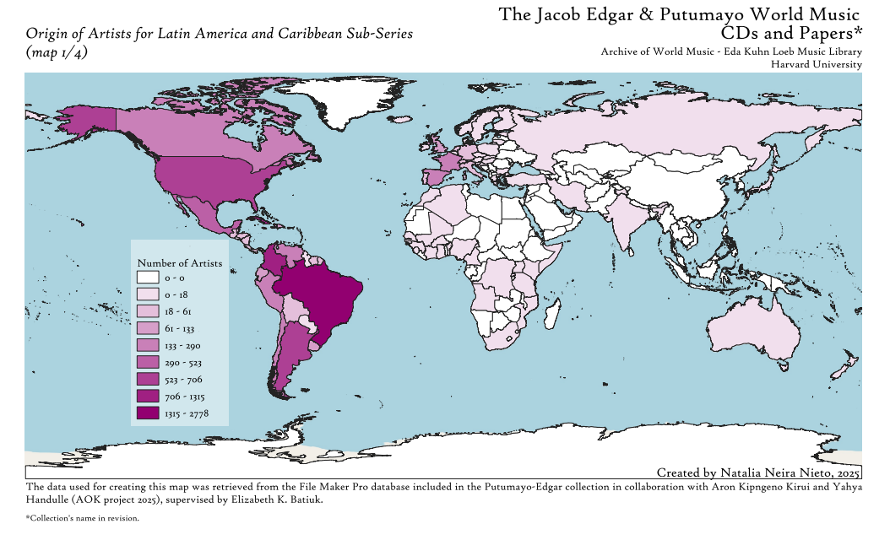
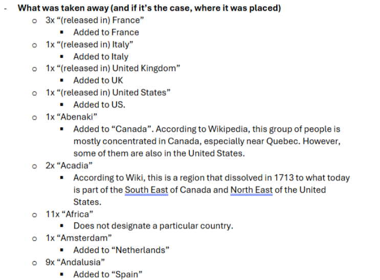

We met Natalia Neira Nieto, a G1 in the Music Department's Ethnomusicology program this summer when she was completing work for a library fellowship. Natalia's work this summer was focused on wrangling geographic data about an important recording collection held in the Harvard Eda Kuhn Loeb Music Library. 

Natalia's project, in addition to exploring the subject matter related to her area of study, ethomusicology, uncovered many insights about the complexities and real-world impact that decision making within data projects can entail. Her work perfectly encapsulates what one can expect when embarking on a thoughtfully-scoped data project. We are happy to share her reflections.

BELLE LIPTON: Hi Natalia. Thanks for talking with us. Could you tell us more about the data project? What were your intended outcomes and why was this project attractive to you based on your learning goals?

NATALIA NEIRA NIETO: The project was part of the Pforzheimer Fellowships 2025. This project took place at the Archive of World Music at the Eda Kuhn Loeb Music Library at the Music Department and was supervised by the wonderful Elizabeth Batiuk. The Archive of World Music recently acquired a large collection of CDs from Putumayo World Music record label, including a File Maker Pro database with so much information about these CDs. As a music scholar, one of my main research interests has been the construction of concepts like "Latin Music” and "World Music", so I had no doubt I wanted to look at this collection and work with it once the opportunity emerged. In the past, for my Master's, I wrote my dissertation from how the concept of "Latin Music” was constructed in academia in the last couple of decades (1980s-today), and now having the opportunity to approach this topic from the perspective of the music industry was amazing. Putumayo has been very influential in the conceptualization of geographical regions in the West and in the Global North (especially in Anglo-America) since its emergence in the 1990s, and therefore I was interested in looking at how the region catalogued as "Latin America and the Caribbean” was built. Of course, it is important to understand that this database was created by Jacob Edgar –A&R for Putumayo since 1998-, with the purpose of arranging all this information in a way he could easily access it, not with the purpose of creating a way for everyone to see the world. Yet, even when this was not his aim, it ended up influencing the way many people today perceive the world and how it sounds. For this project, I was particularly interested how Latin America and the Caribbean conceptualized, and by looking at what the database showed it was the country of origin for the artists, we could get an idea if the music catalogued there was actually constituted by people of this region (spoiler alert: we have artists from all continents, even Oceania!). 

BELLE: What were your key takeaways? How did looking spatially at this data help you answer your research questions? 

NATALIA: Being able to map the information made it clearer to look at, not just for me, but also to share. It also made me confirm about the geo-political restrictions that a map can present.  

Part of the maps I did included three in which I separated the data into three-time blocks to see how the additions to the collection changed. Here I was able to observe how the interest and attention of the curator was in different places at different periods, which could be amplified in the future by questions about the correlation between the concentration of artists in a given time period with political and economic events going on around the world (why were there so many CDs from Argentina acquired between 2000-2007? Why did specific categories for the regions in Spain appear between 2016-2023?). I also think it would be super interesting to see how the regions that are highlighted in the collection actually made it to the Putumayo-produced CDs. There is so much to discover!  

  

*Map by Natalia Neira Nieto showing the country of origin of artists who are classified within the region of ‘Latin America’ and ‘Caribbean in the Putumayo recording collection database.*

BELLE: Natalia, you mentioned that doing this geographic visualization helped you identify some specific examples of artists from other countries of origin who are categorized as being in the region of Latin America and/or the Caribbean. This helped you understand the phenomenon more closely. Can you share some examples you found?

<iframe width="100%" height="600px;" src="https://www.youtube.com/embed/BSpPdkCR4JE?si=Nx8B-WIMKTWSKesc" title="YouTube video player" frameborder="0" allow="accelerometer; autoplay; clipboard-write; encrypted-media; gyroscope; picture-in-picture; web-share" referrerpolicy="strict-origin-when-cross-origin" allowfullscreen></iframe>

*Grupo Chévere from Japan: Grupo Chevere De Japon*

<iframe width="100%;" height="600px;" src="https://www.youtube.com/embed/CGw5JCBSkVU?si=EXmSyYBf9CMpSNLR" title="YouTube video player" frameborder="0" allow="accelerometer; autoplay; clipboard-write; encrypted-media; gyroscope; picture-in-picture; web-share" referrerpolicy="strict-origin-when-cross-origin" allowfullscreen></iframe>

*Chica Boom Salsa group from Japan: 🇯🇵【4k】CHICABOOM (Japanese salsa band）LIVE in TOKYO. 30’s aniversary countdown ❗️(J-LODLive)*

BELLE: You did a lot of work with data cleaning to get from point A (the original database) to point B, something you can map. Can you talk about some of the decisions you made in data cleaning and why having human discernment was important here, rather than automating everything?

  
NATALIA: I think human discernment is particularly important when it comes to cleaning up geographic and cultural data.  

 

For example, there are territories that I had to look up to see what kind of territory they were and decide if they counted as country within the framework of the [Global Administrative Areas (GADM)](https://gadm.org/) or not. This is work that cannot be automated, either because there are typos, or you need to read a bit about what this region is about, where does it belong to administratively or culturally. A good example of this were categories included in the database about indigenous groups in North America. There were a couple of entries I never heard about before, so I had to look them up. For example, Abenaki or Odanak, which are indigenous groups located around what is usually known a Quebec and even the northeast of the United States. Here I had to take a decision of either adding them to Canada or the U.S. or just taking them away due to their lack of compatibility with the GADM.  

 

Another example was deciding about how to treat territories like the Easter Islands, Rapa Nui, Providencia Island, or the Canary Islands, either to have them separate or add them to their continental administrator (Chile, Colombia, and Spain respectively).  

<h2>Data decision note-taking</h2>
  

  
   

<em>Natalia's notes about how to develop a standard for reconciling the messy Putumayo location descriptions with standardized global administrative boundary shapefiles.</em>

BELLE: Any other interesting tidbits you'd like to share? 
 

NATALIA: While doing the maps it was very interesting to learn about the administration and sovereignty of different territories. While making the maps, I used the database of the GADM, which divides the world into different administrative levels. In theory, the widest level (which is ADMN level 0) is the one in which the world is divided by countries, the broadest administrative division. As I was cleaning up the pivot tables for my map, I was expecting to map England independently. To my surprise, England did not appear on ADMN 0, ADMN 1, nor any ADMN, but it turns out that its administration is the same as the United Kingdom. Additionally, Scotland, Wales, and Northern Ireland are also contained as part of the United Kingdom in ADMN 0 level. This was completely unexpected, as I grew up thinking about each of these territories as a country of their own.  

 

Another interesting thing I encountered while working with this collection was dealing with countries that don't exist anymore –or at least not administratively. For context, the collection includes a database in File Maker Pro that was created in the year 2000 and is continuously updated with new music to this day. Therefore, there are entries indicating places like Yugoslavia or the Netherlands Antilles that were dissolved afterwards into smaller territories, for what I needed to take the decision either of mapping that or not, and if I did want to map that, how. (Spoiler alert: in the end I decided to leave them out).  

 
## Next steps
- To access Natalia's maps and data, visit her data [project repository](https://osf.io/g7sk2/?view_only=b8c940520917488c8e0fcf298ecedd52) in the Open Science Framework.
- To learn more about the Archive of World Music and other collections at the Eda Kuhn Loeb Music Library, visit the Music Library's [Ethnomusicology research guide](https://guides.library.harvard.edu/c.php?g=310120&p=6879889).
- To request similar support with a mapping project, please [reach out](https://ask.library.harvard.edu/maps?_gl=1*1l9zbvl*_ga*NTc3NDAzMzIxLjE3NTgyMDk1NzE.*_ga_3CXC97RWEK*czE3NTgyMTc5MjUkbzIkZzEkdDE3NTgyMTgxNjQkajUxJGwwJGgw) to the Harvard Map Collection.
 

