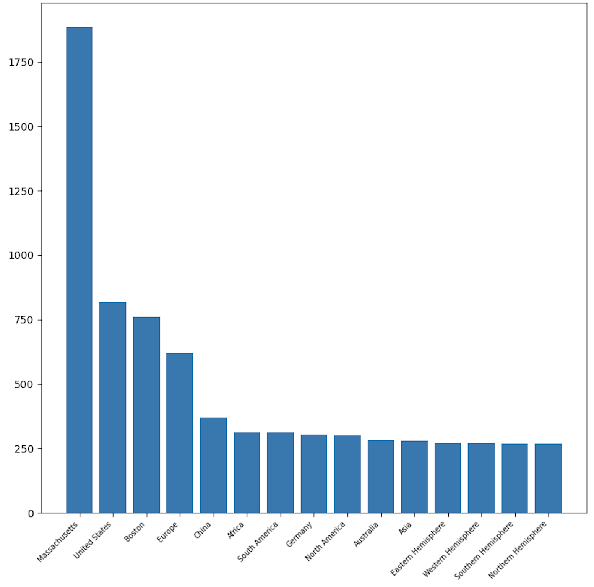
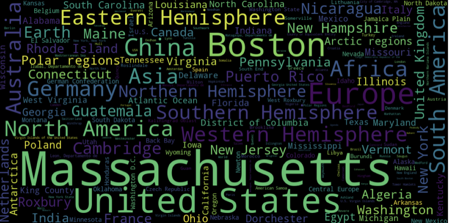
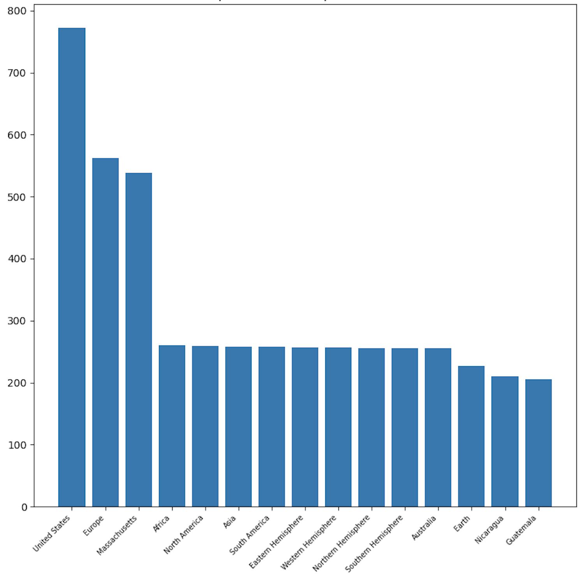
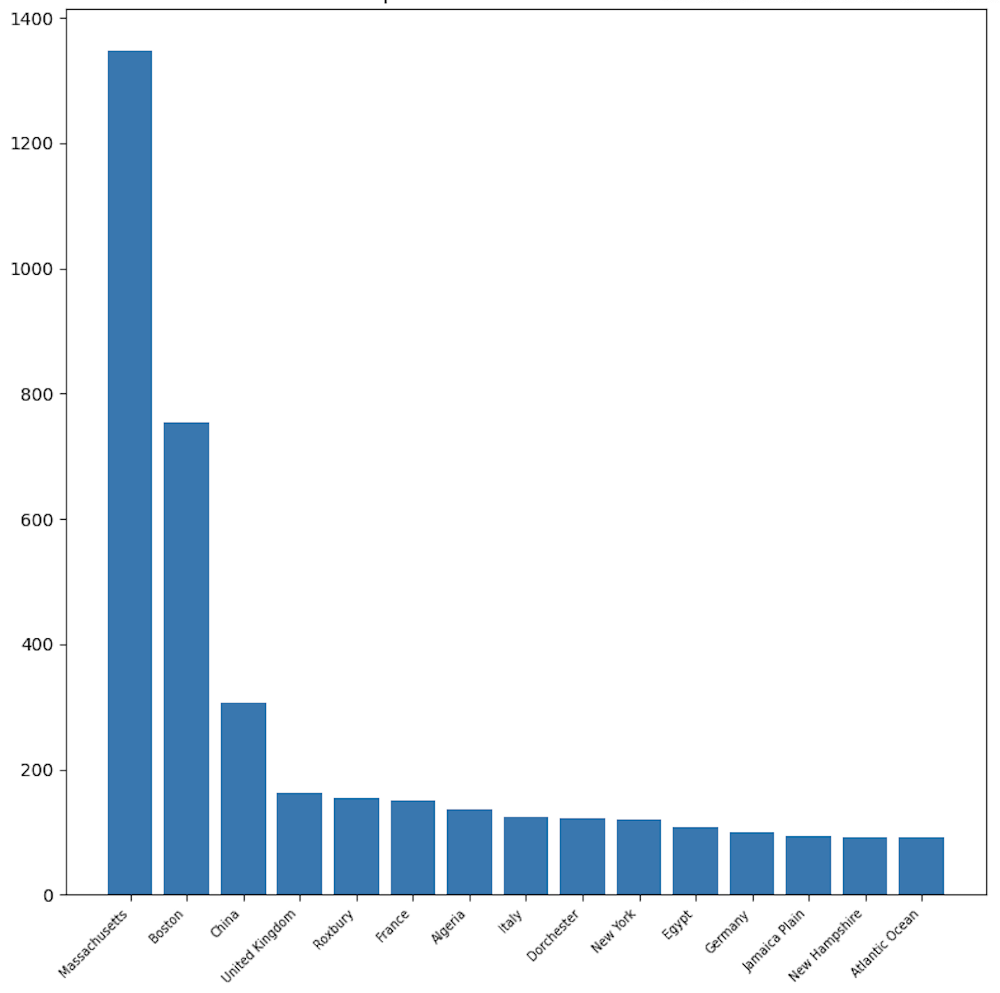
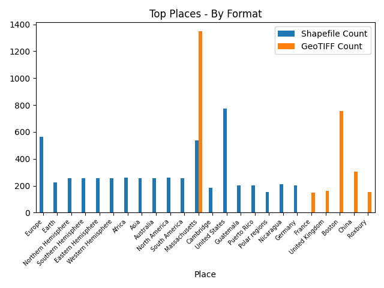
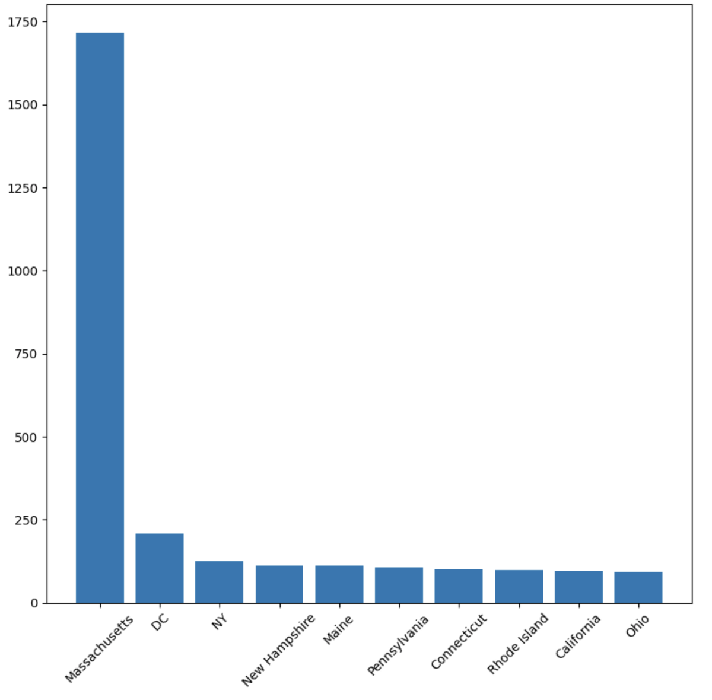
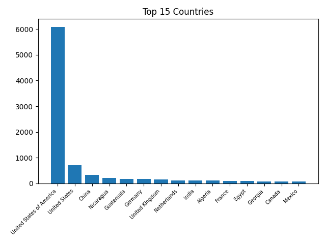
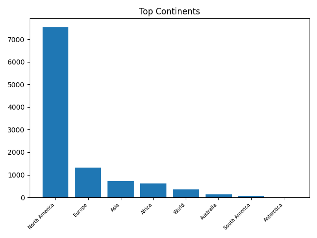

## Motivation
One of the most immediate features of a geospatial dataset is the region it covers. That's why early on in this project, a burning question for me was “what region(s) -- cities, states, countries, continents -- does the Harvard Geospatial Library (HGL) have data to describe?” 

## Diving into the metadata

To acquire insights into the library's vast collection of geospatial datasets, totaling over 11,000 to date, I worked with the metadata records for every dataset in the Harvard Geospatial Library, which are available publicly from the [Harvard Library Github](https://github.com/harvard-library/harvard-geodata/). One of my favorite and earliest conversations with a librarian was with HGL's very own [Marc McGee](https://library.harvard.edu/staff/marc-mcgee), the Geospatial Metadata Librarian, who specializes in the production of FGDC (Federal Geographic Data Committee)-compliant metadata records. He noted that there are two main formats of metadata records that the library keeps -- the robust FGDC format and more accessible JSON GeoBlacklight format, which is derived from the former.  

After exploring both formats of metadata, I elected to delve into the JSON GeoBlacklight metadata. Find the [.py script](https://github.com/HarvardMapCollection/may-crane-23-documentation/blob/main/places-analysis/all-jsons.py) to download all metadata fields for the 11,000 datasets as one `.csv`. The relevant data field was `dct_spatial_sm`, which describes the spatial or geographic coverage given by a geospatial dataset. For simplicity, I refer to this field as `spatial`, and `spatial` has no controlled vocabulary, which makes its values variable and unstandardized.  

## Exploratory visualizations
### Top 15 Locations of Spatial Coverage in HGL
Using the metadata as is, I plotted the top 15 places covered in the Harvard collection:

We see the same Massachusetts, United States, and Boston prevalence in this alternate view, a wordcloud:

Interestingly, China, Germany, and Australia, in that order, stand out as the dominating countries, while Europe, Africa, South America, and North America, in that order, are the prevailing continents. We can rather easily reason about the prevalence of United States, Massachusetts, and Boston, given the location of the Harvard Map Collection, but why not Asia? Why Germany? In addition to analyzing the metadata, I also benefitted from conversations with 
Bonnie Burns, the Head of Geospatial Resources at the Library, and a key decisionmaker in the collection's development, to help contextualize.

## Top places for vector and raster data

Marc and Bonnie suggested looking at the data filtered by the field of `dc_format_s`, which describes the file format of the data. The two main formats archived by the Harvard Map Collection are shapefiles, which are structured feature classes, and GeoTIFFs, which are georeferenced versions of the [scanned maps](https://curiosity.lib.harvard.edu/scanned-maps) from the Harvard Map Collection. To read more on the distinction between these file types, and their applications for geospatial research, you can check out the Map Collection's [Intro to GIS workshop](https://mapping.share.library.harvard.edu/resources/new-to-gis/workshop/introduction/), which is offered synchronously and asynchronously.

### Shapefiles (vector data)

Looking at shapefiles first:

We see that the HGL keeps the most shapefile records of the U.S., Europe, Massachusetts, Africa, and North America. 

### GeoTIFFs (raster data)

In contrast, looking at GeoTIFFs:

We see that the HGL keeps comparatively more GeoTIFF records of Massachusetts, Boston, China, the U.K., and European places. 

### Shapefiles and GeoTIFFs

Placing both format-place breakdowns onto the same plot, we can compare their top 15's head-to-head:

Looking at this view of the metadata reveals that shapefiles seem to describe larger regions than GeoTIFFs -- like Earth, hemispheres, and even the Polar regions.  

## Spatial Levels

After an initial passthrough with the original metadata, I wanted to dive deeper into the `spatial` field. In the original metadata, the way places are categorized is such that datasets are tagged spatially with the most *true* description of where they represent. So, for instance, if we had a dataset of Boston, and a dataset of Massachusetts, those would not show up if we clicked on the "United States" filter tag in HGL. The reason the cataloggers tag datasets this way, is so that when people are trying to search for datasets of the United States, the results are not cluttered with more localized results, of places like Boston, or Massachusetts.

The problem for us, when we were venturing out to understand the contours of the data in HGL for this project, was that Boston and Massachusetts *are* in the United States. So, if we wanted to understand the breakdown of datasets by country or continent, we needed to do some cleaning. 

I tried to standardize the completeness of our spatial descriptions by using the [Google geocoding API](https://developers.google.com/maps/documentation/geocoding/overview) to aggregate the `spatial` field, so that every dataset would have information about the municipality, state, country, and continent if available. I've made available the [documentation for the feature engineering workflow](https://github.com/HarvardMapCollection/may-crane-23-documentation/blob/main/places-analysis/spatial_levels.py).

Please take these considerations about the nature of the descriptions into account, when interpreting the following charts.

### States with the most amount of data in HGL

 

Again, Massachusetts prevails. D.C. and N.Y. follow, the political, economic, and social capitals of the U.S. Interestingly, N.H. and M.E. are next. 

### Countries with the most amount of data in HGL

 

The U.S. and China are intuitive to me. But shockingly, Nicaragua, Guatemala, and Germany trail China closely. 

### Continents with the most amount of data in HGL

 

North America and Europe stand out here. Of course, we have the least data -- nearly none -- on Antarctica. It really suprises me that we have so little data available about South America relative to the other continents.

When we fully flesh out the spatial metadata, we find that Massachusetts, the United States, and North America still prevail, with some suprising places trailing. It would be very interesting to investigate next exactly which regions of Masssachusetts, the U.S., or North America have the highest density of coverage by our library's collection! We could use this information to dive deeply into those regions with rich data, or pose questions about which undercollected datasets and regions we'd like to delve into next.
