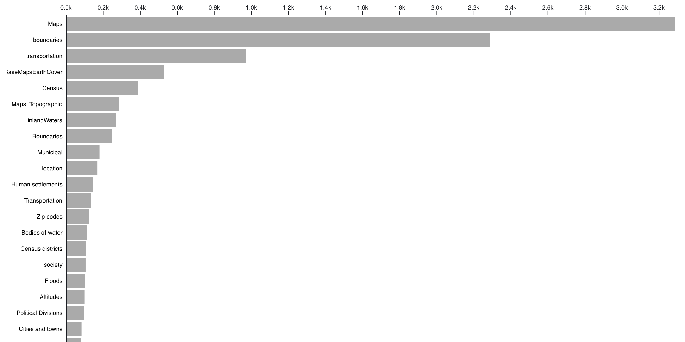

*Top twenty subject tags in the original, uncleaned metadata for all Harvard Geospatial Library datasets.*

## My approach and methods

I wanted to condense this messy subjects list into more comprehensible buckets. Within the over 11,000 metadata records representing the datasets in the [Harvard Geospatial Library (HGL)](https://hgl.harvard.edu/), I noticed that there are only 256 unique subject values. Subject tags are meant to give users a sense of what the dataset is about. 

I wanted to work with massaging these 256 subject values using approaches I had learned in previous life sciences data analysis. The approach I used was one of thematic clustering. I started by grouping the 256 unique subjects that are closely related, intertwined and intermingled into bigger categories. 

### Step 1: Defining 24 research areas

On a whiteboard, as I was thinking about how to approach the data cleaning for the messy subjects in the metadata, I manually worked out 24 categories that could could subsume the larger 256 unique subjects.

### Step 2: Defining 8 application-based metacategories
I continued to refine this list by adding another level of headings, or another "parent for the children", to use the `.json` jargon, or another node for the network, as is defined in the [D3 user documentation](https://d3js.org/d3-hierarchy/tree). I finally finessed the number of headings down to a more digestible eight super-headings, which we can think of as application-based research areas. To clarify, the 256 unique subjects became the lowest level of the hierarchy or "level 3", the research area headings became the second lowest level of hierarchy or "level 2", and the megacategory headings became the highest level of the hierarchy of "level 1". 

### How I finalized the categories

I spent a little time tweaking the categories to adjust for some of the discipline-specific nuances. I created a ninth category for Indian Reservations, "administrative boundaries", and I defined a few more granular specification for some of the categories. 

To make the groupings, I looked up the different subjects on Wikipedia, spoke with researchers and found scientifically-coherent megacategories that encapsulate the other subject areas. For example: Water bodies is an appropriate research area that can include oceans, rivers and lakes. This thematic clustering method requires human imagination, empathy for researchers and a creative passion for simplification— I am not ashamed to say this is as much art as science. There are many ways one could create these groupings -- this just the way that made the most sense to me.

#### Long, unclustered list of original subject tags

 

#### Final, live version of subjects after thematic clustering

 

### How I made the final thematic clustering chart 

1. I made a [hierarchical JSON](https://github.com/HarvardMapCollection/may-crane-23-documentation/blob/main/subject-clustering/clusters.json) file with parent-child relationships, specifying the location of every node. In D3.js you get incredible control, this allows you to pass in a numerical value for where exactly you want every parent and child to sit, which then allows us to draw it in the chart.

- e.g. **Water Body** is a research area that includes Seas, Oceans, Coastline, Island, Lake, River.
- e.g. Cliffs, Hills, Mountains and Valleys can be grouped as **Landforms**.
- e.g. Crosswalks, Ramps and Sidewalks become **Walkways**.

2. I uploaded the file to D3 and used their [tidy tree algorithm]((https://d3js.org/d3-hierarchy/tree)) to demonstrate my work. 

