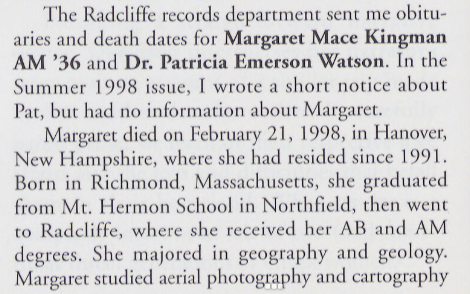
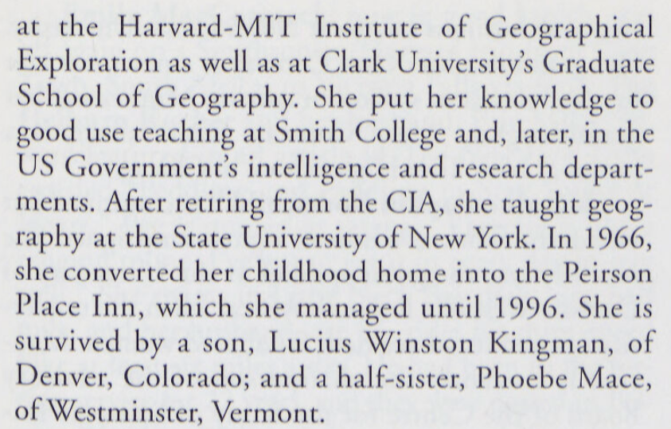
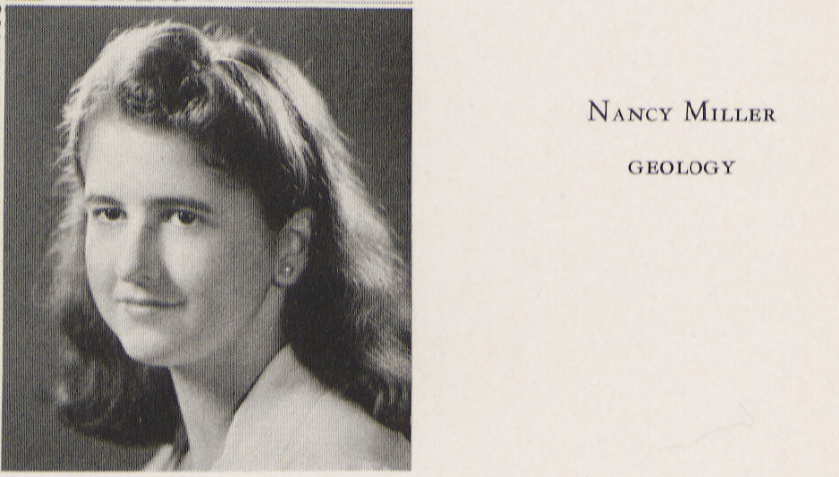
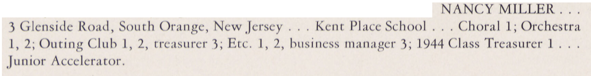

The Harvard University Archives, along with almost every other repository of HUIGE-related information at Harvard, holds only scant information about the Radcliffe women who took to the air through courses at the HUIGE. From brief mentions, signed releases, examination records and more, the names of all women enrolled in aerial photography classes throughout the HUIGE’s existence are:

| Lottie Simes (Radcliffe) |
| --- |
| Margaret Randall Smith (Radcliffe) |
| Priscilla H. Webster (Graduate, Radcliffe) |
| Olmstead Peet (Radcliffe) |
| Mrs. Margaret Mace Curtis (Radcliffe) |
| Peet Olmstead (Radcliffe) |
| Helen L. Garfield ('42) (Radcliffe) |
| Nancy Miller ('44) (Radcliffe) |
| Ursala A. Bailey (Gr.) (Radcliffe) |

The following is only a first step in the recovery of their stories, and perhaps that of even more students in the future.

Discovering our University’s archival resources has shown me the depth of enthusiasm present in each of these treasure troves. Consultations ran past the hour because every archive specialist knew of connections to astoundingly useful resources which I could not have discovered myself. For instance, when visiting the Schlesinger library, where I met the astute and spirit-raising Sarah Hutcheon, I was led to the puzzling mention of the “Harvard-MIT Institute of Geographical Exploration”, in the obituary of one Margaret Mace Kingman[^1], presumably the “Mrs. Margaret Mace Curtis” recorded in the Student lists collected from the Harvard University Archives:

What was that about? I had purposefully always opted for the neutral Harvard University Institute of Geographical Exploration (HUIGE), rather than any other nickname given the Institute, but never had I fallen upon a “Harvard-MIT IGE”. Whether a typo or the result of an approximate recollection, this graduate of the aerial photography courses spent her entire post-graduate career at the CIA, perhaps putting to use some of the techniques learned at the HUIGE. Her story would not have been found without Sarah’s help, since I had no instinct whatsoever on where to start the research for Harvard’s Women of the Air…

So here are Sarah Hutcheon’s tips for searching for them through the Schlesinger library archival system:

Start with the [Radcliffe College Archives Digital Collections](https://guides.library.harvard.edu/schlesinger_radcliffe_digital_collections) guide.

- The [Yearbooks](http://nrs.harvard.edu/urn-3:RAD.ARCH:4710437)  contain information about all Radcliffe undergraduates.
- The Radcliffe News are an undergraduate publication.
- For graduate students, not included in the Yearbooks or Radcliffe News, a safer bet is the	[Radcliffe Quarterly](http://nrs.harvard.edu/urn-3:RAD.ARCH:4731683), a publication for and about Radcliffe Alumnae.

For a broader reference structure, the [Harvard-Radcliffe Online Historical Reference Shelf](https://guides.library.harvard.edu/c.php?g=638791&p=4471938), contains all of Harvard’s reports, course registers and more.

Class reports from Radcliffe college are not digitized, yet the box of every Class Year may be found using Hollis Advanced search and the Subject line: "<a href="https://hollis.harvard.edu/primo-explore/search?query=sub,exact,Radcliffe%20College%20--%20Alumni%20and%20alumnae%20--%20Directories,AND&tab=books&search_scope=HVD_SCH&vid=HVD2&mode=advanced&offset=10">Radcliffe College -- Alumni and alumnae -- Directories</a>" along with the year of the Class in question.

One of the most useful tools for research shared by Sarah was an alternative browser for researching Harvard-specific data. Our beloved Library navigation system, Hollis, is a two-faced beast. The platform any user faces when visiting "[hollis.harvard.edu](http://hollis.harvard.edu/)" is a welcoming and easy-to-use portal. Its "Advanced Search" page, a control panel to access a whole universe of knowledge. But it does not lead to all answers. The underbelly of the Harvard Library systems is its directory to all items digitized by Harvard: "[Full-text search](https://fts.lib.harvard.edu/fts/search)". The crucial difference is that full-text searches render any mention of a name, event, institute or... anything. A full-text search for the "Institute of Geographical Exploration" yields over 92,000 results, to Hollis' couple of hundred, for example. This makes the search for individual classes, instructors or students far easier.

Sarah Hutcheon’s immensely helpful research through all these troves of information and more led to the following information about the HUIGE’s women of the air (all quotations are from Sarah’s email communication from July 31st 2024):

| Name | Primary link to personal record | Additional information |
| --- | --- | --- |
| Lottie Simes (Radcliffe) | no listing |  |
| Margaret Randall Smith (Radcliffe) | [GROVER, MRS FRANK N (MARGARET RANDALL SMITH) X 44 N39-40 40-41 3702 WEST 77th AVENUE WESTMINSTER COLORADO 80030](https://nrs.lib.harvard.edu/urn-3:rad.arch:5363532?n=173) | “The listing means she was affiliated with the class of 1944 and attended/took classes in 1939-40, and 1940-41 but did not receive a degree...Also, I am so excited to say I found this link to a newsletter which indicates she was a Ninety-Niner! Please see new members on [page 8 of the PDF](https://www.google.com/url?sa=t&source=web&rct=j&opi=89978449&url=https://www.ninety-nines.org/pdf/newsmagazine/193301.pdf&ved=2ahUKEwjv2qGs3LuHAxVCkokEHW4SD-MQFnoECBgQAQ&usg=AOvVaw043BEz7QXmCdPZBUIzI_-P). The [Ninety-Nines](https://www.ninety-nines.org/are) an International Organization of Women Pilots! |
| Priscilla H. Webster (Graduate, Radcliffe) | [ROSE, MRS JOHN K (PRISCILLA H WEBSTER) AB27 AM33 117 E STREET S E WASHINGTON D C 20003](https://nrs.lib.harvard.edu/urn-3:rad.arch:5363532?n=350) | “The listing indicates she received both a bachelor's degree in 1927 and a master’s degree in 1933 from Radcliffe.”
 |
| Olmstead Peet (Radcliffe) |  |  |
| Mrs. Margaret Mace Curtis (Radcliffe) | (see above) |  |
| Peet Olmstead (Radcliffe) |  |  |
| Helen L. Garfield ('42) (Radcliffe) | [GARFIELD, H LOUISE AB 42 MLS53 ILLINOIS PO B0X 945 W PALM BEACH FLA 33402](https://nrs.lib.harvard.edu/urn-3:rad.arch:5363532?n=154) | “She received her Bachelor’s degree in 1942 from Radcliffe and also received an MLS from Illinois.” |
| Nancy Miller ('44) (Radcliffe) | [ARNN, MRS EDWARD T (NANCY MILLER) SB43 314 RIDGEDALE RD LOUISVILLE KY 40206](https://nrs.lib.harvard.edu/urn-3:rad.arch:5363532?n=25) | “She received her Bachelor of Science degree from Radcliffe in 1943.” |
| Ursala A. Bailey (Gr.) (Radcliffe) | [MARVIN, MRS THOMAS C (URSULA A BAILEY) AM46 G 46-47 50-51 AB43 TUFTS 8 PLYMPTON STREET APT 61 CAMBRIDGE MASS 02138](https://nrs.lib.harvard.edu/urn-3:rad.arch:5363532?n=271) | “She received her master’s degree in 1946 from Radcliffe and continued to do graduate studies in 1946-47 and 1950-51.  She  received her bachelor’s degree from Tufts.” (Her records are still under privacy protection) |

Although a fuller account of these women’s stories remains to be written, the Schlesinger archives promise very much to their stories as well as that of the HUIGE. Take, for instance, Nancy Miller’s 1943 yearbook entry:

 

For these bridges and the promise of stories ahead, I thank once more Schlesinger Research Librarian Sarah Hutcheon.

Sources:

[^1]: The Radcliffe Quarterly, Spring 1999, pp.34-35, [https://nrs.lib.harvard.edu/urn-3:rad.arch:4668571?n=204]
