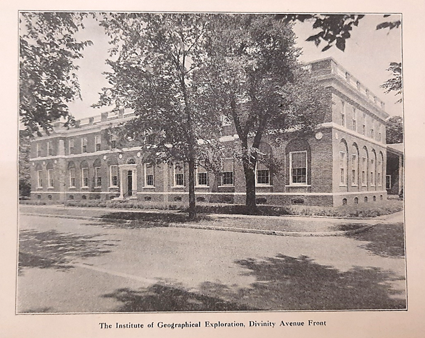
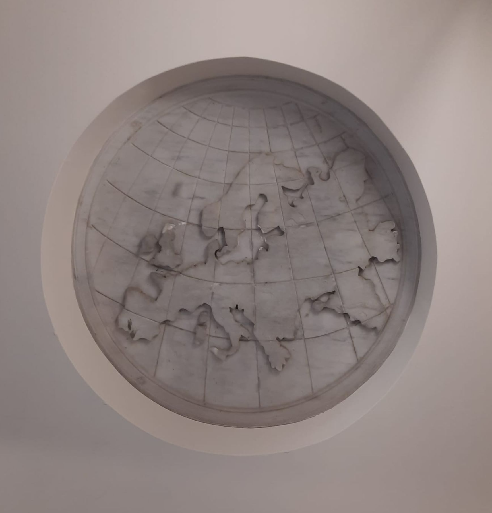
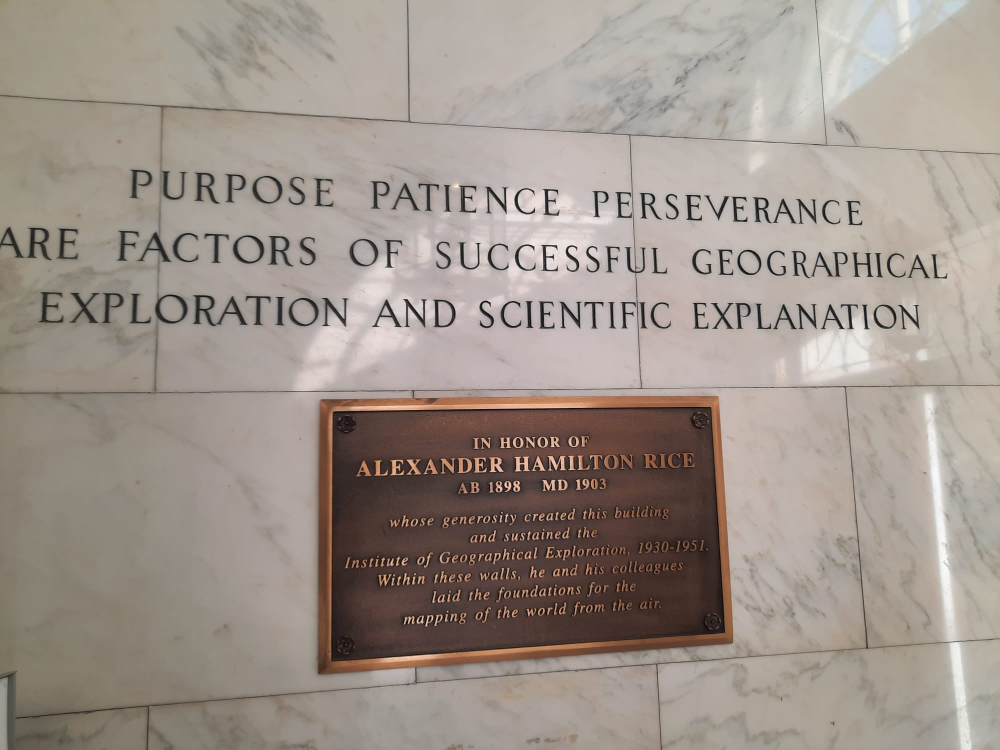
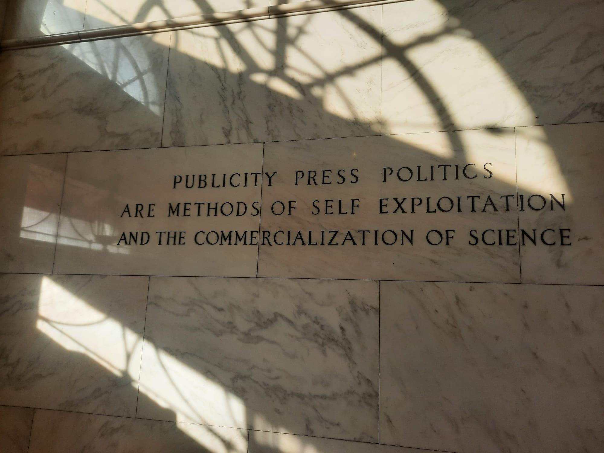
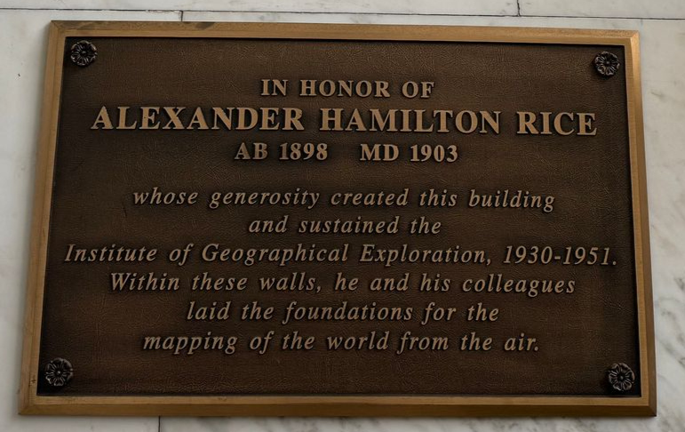
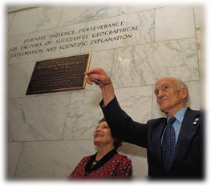

The old building at 2 Div. Ave.[^1] keeps the design markers of the HUIGE’s presence mostly on the outside.

Above the door is the presently contradictory map of the world centered on Cambridge, Mass.

    

        
    

    

        
    

 

This marble detail is supplemented by medallions representing each of the Zodiac (or latitudinal) signs running around the whole building, interspersed with medallions representing each continental landmass in the world. Because of the renovations which have added to the Yenching Library space at 2 Div. Ave, the Northeast-facing facade has been covered by a staircase and corridor connecting the two buildings. While the red brick outside has been dismantled on this face of the old HUIGE, Yenching librarians have kindly taken me to the staircase between the old and new buildings to show me the medallion representing Eurasia which remains there to this day:

    

        
    

    

        
    

 

Inside the building, many visitors walk right past the marble foyer and into the space of the grand staircase:

In doing so, however, they miss the two quotations initially inscribed on each side of the foyer upon its inception: “PURPOSE PATIENCE PERSEVERANCE ARE FACTORS OF SUCCESSFUL GEOGRAPHICAL EXPLORATION AND SCIENTIFIC EXPLANATION” on the South-wall (or to the right, when entering the building) and “PUBLICITY PRESS POLITICS ARE METHODS OF SELF EXPLOITATION AND THE COMMERCIALIZATION OF SCIENCE” on the wall opposite. 

    

        
    

    

        
    

 

The origin of the two quotations in the marble foyer is unaccounted for, so far as I know, but the distancing from “publicity”, “press” and “politics” is deeply intertwined with Alexander H. Rice’s own reputation. The reality of Rice’s proselytization of geographical exploration through accounts of his adventures is well summarized and analyzed by Luciana Martins, who concludes that: “Rice’s heavy investment in making a visual record of the expedition through maps, still photographs, and, especially, films was a rather ambiguous enterprise: a mix of scientific achievements, show business, and sensationalism.”[^2] While the truth of Rice’s approach was steeped in the propagation of his travels through different media, lack of publicity is precisely why he was awarded the David Livingstone Centenary Medal earlier in his career (1920):  “[Rice] has pursued his important work with modest devotion to his quest, free from any public exploitation or advertisement. Such a bearing adds to the satisfaction which the [American Geographical] Society may well feel in according suitable recognition to a notable accomplishment.”[^3] The strong emphasis on keeping scientific achievements free from advertisement, at least in appearance, tracks with the quotation on the North side of the marble foyer at 2 Div. Ave.

The plaque below the first quotation was however not installed with the beginning of the HUIGE, nor with its disbanding. Rice had asked for some such plaque to commemorate his efforts upon the announcement of his funds’ withdrawal in 1951. In his own words, in a letter to Harvard Provost Paul H. Buck, March 6th 1951: “If in the future the building is not used to house the Institute I would appreciate it if a plaque were placed on or in the building with an inscription to the effect that the building was constructed by me for the Institute of Geographical Exploration which I directed from 1931 to 1951.”[^4]

The wish was not fulfilled until 1998, when an old instructor of the HUIGE’s and famous aerial photographer and map-maker Bradford Washburn insisted on the erection of a plaque recognizing Rice’s work and that of the HUIGE’s staff members.[^5]

Sources:

[^1]:  Harvard University Archives, James Conant papers UAV_5.168_Box 431, document: Weld Arnold, “Institute of Geographical Exploration,” *Harvard Alumni Bulletin*, February 26, 1932.   

[^2]: p. 234, Luciana Martins, “Geographical Exploration and the Elusive Mapping of Amazonia,” *Geographical Review* 102, no. 2 (2012): 229, https://doi.org/10.1111/j.1931-0846.2012.00144.x.

[^3]: “Presentation of the David Livingstone Centenary Medal to Dr. Alexander Hamilton Rice and Lecture by Dr. Rice.” *Geographical Review* 11, no. 1 (1921): 139–41.

[^4]: Harvard University Archives, JB Conant papers, UAV_5.168_Box 399, folder: "Geographical Exploration, Institute of, 1950-51”, letter of March 6th 1951.

[^5]: Harvard Magazine. “A nod to Ham Rice”, March 1999, retrieved from the Web Archive on August 1st 2024 [https://web.archive.org/web/20161027075928/http://harvardmagazine.com/1999/03/jhj.ham.html]

All pictures above are my own, except for cited ones.

Harvard Property Information Resource Center “2 Divinity Avenue, Yenching Library”, https://harvardplanning.emuseum.com/sites/322/2-divinity-avenue-yenching-library

Melissa McCormick, “2 Divinity Avenue,” Department of East Asian Languages and Civilizations, March 6, 2023, https://ealc.fas.harvard.edu/2-divinity-avenue 

Ruohong Li, “From Harvard Yard to Divinity Avenue: The Harvard-Yenching Institute’s Two Homes,” Harvard-Yenching Institute Working Paper Series, 2021.