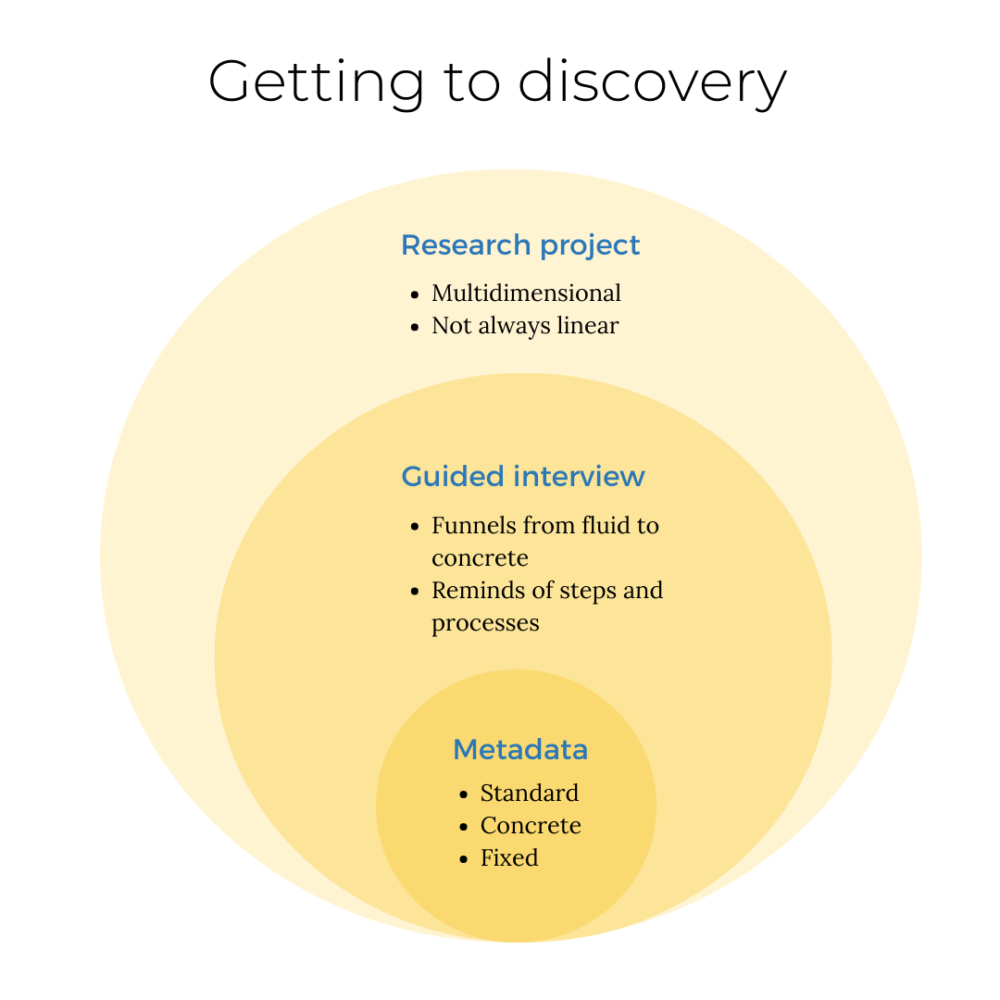

The Harvard Map Collection collects and preserves GIS data for long-term discovery and reuse in the [Harvard Geospatial Library (HGL)](https://library.harvard.edu/services-tools/harvard-geospatial-library). Depositing your data in HGL or [Dataverse](https://dataverse.harvard.edu/) might not be the right choice for your project; perhaps you'd like to simply make sure you're checking all the boxes to make sure your data is the most accessible and reusable it can be. 

## On this page, you will find:
- A [list of prompts](#prompts) for creating your own geospatial metadata
- A <a href="media/FGDC-Metadata-Template.xlsx" download="FGDC-Metadata-Template.xlsx">template</a> for doing so
- Descriptions of the [consultation services](#guided-interview) available through the library

## 3 steps to discovery

It is helpful to think of packaging up your data in 3 steps.

### Research project

In the research project stage, you are immersed in the work of your project. You are working to capture and encode your data. You are managing many different aspects of the project.

### Metadata

Compared against the broader mentality described above in the research project stage where you are thinking about and synthesizing many different variables, creating metadata for your project's data layers can feel like the exact opposite state of mind. 

It can sometimes be rote, technical, and specific to create metadata. To oscillate between these two modes -- actually working on your project *and* creating good metadata ensuring long-term reuse and discovery -- is a serious challenge, especially under deadline pressures and time constraints. 

### Guided interview

One of the services we offer at the Harvard Map Collection is a guided interview meant to intermediate between where you are with your project, and where you'd like to be with your data. If you were to deposit your data layers so that they were downloadable from the [Harvard Geospatial Library (HGL)](https://library.harvard.edu/services-tools/harvard-geospatial-library), the way we would technically facilitate that would be to create metadata in extensible markup language (XML) format, using a federally-specified standard of description, by the [Federal Geographic Data Committee (FGDC)](https://www.fgdc.gov/metadata). 

Describing data this way allows portals like the Harvard Geospatial Library to function, and provides useful contextual information for researchers trying to understand details about the datasets they find in online discovery portals. The problem is that these standards are incredibly specific and time consuming, and do require specialist knowledge to populate. On the other hand, the project context which is so crucial to creating data that is actually usable, is only known by you, the researcher.

Our guided interviews are meant to liaise between the vast knowledge you have about your project, and the technical, specific ways to capture it so that many people can benefit from and continue building upon your work.

## Suggested steps

1. Even though we don't recommend trying to fill out the <a href="media/FGDC-Metadata-Template.xlsx" download="FGDC-Metadata-Template.xlsx">FGDC template</a>  on your own, it can be useful to know which fields we typically capture, so that while you're working you can document any important information. 

2. [Schedule an interview with us](https://library.harvard.edu/libraries/harvard-map-collection). We will walk through prompts designed to generate high-quality metadata. Even if your goal is not to deposit datasets, it can be helpful to get feedback about how you are thinking about and communicating your data work. You can also use [the prompts](https://mapping.share.library.harvard.edu/resources/researchers-handbook/diy-metadata/) on your own.

