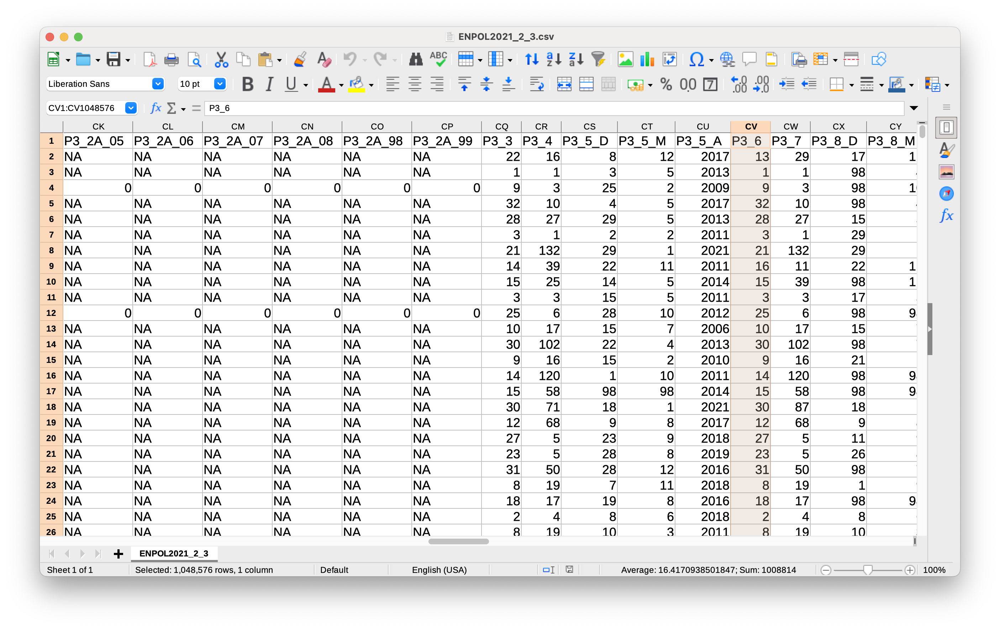

Workshop materials in progress. Check the [library calendar](https://libcal.library.harvard.edu/calendar/main?cid=15049&t=d&d=0000-00-00&cal=15049&inc=0) early in September to register. 

## Key takeaways (for belle)

1. Resources
- Us (HMC GIS Data Services)
     - Consults
     - Office hours
- Network (local libs)
- Jess
- DSSG Workshops
- CGA Institute, FAQs etc
- Julie's Carpentries

2. Data cleaning requires lots of steps
- Your data is likely to require cleaning
- Demo-ing one project example today
- Your project will require different steps

3. Likely you will have to use more than one software

## Workshop software specs

We'll be demo-ing how to approach pre-analysis data cleaning steps in a number of software environments. Sometimes it is necessary to use one environment over another, and it is common people are already using a particular environment for their analysis (Python or R), so the goal of this workshop is to demonstrate how to incorporate GIS data cleaning in the environment that works best for you. We will be leading with the concepts, and showing how to accomplish the concepts in a few different ways.

For that reason, we will be using many different software packages, and you are not required to download them all to follow along step-by-step for this workshop, unless you want to. If you'd like to practice hands-on with a particular data cleaning step or environment during the workshop, you can download the software of interest prior to attending, using these  links:

### Software
- [Desktop GIS (QGIS)](https://mapping.share.library.harvard.edu/tutorials/census-data-primer/download-software/)
- [Data cleaning tool (OpenRefine)](https://jcszamosi.github.io/2017-12-14-McMaster/install.html)
- [R](https://jcszamosi.github.io/2017-12-14-McMaster/install.html)
- [Python](https://www.tutorialsteacher.com/python/install-python)

## Workshop data

In this workshop, we will be using an example from a real data cleaning project we helped with. The source dataset contained 1,048,576 data points or records. There were 1,024 columns or fields of observations to be potentially analyzed.

For the purposes of this workshop, where we will need to be able to run cleaning processes in the software in a timely fashion, we have clipped this dataset down from over a million records to only a handful. For that reason, the workshop test data is not representative, and you should not use it for any purpose other than data cleaning practice. We will not be able to garner any statistical insights from this practice dataset.

### Data download

The workshop practice data is available from this [Google Drive folder](https://drive.google.com/drive/folders/1JILKFS7P9FV4EAui1gAuT1rqgPcnaqls?usp=sharing).

If you are interested in the data in its original format, it is available on this [Github page](https://github.com/HarvardMapCollection/jb-pae), although this is optional and not required for the workshop.

### What is the data?

A student researcher wanted to understand geographic contexts for women who had been imprisoned in Mexico. The researcher was looking at places where women had been born, were supposed to have committed crimes, and where they had been arrested.

To do this, she had identified [a national survey](https://www.inegi.org.mx/programas/enpol/2021/#Microdatos) of incarcerated people in Mexico. It contained results from over 1,000 variables about the participants, but only three of those columns contained geographic information the researcher wanted to map. To use this dataset, we will have to rely on the documentation, which is available [in Spanish](https://github.com/HarvardMapCollection/jb-pae/blob/main/documentation/2021_enpol_cuestionario_principal.pdf) and here [translated for English](https://github.com/HarvardMapCollection/jb-pae/blob/main/documentation/2021_enpol_cuestionario_principal_english_translation.pdf).

### Data scope discussion
MPB considerations of the datasets
Details about joint consults

### Steps

2 Examples:

1. When you have joinable (with Mexican national survey data):
    - Create a pivot table to the states with row counts
    - Then join using the country codes
2. When you have points (locations of Russian universities)
    - Discuss problems with IP addresses in the Qualtrics, why do we need other workflow
    - Translate the cells
    - Standardize responses
    - Pivot to get counts per university
    - Geocode 
    - Aggregate responses to oblasts
    - Normalize

