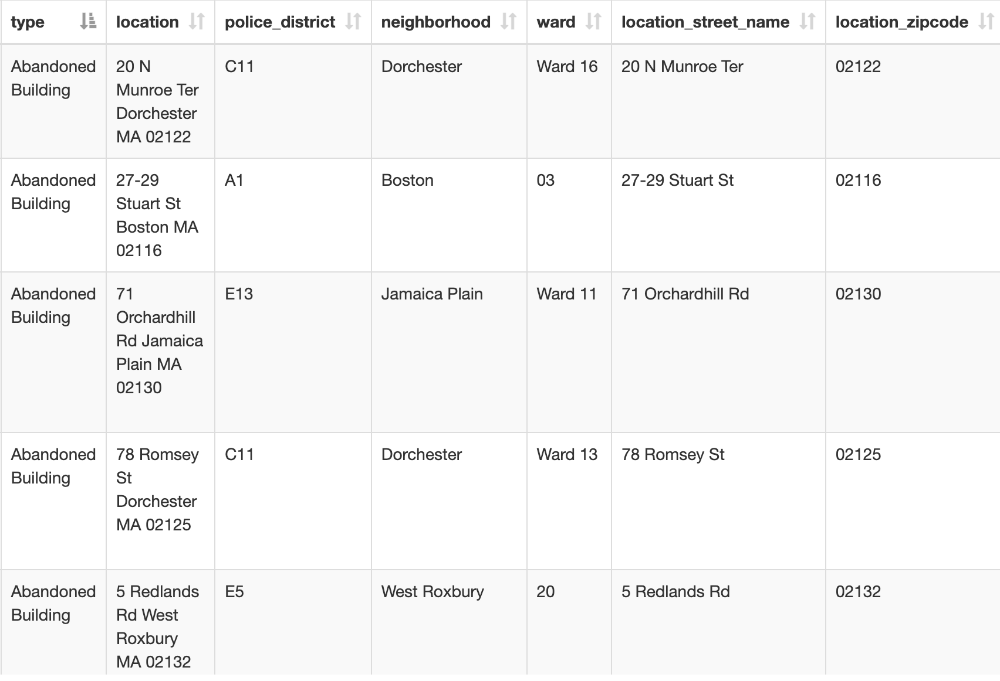

## Objectives
- Understand how to use table joins to connect a spreadsheet of data to mapping data
- Practice thinking outside of the box with datasets

## 10 minutes to get started

*Imagine you are working on a project where you can find data for your project in spreadsheet format, but there are no shapes associated with the table. Maybe the data references towns, countries, or other units of geography. In this activity, we will explore how to evaluate a dataset's GIS viability based on our ability to join it with spatial data.*

> 1. Visit the [documentation page](https://data.boston.gov/dataset/311-service-requests/resource/b237f352-49d1-4423-804f-b478e4f24e61) for data about [Boston 311 service requests](https://www.boston.gov/departments/boston-311), to get a sense of what this dataset shows. 

> 2. Look at the category codes in the PDF. What is this dataset representing? What do the codes in the table mean?

> 3. Consider how mapping these codes might provide insight. What questions could you ask and maybe answer using this information about a city?

> 4. Now glance at the actual [311 requests dataset](https://data.boston.gov/dataset/311-service-requests/resource/dff4d804-5031-443a-8409-8344efd0e5c8) for 2024 from Analyze Boston. Observe a few records to get a sense of how this table is filled out.

## 311 data table

## Neighborhoods data table

> 1. In a web browser, search for "GIS neighborhoods Boston shapefile download". 

> 2. Click [Census 2020 Block Group Neighborhoods Shapefile](https://data.boston.gov/dataset/census-2020-block-group-neighborhoods/resource/ed89fab7-aa21-42ce-874b-1b4971ab50fb) until it appears as a map preview (pictured above).

> 3. Select one of the polygons and observe how the attribute information is structured. Which attribute value is collected in both this neighborhoods shapefile, as well as the 3-1-1 spreadsheet that could be used to facilitate a join?

    
Show me the answer

    You would use the field containing values for the neighborhood name, which is present in both datasets to join the data. In the 3-1-1 requests table, the attribute field is titled "neighborhood"; in the neighborhood GIS data, it is titled "BlockGr202".

## Follow-up resources (next steps)
- [How and why we perform table joins (step-by-step instructions for QGIS)](https://mapping.share.library.harvard.edu/tutorials/census-data-primer/perform-a-table-join/)
> Note: to join the dataset in this example, one would likely need to perform substantial data cleaning. This could include tidying up the records, and using a pivot table to aggregate individual requests by neighborhood prior to join.
- An alternative to using a table join could be doing a [count point in polygon analysis](https://maps.cga.harvard.edu/qgis_2/wkshop/pt_in_pgn.php)

## Discussion questions
1. How could using table joins open up the possibilities for finding data for a GIS project?
2. How do you think the 3-1-1 request data could be an example of a dataset that was collected for one purpose, but could be repurposed? Were there any values in the 3-1-1 data codebook you think might be interesting for a GIS project?
4. Prepare to present any demos which could help communicate these takeaways.
5. Did you find anything surprising or interesting in the follow-up resources?

