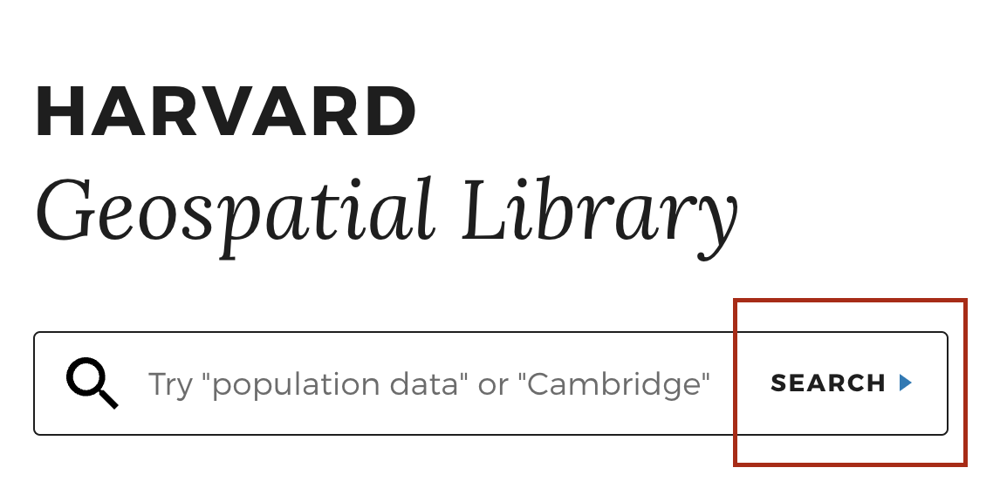

## Objectives

- Understand why georeferenced maps can be useful when asking and answering spatial questions
- Understand how to find georeferenced maps to use in a GIS project
- Find out how to take next steps in using information from paper maps in a GIS project
## 10 minutes to get started

### Example of using georeferenced maps

> 1. Visit [Atlascope.org](https://www.atlascope.org/), search for a place in Boston or Cambridge you are interested in exploring on a historical map, and experiment with toggling between different georeferenced map layers.

### How to find georeferenced maps to use in a project

> 2. Visit the [Harvard Geospatial Library (HGL)](https://hgl.harvard.edu/?_gl=1*1y0xlw4*_ga*NTcxOTEzNDcyLjE3MjE4NTI2NzQ.*_ga_3CXC97RWEK*MTcyNDQzNTUyMC4yNy4wLjE3MjQ0MzU1MjAuNjAuMC4w).

> 3. Click the `Search` button.

> 4. In the left-hand side facets, under `Format` choose `GeoTIFF`. Under `Access`, choose `Public`. You can further filter results by the `Institution` which holds the source, the `Place` it depicts, or you can use the `Search Bar` to further refine results. 

> 5. Choose a result, and click `Click to Wake` on the map, to see a preview of the georeferenced image.

> 6. Notice on the page where to download the `.geoTIFF`, so that you could bring the file into your GIS project.

## Follow-up resources (next steps)

If you have additional time, or would like to get started working with information from paper maps in your GIS project, you can use these step-by-step guides:
1. [How to select a map to georeference](https://mapping.share.library.harvard.edu/tutorials/georeferencing/selecting-a-map/)
2. [How to georeference a map in QGIS](https://mapping.share.library.harvard.edu/tutorials/georeferencing/qgis/)
3. [How to vectorize information from georeferenced maps](https://mapping.share.library.harvard.edu/tutorials/qgis/adler/)

## Discussion questions

1. How do you think using georeferenced maps such as the ones overlaid in the Atlascope tool can help us ask and answer spatial questions?
2. What are some other examples of information one might be able to find in paper maps that could be useful in a project, if georeferenced?
3. What are some ways to get started finding georeferened maps to use in a GIS project?
4. Prepare to present any demos which could help communicate these takeaways.

5. Did you find anything suprising or interesting in the follow-up resources?
6. When faceting by `FORMAT`, why do you think we select `GeoTIFF` instead of `Shapefile`? How might working with raster vs. vector data impact how we approach looking for datasets?

