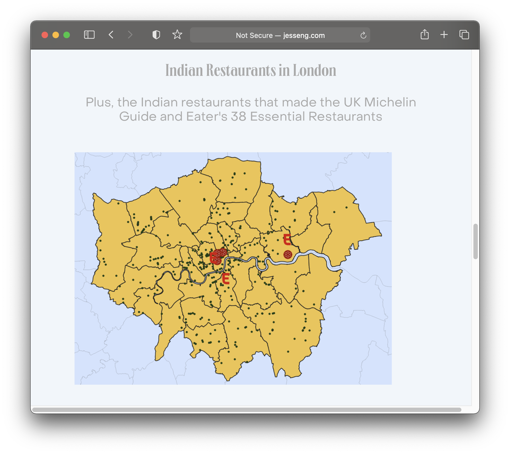

## Objectives

## 10 minutes to get started

Sometimes "official" data is not available for particular data topics or places in the world. Leveraging data extracts from crowd-contributed projects, such as [OpenStreetMap (OSM)](https://www.openstreetmap.org/about) can help fill in the gaps.

Consider Jess Eng's 2021 project which looks at the location of Indian cuisine in London, using data extracted from OSM. 

> 1. Visit the list of available [Map Features](https://wiki.openstreetmap.org/wiki/Map_features) you can extract as data layers from OSM. Identify a feature layer you might be interested in downloading. 

> 2. OSM makes its crowd-contributed database available via a queryable API. To understand how this works, in a search engine or chatbox, prompt "How do i use the openstreetmap api?".

> 3. The results discuss how to script API calls using programming languages, such as Python. If you are not a programmer, there is a plugin for extracting OSM layers in QGIS. Skim through the Harvard Map Collection's [step-by-step tutorial](https://mapping.share.library.harvard.edu/tutorials/openstreetmap/extractbyfeature/) on how to use this plugin. 

## Follow-up resources (next steps)

## Discussion questions

