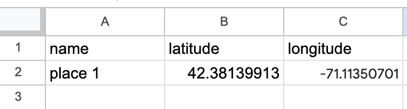

## Objectives

## 10 minutes to get started

<h2>⚠️ Requirements</h2>

<em>At least one group member will need to be logged into their Google account to complete this activity.</em>

  
The group member logged in should be ready by the end to share their screen on the class projector and lead a group discussion about their Google Sheets table and Google My Maps map. 

> 1. Create a new Google Sheets by typing `sheets.new` into a browser. 

> 2. Create three header columns, `name`, `latitude`, and `longitude`. 

> 3. In a new tab, navigate to [Google Maps](https://www.google.com/maps/).

> 4. Find a location you are interested in mapping.

> 5. In your spreadsheet, under the `name` column, give the location a name. 

> 6. `Right click` on the map in Google maps in the area you are interested in. A window with coordinates should pop up. Click on the coordinates, and they will copy to your clipboard. 

> 7. Paste the value into the spreadsheet, under the `latitude` column.

> 8. You will need to edit the values so that the first number in the set of coordinates is under the `latitude` column, and the second number is in `longitude` column. Make sure to include the negative `-` symbol, if it exists, and remove the separating comma. 

*Properly formatted table.*

> 9. Repeat this process and add two more points, so you have three altogether.

> 10. When you are finished entering your data, name your spreadsheet, and export it to a `.csv` format by clicking `File` → `Download` → `Comma Separated Values (.csv)`.

> 11. In a search engine, search for `Google My Maps`. 

> 12. From Google My Maps, choose `CREATE A NEW MAP`.

> 13. Next to `Untitled Layer`, select the three dots (`Layer options`), and choose `Import`. 

> 14. Choose `Browse` and upload the `.csv` you exported from Google Sheets. 

> 15. Make sure all columns are checked off, and choose `Continue`. 

> 16. Under `Choose a column to title your markers`, select `name`. Choose `Finish`. 

> 17. If you have extra time, spend some time exploring the rest of the Google My Maps interface.

## Follow-up resources (next steps)

## Discussion questions

