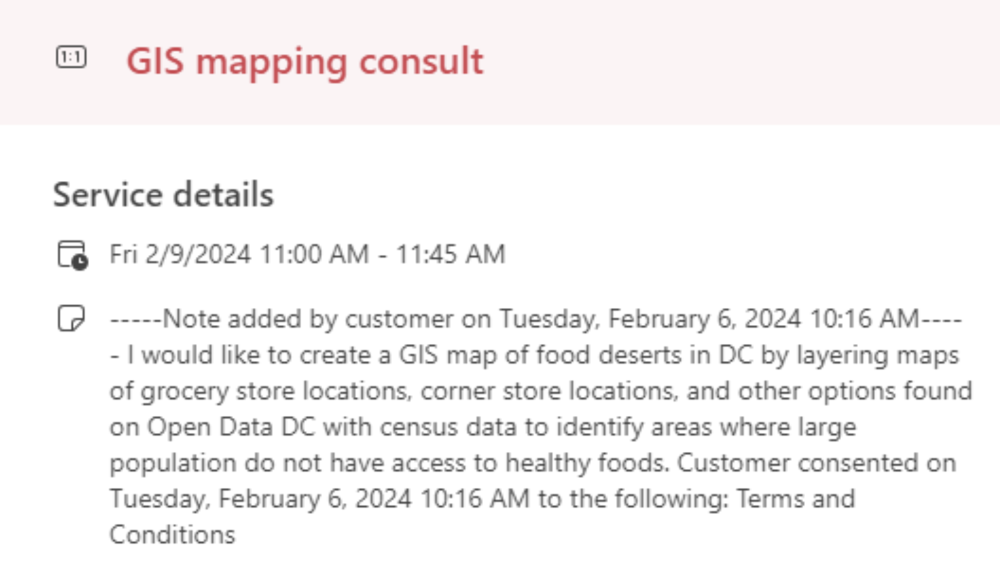

*We are actively developing this handbook. It will be available September 2024.*

>
> ## Action item
>
> Make an appt. Have checklist feed into signup. 

> ## At a glance
>### Framing key points
> - Developed by a bunch of GIS librarians
> - Our goal is to help you develop your search skills
> - We're here to support this skill-building
> - This handbook will help you decide where you want guidance
> 
>### Low-hanging fruit
> #### Search tips
> - site:.gov
> - "open data"
> - "shapefile" 
> - "download"
>
> #### Portals
> - State clearinghouses
> #### Spatial resolution 
> - Starting small + scaling up
> - If you scale up, you can filter or geographically clip after
> #### Use visualization tools to point back to source
> - PolicyMap (including blog), SocialExplorer, ArcGIS Online
> ### Getting creative
> 
>### Making the most out of your consultation
>
> - key point 1
> - key point 2

> ## Deep dive topics
> ### Start by framing -- why are we doing this
> - Fishing example
> [topic 1 example](dive-1/)
> ### Low-hanging fruit 
> #### Search tips
> - e x a m p l e 
> #### Portals
> - example w DC food deserts
> 
> [Grocery store locations](https://opendata.dc.gov/datasets/1d7c9d0e3aac49c1aa88d377a3bae430_4/explore?location=38.906500%2C-77.022567%2C12.60)
> [Healthy corner stores](https://opendata.dc.gov/datasets/9a2df4a51ce646819d0dedfecb7f466a_57/explore?location=38.910372%2C-77.001879%2C12.00)
> [Farmer's markets](https://opendata.dc.gov/datasets/f2e1c2ef9eb44f2899f4a310a80ecec9_2/explore?location=38.894861%2C-77.015000%2C11.82)
> [DC Wards 2022](https://opendata.dc.gov/datasets/DCGIS::wards-from-2022/about)
> #### Spatial resolution 
> - Cali schools city, state, etc
> - County e x a m p l e
> - How 2 clip
> #### Use visualization tools to point back to source
> - e x a m p l e
>### Making the most out of your consultation
> - key point 1 e x a m p l e
> - key point 2 e x a m p l e 

