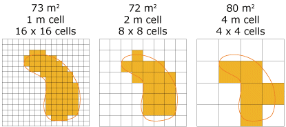

- [↵ Back to Optimizing Search Home](/resources/finding-data/optimizing-search/)
- [↵ Back to Finding Data Home](/resources/finding-data/)

- Cali schools city, state, etc
- County e x a m p l e
- How 2 clip
- Census hierarchies 
- Spatial scale of raster data
    - e.g. Off-gassing from oil and gas wells can be measured with general formulas that estimate particulates over a certain distance. However, the data is often very rough. For example, in Weld County CO, there are about 10,000 wells. Some might say the entire county is a toxic waste dump, but in reality, the impact is only within 100 feet of each well, which is about 1% of the county. The data cells they use are one mile by one mile.
 
    - 
   
