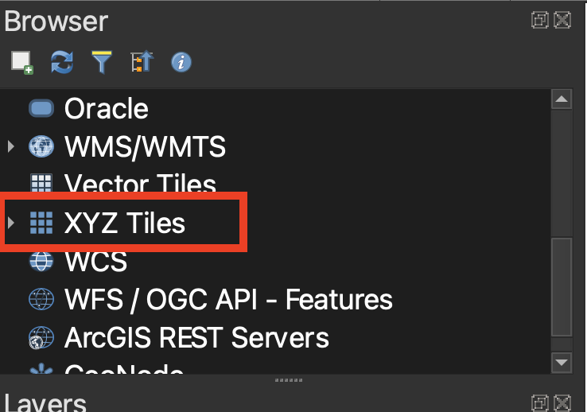
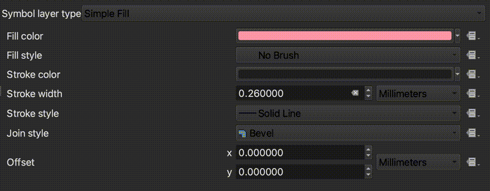
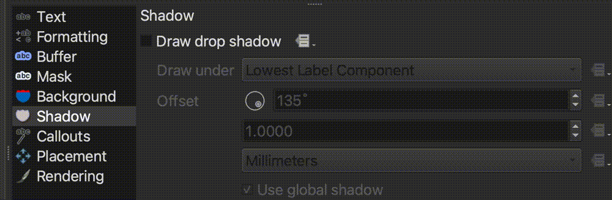
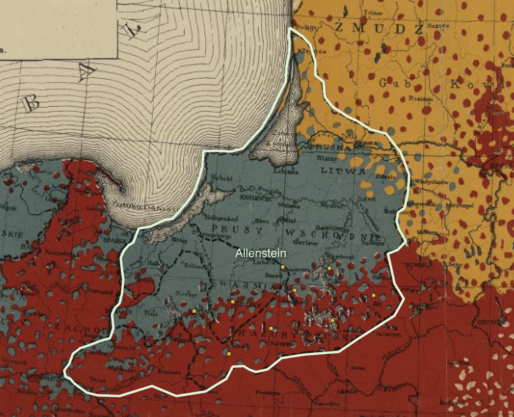

To review the difference between raster and vector data, visit the [Introduction](/resources/new-to-gis/workshop/introduction/).

## Raster data

1. If you haven't already, [download and install QGIS](https://mapping.share.library.harvard.edu/tutorials/census-data-primer/download-software/).

2. Open QGIS.

3. Open a `New Empty Project`.

4. In the left-hand `Browser` menu, find the dropdown titled `XYZ tiles`.

5. Expand the `XYZ tiles` dropown and double-click `OpenStreetMap` to add a basemap to your project. The basemap exists in the background of the project to give us a reference while we are working.

6. In the banner that runs across the top of the QGIS project, find the `Zoom in` button. Select this button. 

7. Click and hold to drag a square around Europe. You can also scroll in and out on your mouse to Zoom in and out. To pan around the map without zooming, engage the `Pan map` button, which looks like a hand.

8. In the left-hand browser menu, right-click `XYZ Tiles` and select `New Connection`. 

> We are adding the map of Poland nationalities. This map has already been georeferenced. Georeferencing maps like this one allows us to overlay it onto other maps and directly compare maps and data of the same area. The map is currently hosted online as a streaming data layer. We can bring it into our project by specifying in QGIS what the layer URL is.

9. In the XYZ Connection wizard, title the new layer `Poland Nationalities 1919`.

10. Copy and paste the following link into where it asks for a URL: `https://allmaps.xyz/maps/8d5cc5d1fec615d6/{z}/{x}/{y}.png`

> To learn how we georeferenced this [map from our Digital Collections](https://iiif.lib.harvard.edu/manifests/view/ids:445002895), you can follow [this tutorial](https://harvardmapcollection.github.io/tutorials/allmaps/georeference/).  

11. Accept all other defaults. Select `OK`.

12. Make sure the dropdown caret next to `XYZ Tiles` in the browser menu is expanded. To add the Poland Nationalities 1919 map layer to your QGIS project, double-click on `Poland Nationalities 1919`. You should be able to see the old map overlaid on the basemap now. 
> It might take a few moments to render. As you zoom in and pan around, you are querying the map data at different zoom levels. The resolution should improve as it finishes loading.

## Vector data

1. Download [the zipped data from this Google Drive link](https://drive.google.com/file/d/1cKUtwbPIaWjvI_a_zD-Su_fItkA9u5UT/view?usp=sharing).

2. Uncompress the zipped data folder. If you need help unzipping folders, follow [the steps on this website](https://www.sweetwater.com/sweetcare/articles/how-to-zip-and-unzip-files/).

3. In the very top QGIS program menu, select `Layer → Add Layer → Add Vector Layer`. 

4. In the Data Source Manager, Under `Source`, click the ellipsis next to `Vector dataset(s)`. This will open your computer's files. Navigate to where you downloaded and unzipped the project data. In the `allenstein-region` folder, select the file `allenstein-region.shp`.

5. Select `Open`.

6. Select `Add` and `Close`. The `allenstein-region` layer should now appear in your layer list, and on your map.

6. Follow the same prompts to add the Polish cities statistical data. In the Data Source Manager, Under `Source`, click the ellipsis next to `Vector dataset(s)`. This will open your computer's files. Navigate to where you downloaded and unzipped the project data. In the `poland-stats` folder, select the file `poland-stats.shp`.

5. Select `Open`.

6. Select `Add` and `Close`. The `poland-stats` layer should now appear in your layer list, and on your map. Your map document should look something like this. 

*All three layers, the georeferenced map, the allenstein region, and the polish cities statistics.*

7. Let's make this data a little easier to work with. Double-click the `allenstein-region` layer in the `Layers Panel`. This will open up the `Layer Properties` for the `allenstein-region` shapefile. 

8. Select the `Symbology` tab from the Layer Properties menu.

9. We want to change the symbology on the plebiscite region layer so that instead of QGIS symbolizing the region as a solid shape, it is just a border around the region. Select where it says `Simple Fill`.

10. In the `Fill Style` drop-down, change `Solid` to `No Brush`.

11. Let's change the border outline, or "Stroke", to a color and width that appears a bit more prominently against the detail of the bold colors on the historic map. Click the colorful bar which appears to the right of the `Stroke Color` option to open the `Select Stroke Color` menu.

12. We're going to use a light greenish color which will pop against the map background. Paste the color code for this color into where it says `HTML notation`. The value to paste in is `#e0f3db`

> To learn more about color codes, check out [htmlcolorcodes.com](https://htmlcolorcodes.com/).

13. Increase the `Stroke Width` to `1.0`.

14. Select `OK`

15. This works better for us, because now we can see the extent of the plebiscite region, but can also "peer under" the layer to see the details of the historic map. Your map should look something like this.

16. Now let's label the Allenstein region. Double-click the `allenstein-region` layer in the `Layers Panel` again, to open up the `Layer Properties`.
 

17. Select the `Labels` tab in the `Layer Properties` menu.

18. Select the drop-down that says `No Labels`, and change it to `Single Labels`.

19. Select the `Text` tab, and change the size of the label to `14.0`.

20. Click the color bar next to `Color` and paste `#eee` as the color code into the `HTML notation` field.  

21. Let's add a drop shadow to make the label stand out better against the map background. Select the label tab called `Shadow`, and toggle on `Draw drop shadow`.

22. Select `OK`. Your map should now look like this, with the Allenstein region outlined and labeled. 

23. The points representing the Polish cities in the `poland-stats` layer are also quite small and difficult to see. Let's make them bigger. Double-click the `poland-stats` layer in the `Layers Panel` to open the `Layer Properties`. 

24. Select the `Symbology` tab.

25. Select where it says `Simple Marker`.

25. In the text box next to `Size`, change the marker size to `6.0`.

26. Select `OK`. Your map should look something like this.

[Next lesson: 5. Visualize statistics →](/resources/new-to-gis/workshop/visualize-statistics/)

[← Previous lesson: 3. Data overview](/resources/new-to-gis/workshop/data-overview/)