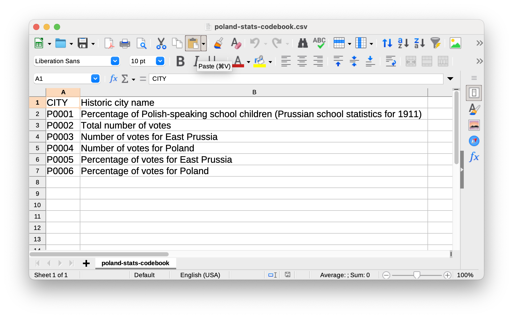
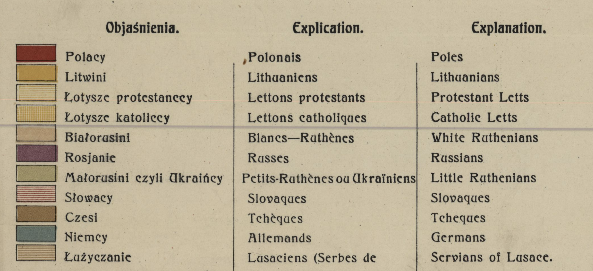
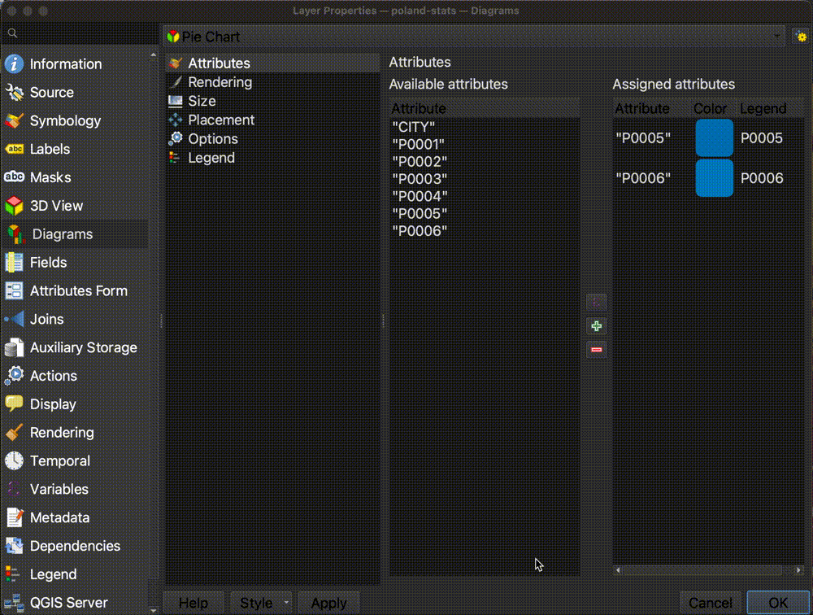
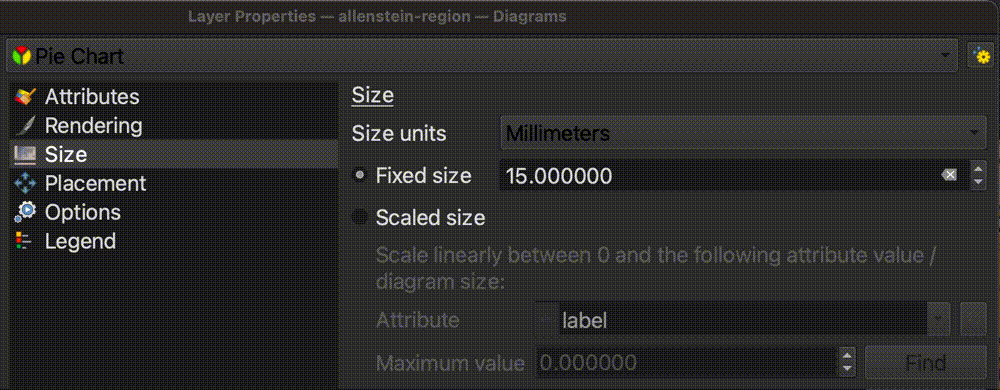
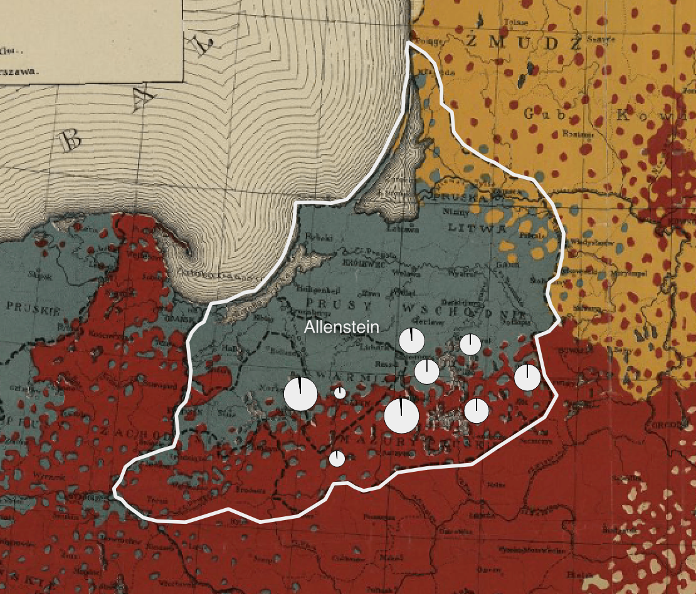

## Exploring the Polish cities dataset

1. Now, let's familiarize ourselves with the Polish cities statistical data. Right-click on the `poland-stats` layer in the `Layer Panel` and select `Open Attribute Table`. 

2. You should see a table where each row is one of the Polish cities on the map, and each layer is a statistical figure about that city. Take a look and try to make sense of the table.

3. You may have noticed that the field headers are not easy to understand. This is common when working with datasets. Because column headers have character limits, datasets often come with codes as the field headers, and you must use what is called a **codebook** to interpret what the columns mean. In the data you downloaded for this activity, navigate to `poland-stats` and open the file `poland-stats-codebook.csv`. 

4. Revisit the Polish cities attribute table and use the codebook to make sense of the values in the table. What do you notice?

## Using map symbology to notice trends

1. While we can observe the values in tabular format, it is difficult to understand trends looking at a list of statistics. Let's try to symbolize some of these values on the map and see what we can learn. Double-click the `poland-stats` layer in the `Layer Panel` to open the `Layer Properties`.

2. Select the `Symbology` menu tab.

3. Engage the drop down that says `Single Symbol`, and change it to `Graduated`.

> QGIS had been symbolizing each city with the same, singular symbology. We are now telling it we want to symbolize the values so they gradually get larger based on the values within our data.

4. We need to tell the program *which* column or attribute we want to create graduated symbology based on. Let's select `P0001`, which as we learned from our codebook, is the percent of Polish-speaking school children in each city. Use the drop-down next to `Value` and select `P0001`.

5. Change the `Method` from `Color` to `Size`.

7. Select `Classify` in the bottom-left corner of the symbology interface.

8. Select `OK`. We can now see the spatial breakdown of where cities with high percentages of Polish-speaking school children lived. 

9. If we consult the legend from our historcal map, we can remember that `red` represents Polish, and `blue` represents Germans. We can compare this demographic breakdown on the historic map from 1919 with the pattern we are seeing in the Polish-speaking school children data from 1911. 

10. Now let's compare this nationality data against the results of the plebiscite vote. This is the data we are going to use to make our finished map. We are going to compare the votes for East Prussia (or Germany) against the votes for Poland. Double-click the `poland-stats` layer in the `Layer Panel` to open the `Layer Properties`. 

11. Under the `Symbology` tab, engage the drop-down that reads `Graduated`, and change it to `No Symbols`.

> We are going to emulate the comparative proportional symbol style of this hand-drawn map in the Harvard Map Collection's digital collections. This map from 1911 shows Polish school children (in black) compared to German school children (in white) in the pie charts, scaled by size depending on the total number of children who lived in that city. We are going to apply the same symbology to look at votes for Germany vs. votes for Poland in the plebiscite result. 

12. The QGIS program handles pie-chart maps as `Diagrams`, rather than `Symbology`, as we have been working with so far. Click the `Diagrams` tab in the `Layer Properties`. 

13. Engage the drop-down that says `No Diagram`, and change it to `Pie Charts`.

14. Recall from our codebook that the columns `P0005` and `P0006` represented percent of votes for East Prussia vs votes for Poland, respectively. Add these two variables to the pie chart diagram, by highlighting one at a time, and selecting the `Add Selected Attributes` button, which looks like a green plus sign.

15. Double-click each of the `Assigned Attributes` color squares to change the color. For `P0005`, or East Prussia, paste in the HTML color code `#eee`. For `P0006`, or Poland, paste in the color code `#000`. 

16. In the `Size` tab of the `Diagram` Properties, change the size from `Fixed Size` to `Scaled Size`. 

17. Fill out the rest of this dialog box as follows:
> - For the `Attribute`, select `P0003`, because we want to scale the symbols by the total number of votes.
> - Next to `Maximum value`, click the `Find` button to let it automatically generate the maximum value from the dataset.
> - Set the size to `10.0`, and switch the `Scale` from `Area` to `Diameter`.
The dialog box should look like this when you're all done:

18. Select `OK`. Your map should now look like this, with the symbol showing two comparative variables for each city. 

[Next lesson: 6. Share results →](/resources/new-to-gis/workshop/share-results/)

[← Previous lesson: 4. Import datasets](/resources/new-to-gis/workshop/import-datasets/)