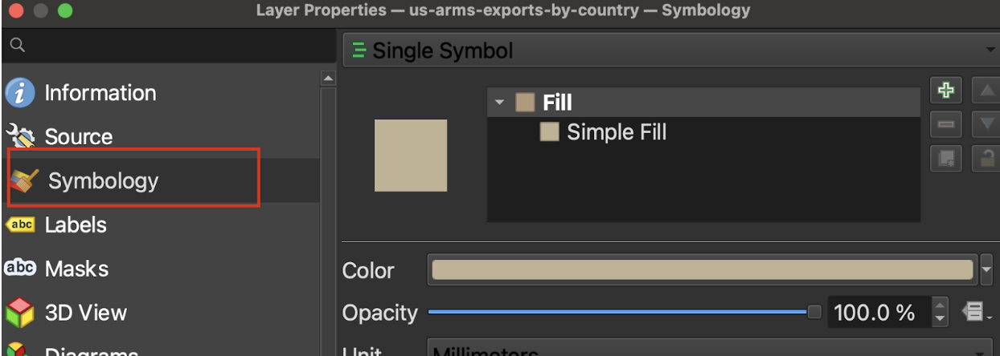

## As a class...

1. Open QGIS. Select `Project` → `New` and navigate to `arms-map.qgz` in the `Activity 2` folder of your class data materials.
2. Right click the layer in the layer list `us-arms-export-by-country`
3. Select `Zoom to Layer`. You should see the countries dataset
4. Right-click the layer in the layer list
5. Select `Open Attribute Table`
6. Take note of the column names. Which column do you think we should symbolize based on?
7. Double click on `us-arms-exports-by-country` in the layer list. This will open `Layer Properties`
8. In the side menu select the paint brush Icon or `Control Feature Symbology` or `Symbology`

10. Click where it says `Single Symbol` and change it to `Graduated` 
11. Click the arrow drop down next to Value and select `US-arms-exports-2022-by-country_TIV` as the column to symbolize
12. At the bottom under `Layer Rendering` select `Style` and then `Load Style`
13. Click the three dots next to File, and choose `Style.qml` from the Activity 2 folder you downloaded

14. Click `Load style`
15. Choose `Apply` and then `OK`

