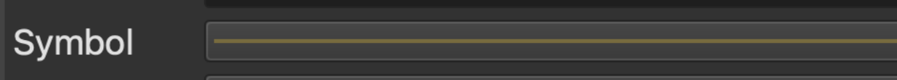

## As a class...

1. Visit [MassGIS Data: Bicycle Trails](https://www.mass.gov/info-details/massgis-data-bicycle-trails), and read through the page. Discuss any observations you make about how this data is structured and presented.
2. Select `Download this data`
3. Uncompress `biketrails_arc.zip`
4. In the QGIS main menu at the top of the screen, navigate to `Project` and then click `New`
5. If you are prompted to save your work, you don’t have to, we won’t need it for anything else later
6. In the `Browser pane`, under `XYZ Tiles`, double click `OpenStreetMap`. Only do this once, it may take a moment to show up in the map screen
7. Use the Zoom button in the menu bar across the top of the screen to draw a square around Massachusetts/Boston area.

8. Add the bicycle data by clicking on the file which ends in the extension .shp, and dragging that file (`BIKETRAILS_ARC.shp`)  onto the map in the QGIS document
9. Click `OK` through the warning that tells us this data is in a different projection
10. Right now, the bike lane lines are all the same color. We are going to leverage the properties inside the data to symbolize the shapes by category. Let’s look at the attributes. Right click on the bike layer in the `Layer pane`, and select `Open Attribute Table`
Note the field `FAC_TYPE_N`, which the [documentation on the website](https://www.mass.gov/info-details/massgis-data-bicycle-trails) tells us means 
> Type of bike facility: shared use path, bike lane, separated bike lane, or bicycle/pedestrian priority roadway

12. Close out of the attribute table, and double click on the bike layer to open the `Layer properties`
13. Navigate to the menu properties option Symbology
14. Click where it says `Single Symbol` and change it to `Categorized`
15. Using the drop-down arrow next to `Value`, select the field `FAC_TYPE_N`
16. Towards the bottom of the screen, select `Classify`
17. Where it says Symbol at the top of the screen, and has a long, colorful line, click on the line!

18. Under `Line`, click where it says `Simple Line`
19. Under `Stroke Width`, change it to `1.0`
20. Click `OK` and `OK` 
21. Zoom in to Boston area to investigate the new symbology
22. Discuss, can you think of any other applications of using categories in the data to power symbolization?

