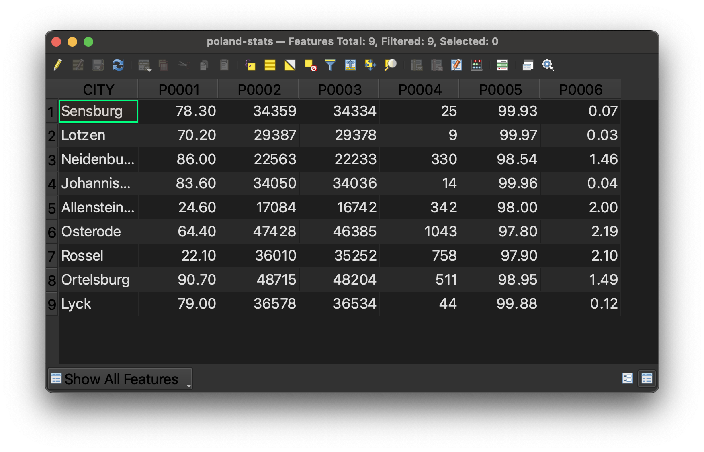

## Polish cities data: interactive map view

<iframe title="Interactive map of the Polish cities statistical data. Hovering over each city reveals information about the city." src="https://harvardmapcollection.github.io/classes/gened1140/fall-2022/assignment/demo/polish-cities/" width="100%" height="600px"></iframe>
<figcaption class="append">Hover over each Polish city to engage with statistics about the city from around the time of WWI. In addition to plebiscite vote results, there is also statistical demographic data from 1911 conveying the percentage of Polish-speaking school children in each city.</figcaption>

## Polish cities data: table view

*This is what the Polish cities GIS dataset looks like, displayed in tabular view in the GIS software. To interpret what the column headers mean, use the codebook pictured below. The codebook and dataset are both available for download as spreadsheets in `.csv` format. You can open these files in Excel, if you would like to use the data, but don't want to map it. Here is the [data download link](https://drive.google.com/file/d/1cKUtwbPIaWjvI_a_zD-Su_fItkA9u5UT/view?usp=sharing).*

## Polish cities data codebook

*The codebook, used to interpret the column headers in the Polish cities dataset.*

## Polish cities data source

_The source of this dataset is a table found in `The American Political Science Review`. So long as sources contain some indication of where phenomena occur, such as city names, or coordinates, we can transform the information into GIS data used for map making._ 

## Polish cities data symbolized and compared against nationalities map

*In the GIS tutorial, we learn how to make this map, using the above datasets to compare the percent of plebiscite vote results for East Prussia (Germany) and Poland, respectively. This data is overlaid onto a map from 1919, showing nationality demographics of Poland at the time -- red for Polish, and blue for German.*

[← Previous lesson: 6. Share results](/resources/new-to-gis/workshop/share-results/)