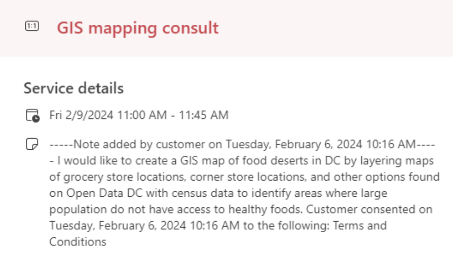
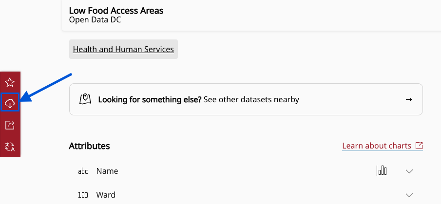

- Explore open data portals and learn how to use them to find GIS data
- Explore how content may be organized and how to refine searching

## In class activity

Consider this request a student made to the Harvard Map Collection for help with finding GIS data in 2024:

> "I would like to create a GIS map of food deserts in DC by layering maps of grocery store locations, corner store locations, and other options found on Open Data DC with census data to identify areas where large populations do not have access to healthy foods."

Where is a good place to **get started** searching for food desert data in DC?

> 1. In a web browser, search for "GIS open data portal DC".

> 2. Visit `opendata.dc.gov`.

> 3. Scroll down and find the search bar that says "Search for apps, maps, documents, data and stories...". Place your cursor in the search bar and click `Enter`. This will bring you to a results page with all items, and filters you can use to refine your search.

> 4. Under `Type` select `Feature Service`. It is a trend that many open data portals host GIS data layers as streaming "feature services", which are displayed in web maps. From these feature service landing pages, you can often download the data in various common geospatial formats, such as `shapefile` or `geoJSON`. Using `type` facets and filtering data by `shapefile`, `geojsons`, `point, line, or polygon` or `feature service` are a good way to tell the search portal you are looking for **geospatial data**, as opposed to spreadsheets, PDFs, or other kinds of information. 

> 5. Click a random result, and observe how the feature service landing page is structured. What are your observations? How would you download this data, in order to bring it into a GIS?

> 6. Return to the results list, filtered by `Feature Service`. Search for relevant terms `food`, `grocery`, `corner stores`, and observe which datasets are available which could be useful to the project. 

---

## Demo and explore more

### Sample data
You can download and explore sample datasets related to this activity from the workshop data homepage, hosted on the Open Science Framework (OSF.io)
> 1. Visit the [workshop data homepage](https://osf.io/exnyg). 

> 2. Click the three vertical dots icon and select `Download`.

> 3. The folder that downloads to your computer contains sample data from all the workshop activities. It is a zipped or compressed file. In order to use it, you will have to `double-click` it on Mac or `right-click` → `Extract` or `Uncompress` on a PC. 

4. The sample data for this activity, <strong>Activity 1</strong> is in the folder <code>activity1_portals</code>. In this folder you will find the following files:

<ul>
<li><code>Low_Food_Access_Areas.zip</code>, a zipped shapefile</li>
<li><code>Low_Food_Access_Areas.geojson</code>, a .geoJSON file</li>
</ul>

### Follow-along steps

How did we access the sample data, and how do we learn to understand and use it?

1. From Open Data DC, search for `food` and filter by `feature service`.
2. To understand the data and how it is structured, click `View Full Details`, which brings us to this [documentation page](https://opendata.dc.gov/datasets/DCGIS::low-food-access-areas/about).
3. To download as GIS data, select the `Download` button in the left-hand sidebar, and choose `GeoJSON` or `Shapefile`.

4. To use the data in QGIS, `extract` or unzip the shapefile, and drag the file ending in `.shp` into the QGIS document. Alternatively, you can drag the `.geoJSON` file into the QGIS document. Another way to add vector data to a QGIS project is use the menu on the top bar `Layers` → `Add Layers` → `Add Vector Layers` and select the file ending in `.shp`.

> Why are there so many files associated with a shapefile? You can [learn more](https://gisgeography.com/arcgis-shapefile-files-types-extensions/). 

5. Right-click `Low_Food_Access_Areas` in the Layers pane and click `Open Attribute Table` to see how the table matches up with the "View Full Details" documentation from the portal. 

6. Right-click `Low_Food_Access_Areas` in the Layers pane → `Properties` → `Symbology` → Click `Single symbol` to change it to `Graduated` → Value = `PRTUND185` → `Classify` (notice under `Mode` there are many classification options. Be aware of which you’re choosing by [reading about each method](https://pro.arcgis.com/en/pro-app/latest/help/mapping/layer-properties/data-classification-methods.htm)) → `OK`.