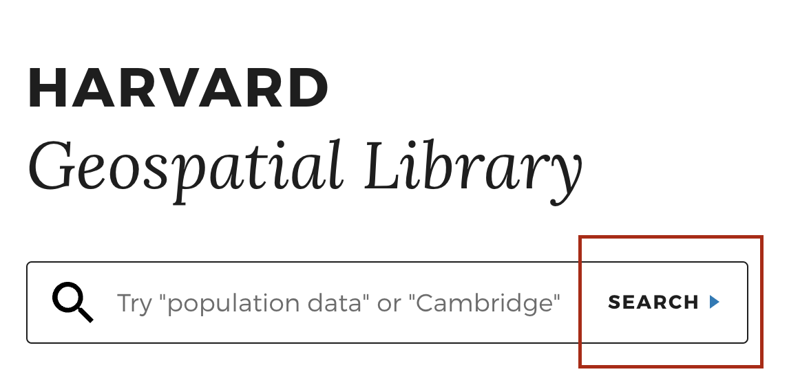
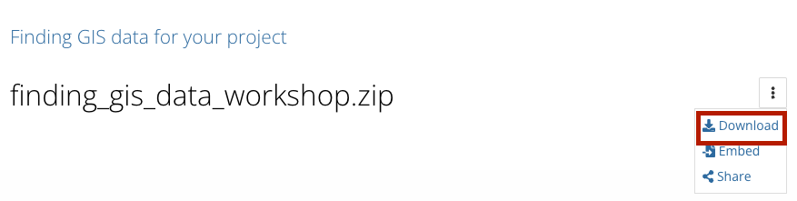

- Understand why georeferenced maps can be useful when asking and answering spatial questions
- Understand how to find georeferenced maps to use in a GIS project
- Find out how to take next steps in using information from paper maps in a GIS project

## In class activity 

### What is georeferencing?

> 1. Visit [Atlascope.org](https://www.atlascope.org/), search for a place in Boston or Cambridge you are interested in exploring on a historical map, and get a sense of the value of georeferencing historical maps by toggling between different georeferenced map layers.

### How to search for Harvard Maps that are already georeferenced

> 2. Visit the [Harvard Geospatial Library (HGL)](https://hgl.harvard.edu/?_gl=1*1y0xlw4*_ga*NTcxOTEzNDcyLjE3MjE4NTI2NzQ.*_ga_3CXC97RWEK*MTcyNDQzNTUyMC4yNy4wLjE3MjQ0MzU1MjAuNjAuMC4w).

> 3. Click the `Search` button.

> 4. In the left-hand side facets, under `Institution` choose `Harvard` and under `Format` choose `GeoTIFF`.   

> 5. Click on some results. Select `Click to Wake` on the map to see the georeferenced map layer.

> 6. Notice the `Download GeoTIFF` button which gives a file that will work in QGIS.

--- 

## Demo and explore more

### Sample data
You can download and explore sample datasets related to this activity from the workshop data homepage, hosted on the Open Science Framework (OSF.io)
> 1. Visit the [workshop data homepage](https://osf.io/exnyg). 

> 2. Click the three vertical dots icon and select `Download`.

> 3. The folder that downloads to your computer contains sample data from all the workshop activities. It is a zipped or compressed file. In order to use it, you will have to `double-click` it on Mac or `right-click` → `Extract` or `Uncompress` on a PC. 

4. The sample data for this activity, <strong>Activity 3</strong> is in the folder <code>activity3_georeferencing</code>. In this folder you will find the following files:

<ul>
<li><code>G7625_1897_W2.tif</code>, a georeferenced TIFF image of the <a href="https://id.lib.harvard.edu/alma/990126040650203941/catalog">Afghanistan-Pakistan Border Region, 1897</a>.</li>
</ul>

### Follow-along steps

1. Search in [HOLLIS](https://hollis.harvard.edu/primo-explore/search?query=any,contains,massachusetts&tab=books&search_scope=default_scope&vid=HVD2&facet=library,include,map&lang=en_US&offset=0) using the term "Massachusetts" making sure to filter for `Library Catalog` and `Location` = `Harvard Map Collection`.
2. Any map that says `Online Access` can be georeferenced in a web browser. For the class demo we will use the map [Map of Massachusetts : exhibiting the Representative, Senatorial and Councillor districts](https://hollis.harvard.edu/primo-explore/fulldisplay?docid=01HVD_ALMA212094551850003941&context=L&vid=HVD2&lang=en_US&search_scope=default_scope&adaptor=Local%20Search%20Engine&tab=books&query=any%2Ccontains%2Cmassachusetts&facet=library%2Cinclude%2Cmap&facet=searchcreationdate%2Cinclude%2C1800%7C%2C%7C1950&offset=30), which appears on page 4 of the search results. 
3. For the class demo we will georeference this map using [AllMaps](https://editor.allmaps.org/), and then display the new georeferenced layer in QGIS. The demo steps can be replicated using two guides: [Select a map to georeference](https://mapping.share.library.harvard.edu/tutorials/georeferencing/selecting-a-map/) ; [Georeference collections with Allmaps](https://mapping.share.library.harvard.edu/tutorials/georeferencing/allmaps/).
4. If the scanned image of the map is not streaming online via HOLLIS, you will need to obtain a hard copy of the image on your computer and use QGIS to georeference it:  [Make an appointment](https://library.harvard.edu/libraries/harvard-map-collection) ; [Georeference with QGIS](https://mapping.share.library.harvard.edu/tutorials/georeferencing/qgis/).

