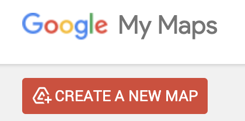

<h2>⚠️ Requirements</h2>

<em>At least one group member will need to be logged into their Google account to complete this activity.</em>

  
The group member logged in should be ready by the end to share their screen on the class projector and lead a group discussion about their Google Sheets table and Google My Maps map. 

## Objectives

- Learn where to find coordinate information for locations
- Learn how to format coordinates in a table so they can be opened in a map
- Learn how to import a table of coordinates into a GIS mapping interface

## 10 minutes to get started

*Imagine you want to make a map of all the places referenced in Chekhov's plays. Where would you get that data? In many cases, you may need to assemble location data yourself into a spreadsheet. This is just one example of the type of project where creating a spreadsheet of coordinates may be necessary. For this activity, you can choose to create data points from any location of your choice.*

> 1. Create a new Google Sheets by typing `sheets.new` into a browser. 

> 2. Create three header columns, `name`, `latitude`, and `longitude`. 

> 3. In a new tab, navigate to [Google Maps](https://www.google.com/maps/).

> 4. Find a location you are interested in mapping.

> 5. In your spreadsheet, under the `name` column, give the location a name. 

> 6. `Right click` on the map in Google maps in the area you are interested in. A window with coordinates should pop up. Click on the coordinates, and they will copy to your clipboard. 

> 7. Paste the value into the spreadsheet, under the `latitude` column.

> 8. You will need to edit the values so that the first number in the set of coordinates is under the `latitude` column, and the second number is in `longitude` column. Make sure to include the negative `-` symbol, if it exists, and remove the separating comma. 

*Properly formatted table.*

> 9. Repeat this process and add two more points, so you have three altogether.

> 10. When you are finished entering your data, name your spreadsheet, and export it to a `.csv` format by clicking `File` → `Download` → `Comma Separated Values (.csv)`.

> 11. In a search engine, search for `Google My Maps`. 

> 12. From Google My Maps, choose `CREATE A NEW MAP`.

> 13. Next to `Untitled Layer`, select the three dots (`Layer options`), and choose `Import`. 

> 14. Choose `Browse` and upload the `.csv` you exported from Google Sheets. 

> 15. Make sure all columns are checked off, and choose `Continue`. 

> 16. Under `Choose a column to title your markers`, select `name`. Choose `Finish`. 

## Follow-up resources (next steps)
- [Add a Spreadsheet .XLSX or .CSV to a QGIS project](https://mapping.share.library.harvard.edu/tutorials/qgis/add-spreadsheet/) 
- Follow an ArcGIS Pro [geocoding tutorial](https://storymaps.arcgis.com/stories/4c42eb942db4454f80dcaffb41c81c11) by clicking  `Your ArcGIS Organization's URL`, typing in `harvard-cga`, and authenticating with your Harvard Key
- Here's a [blog post](https://musingsaboutlibrarianship.blogspot.com/2017/03/openrefine-reconciliation-services.html) about how to extend records you have in a spreadsheet by "reconciling" them with matches in Wikidata, using a tool called OpenRefine. One of the data points you can pull into your spreadsheet are coordinates

## Discussion questions
1. Why might someone need to create location data of their own?
2. How does importing the data into Google MyMaps exemplify what you can do with tabular coordinate data? What do the Google MyMaps activity and the follow-up resource, [Add a Spreadsheet .XLSX or .CSV to a QGIS project](https://mapping.share.library.harvard.edu/tutorials/qgis/add-spreadsheet/) have in common?
3. Prepare to present any demos which could help communicate these takeaways.
4. Did you find anything else surprising or interesting in the follow-up resources?

--- 

## Group exploration 

## Demo and data

