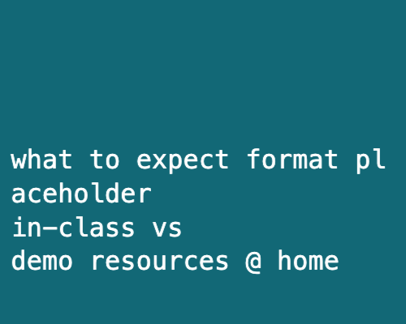
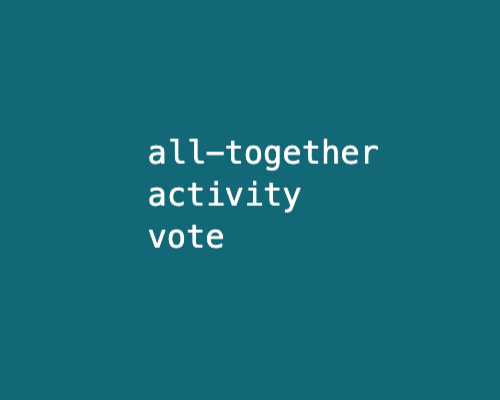
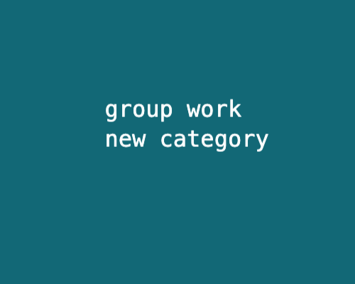
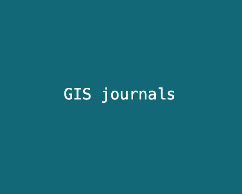
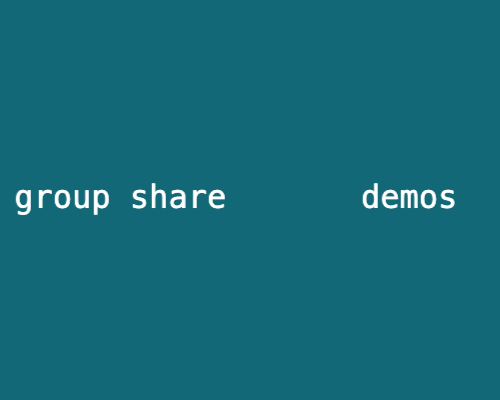

Get here quick: 
`https://bit.ly/gis-find-data`

## Harvard Map Collection

[Map Collection website](https://library.harvard.edu/libraries/harvard-map-collection). 

<h2>Scope</h2>

 🚨 This is not a workshop on how to use GIS mapping software. Please consider referring to our other in-person <a href="https://libcal.library.harvard.edu/calendar/main?t=d&q=gis&cid=15049&cal=15049&inc=0">learning opportunities</a> or <a href = "https://mapping.share.library.harvard.edu/resources/workshops">follow-along materials</a> from previous events. 

🚨 Today will focus on how to find relevant <em>source data</em> for a GIS project. 

## Housekeeping

- ^ little bit about how the session will work
- ^ orientation to resources, where to find stuff, how we will pace 

### Sample data
You can download and explore sample datasets related to this activity from the workshop data homepage, hosted on the Open Science Framework (OSF.io)
> 1. Visit the [workshop data homepage](https://osf.io/exnyg). 

> 2. Click the three vertical dots icon and select `Download`.

> 3. The folder that downloads to your computer contains sample data from all the workshop activities. It is a zipped or compressed file. In order to use it, you will have to `double-click` it on Mac or `right-click` → `Extract` or `Uncompress` on a PC. 

> To follow-along in class, or explore the sample data at home, [download QGIS](https://mapping.share.library.harvard.edu/tutorials/census-data-primer/download-software/), a free tool. Note, if you have a Mac, you will have to `right-click` the green Q desktop icon and select `Open` the first time you use it, since is not available from the App Store.

## Goals

1. Understand why you might use GIS data for your mapping project.
2. Get a feel for the flow and pace of what it's like to work with GIS data.
3. Leave with a sense of which resources you can rely on for next steps in your project.

<table>
  <tr>
    <th>Hand-drawn</th>
    <th>Canva-style</th>
    <th>GIS layers</th>
  </tr>
  <tr>
    <td></td>
    <td></td>
    <td></td>
  </tr>
</table>

 

## Wrapping up

[Map Collection website reprise](https://library.harvard.edu/libraries/harvard-map-collection).

Give us feedback on what worked and what didn't using this [quick survey](https://harvard.az1.qualtrics.com/jfe/form/SV_7aK1ea31ufbdR4O).

## Credits

*Many thanks to our cross-institutional colleagues for providing feedback and expertise on search strategies: Tara Anthony (Penn State), Jessica Benner (Carnegie Mellon), John Clark (Lafayette College), Meagan Duever (Georgia State), Todd Quinn (University of New Mexico), Chris Thiry (Colorado School of Mines), Amy Work (UC San Diego). Thanks to Kevin Holden and Christine D'Auria from the Harvard Bok Center Learning Lab for workshop support.*
