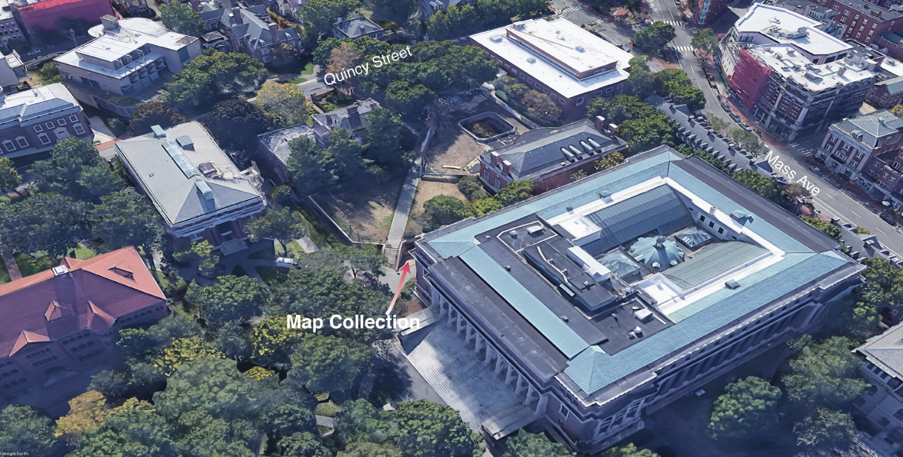

Get here quick: 
`https://bit.ly/find-gis-data`

## Harvard Map Collection

[Map Collection website](https://library.harvard.edu/libraries/harvard-map-collection). 

<h2>Scope</h2>

 🚨 This is not a workshop on how to use GIS mapping software. Please consider referring to our other in-person <a href="https://libcal.library.harvard.edu/calendar/main?t=d&q=gis&cid=15049&cal=15049&inc=0">learning opportunities</a> or <a href = "https://mapping.share.library.harvard.edu/resources/workshops">follow-along materials</a> from previous events. 

🚨 Today will focus on how to find relevant <em>source data</em> for a GIS project. 

## Goals

1. Understand why you might use GIS data for your mapping project.
2. Get a feel for the flow and pace of what it's like to work with GIS data.
3. Leave with a sense of which resources you can rely on for next steps in your project.

## Today's format

1. Topic category overview
2. Democracy - vote which one we do together
3. Group exploration and demo
4. Pick another category to explore with your group
5. Record takeaways in your GIS journal
6. Discussion and more demos

## Next steps
- each activity has data you can explore more at home
- download qgis link
- something about follow-up tutorials

## Wrapping up

[Map Collection website reprise](https://library.harvard.edu/libraries/harvard-map-collection).

Give us feedback on what worked and what didn't using this [quick survey](https://harvard.az1.qualtrics.com/jfe/form/SV_7aK1ea31ufbdR4O).

## Credits

*Many thanks to our cross-institutional colleagues for providing feedback and expertise on search strategies: Tara Anthony (Penn State), Jessica Benner (Carnegie Mellon), John Clark (Lafayette College), Meagan Duever (Georgia State), Todd Quinn (University of New Mexico), Chris Thiry (Colorado School of Mines), Amy Work (UC San Diego). Thanks to Kevin Holden and Christine D'Auria from the Harvard Bok Center Learning Lab for workshop support.*
